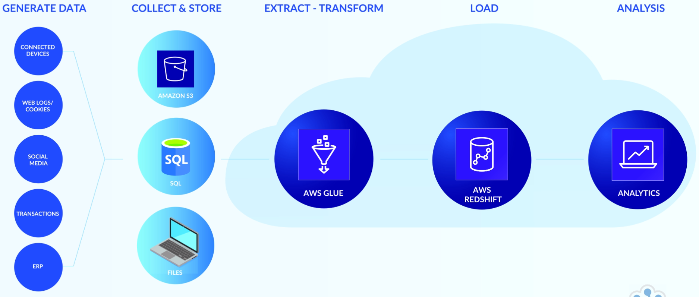
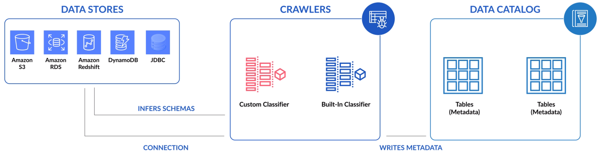
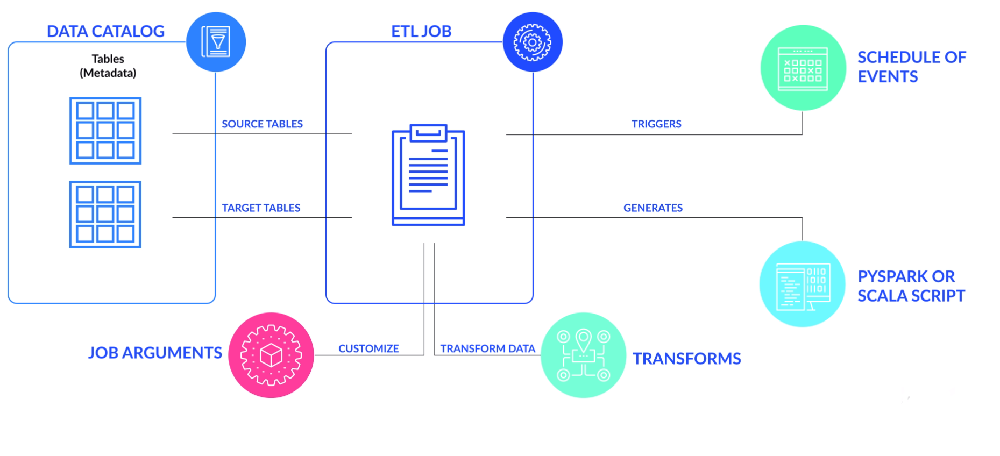

# Developing Serverless ETL with AWS Glue

**Learning Objectives**

The objectives of this course are to provide you with and understanding of:
- Serverless ETL
- The knowledge and architecture of a typical ETL project
- The prerequisite setup of AWS parts to use AWS Glue for ETL
- Knowledge of how to use AWS Glue to perform serverless ETL
- How to edit ETL processes created from AWS Glue

 

## An Overview of traditional ETL in comparison to AWS Glue

**Extract, Transform, Load (ETL)**

**Extraction** - The process of retrieving data from one or more sources--online, brick-and-mortar, legacy data,
Salesforce data, and more.

**Transformation** - The process of mapping, re-formatting, conforming, adding meaning and more to prepare the data in
a was that it is more easily consumed.

**Loading** - Involves successfully inserting the transformed data into the target database, datastore, or data
warehouse.

All of this work is processed in an ETL job.

The advent of cloud, SaaS and big data has produced an explosion in the number of new data sources and streams. There
are has been a dramatic increase in the variety of data sources, volume of data and the need to move data faster
between systems around the world. As a result, there's been a spike in demand for more sophisticated data integration
tools that can handle greater volume, velocity, and then increase in variety.

Many of these improvements have been made in the **on-premise tools**, in addition to being able to connect to cloud
resources.

ETL tool shave also been **developed in the cloud**, which in some cases do a better job of handling big data concerns
in addition to connecting to cloud resources.

The value comes with the analysis and consuming of the prepared data. The improvements to ETL technology provides
real-time or near real-time analytics, simplification and reduced the costs of ETL work. **Serverless ETL** gives us
the ability to run ETL jobs with little or no knowledge of what is behind the scenes technology is provisioning the
processes.

**Serverless ETL**
- ETL pipeline job runs as code on servers that are maintained off-premise or in the cloud.
- ETL tools such as AWS Glue are called ETL as a Service as they allow users to create, store and run ETL jobs online.
- The code for serverless ETL operations can be customized to do what the developer wants in the ETL data pipeline.
**Traditional ETL**
- ETL pipeline jobs typically run in on-premise servers that must be maintained, sometimes by another team.
- ETL tools are typically canvas-based that live on-premise and require maintenance such as software updates.
- There is a canvas-based function represented by an icon with configurable UI for customizing ETL operations in a data
  pipeline.

**Example ETL Process**

 

## AWS Glue Overview

### AWS Glue

AWS Glue is a fully managed ETL, serverless architecture and tool.

The AWS Glue UI will look familiar to those with experience with ETL tools.

AWS Glue helps guide with tasks such as creating connection and selecting and configuring data sources.

**Storing Metadata**

### Crawler

**AWS Glue crawlers** connect to data stores while working for a list of classifiers that help determine the schema of
your data and creates metadata for your **AWS Glue Data Catalog**. While the crawler will discover table schemas, it
does not discover relationships between tables. The metadata is stored in the data catalog and used to help authoring
process for your ETL jobs. You can run crawlers on a schedule from a menu of options, on demand or create a custom cron
job in a Linux based operating system and triggered based on an event such as the delivery of a new data file. By
running the crawler, your metadata stored in your data catalog table is updated with items such as schema changes, such
as new columns in the data source.

You can create an AWS Glue crawler in its simplest by following the wizard and performing the following steps.
1. Name your crawler
2. Choose a data store and include a path to it
3. Optionally, add another data store
4. Select an IAM role or create a new one.
5. Create the schedule for this crawler,
6. Configure the crawler's output
7. Other configuration options which are important to highlight that will be covered in the following demo section.

You add a crawler within your *data catalog* to traverse your data stores. The output of the crawler consists of one or
more metadata tables that are defined in your data catalog.

*Note*: Your crawler uses an AWS Identity and Access Management by IAM role for permission to access your data stores
and the data catalog.

### Classifiers

- A classifier reads the data in a data store and gives an output to include a string that indicates the file's
  classification or format and the schema of the file.
    - For example JSON and the schema of the file.
- AWS Glue provides built-in classifiers for various formats, including JSON, CSV, web logs and many database systems.
- The CSV classifier checks for the following delimiters: `",", "|", "\t", ";"`
- You can include or exclude patterns to manage what the crawler will search for.
- Regular Expressions can also be used to exclude patterns.
- For custom classifiers, you define the logic for creating the schema based on the type of classifier.
- You might need to define a custom classifier if your data doesn't match any built-in classifiers or if you want to
  customize the tables that are created by the crawler.

### Connections

A connection creates the properties needed to connect to your data. Connections are used by crawlers in jobs in AWS
Glue to access certain types of data stores.

AWS Glue can connect to the following data stores by using the JDBC protocol:
- Amazon Redshift
- Amazon RDS including
  - Amazon Aurora, MariaDB, Microsoft SQL Server, MySQL, Oracle and PostgreSQL

The *data store* you select when creating the crawler will *infer the schema* and consequently, the metadata that is
collected and stored in the data catalog.

### Data Catalog

The AWS Glue Data Catalog is created when you run your crawler.

It is a persistent metadata store for data assets and contains table definitions, job definitions and other control
information to help you manage your AWS Glue environment.

A schema version history for target data stores is kept so you can view how your data has changed over time.

### AWS Glue Jobs

AWS Glue automatically generates code for the extract, transform and load steps of an ETL job when you complete the UI
guide for creating a job.
  - The code is generated in your choice between Scala and Python and is written for Apache Spark.

Development endpoints are provided for you to edit, debug and test code that it generates for your ETL job.
  - You can use your preferred IDE to write custom readers, writers or transformations to include in your AWS Glue ETL
    jobs as customer libraries.

AWS Glue Jobs can be scheduled to run, run on-demand, or triggered to run from an event.

Logs and notifications are pushed to Amazon CloudWatch so you can monitor, be alerted and troubleshoot jobs that have
run.

### Creating and AWS Glue Job

**Data Catalog**

Choose a data source for your job. The tables that represent your data source must already be defined in your data
catalog.

If the source requires a connection, the connection is also referenced in your job. Remember that a connection contains
the properties needed to connect to your data. If your job requires multiple data sources, you can add them later by
editing the script.

**ETL Job**

Choose a data target of your job. The tables that represent the data target can be defined in your data
catalog or your job can create the target tables when it runs.

You choose the target location when you author the job and if the target requires connection, the connection is also
referenced in your job. If you job requires multiple data targets, you can add them later by again editing the script.

**Job Arguments**

Customize the job processing environment by providing arguments for your job and generated script. We will add a job
with a demo in the next lecture.

**Transform Data**

AWS Glue generates a script but you can also edit the script to add sources, targets and transforms.

**Triggers**

You specify how your job is invoked either on-demand, by a time based schedule or by an event.

**Script Generation**

Based on your input, AWS Glue generates Pyspark or Scala script. You can tailor the script based on your needs.

### Security

You'll be blocked if you don't have access to the data stores so you must have any of the following identities:
- AWS account root user
- IAM user
- IAM role

You can also generate access keys for each user.

**Best Practice**

- Do not use the root user for accessing data sources
- Limit access to only required data sources to maintain some governance with sensitive data

### Benefits

- **Serverless**
  - Only pay for resources while AWS Glue is running.
- **Crawlers**
  - Detect and infers schemas from data sources with very little configuring which
      - can be scheduled
      - can also trigger job runs
- **Auto code generation**
  - Gives you what you need in Python or Scala code to run a simple job or to extend within your own code additions.
- **The code**
  - Integrates with outer toolchains via custom endpoints.
- For **AWS Glue** you pay an hourly rate, billed by the second, for crawlers (discovering data) and ETL jobs
  (processing and loading data)
- For the **AWS Glue Data Catalog**, you pay a simple monthly fee for storing and accessing the metadata.
- the first million objects stored and the first million accesses are free.
- If you provision a development endpoint to interactively develop you ETL code, you pay an hourly rate, billed per
  second.

**When would you choose not to use AWS Glue?**

- There are many other methods for ETL on-premise and in the Cloud that meet the needs of developers and organizations.
- Your company may have already made significant investments on-prem or other tech for ETL pipelines.
- Languages are limited to Python and Scala and jobs must be edited when schemas are updated.
- AWS Glue is still relatively a young product and there are currently no third party out-of-the-box connectors, such
  as SalesForce, that you can expect in a more mature ETL tool set.

 

## AWS Glue Flight Data Demonstration

### Demo Overview

- Create a crawler
- Create a connection to our destination table
- Demonstrate what classifiers do for crawling
- Create an ETL job to extract and transform data.
- Run the ETL job to extract, transform and load data to our destination table.

 

## Summary

The reward is **prepared, consumable data** for **better analysis**. The transformation is often the more heavy lifting
work to combine from a variety of sources, clean the data, map correctly to the destination, form into a new schema,
aggregate or disaggregate and more.

**Benefits**:
- ETL code in AWS Glue easily runs serverless
- AWS Glue has a crawler that infers schemas for source, working and destination data
- AWS Glue auto-generates ETL scripts as starting point for customizing in either Python or Scala

[AWS Glue Code Samples](https://github.com/aws-samples/aws-glue-samples)

---
