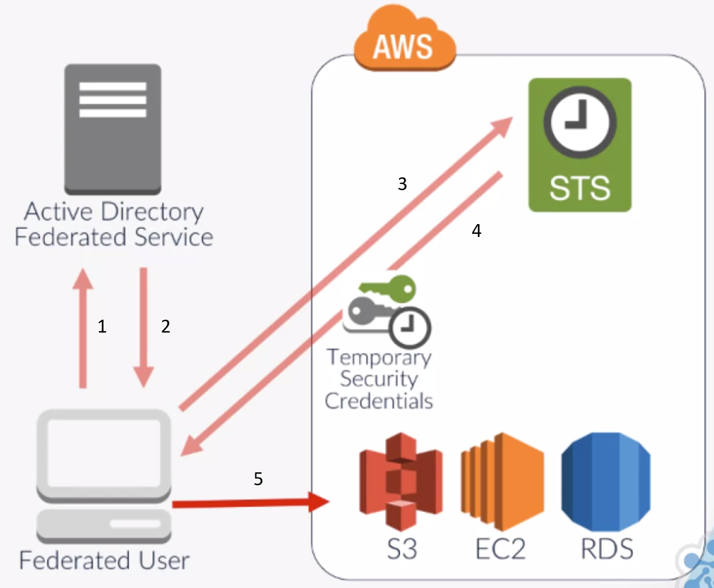

# Overview of AWS Identity and Access Management

<br/>

## Intro

This is a key security service within AWS and is likely to be the first security service you will use and come across
allowing you to configure specific access controls within your environment.

**Course Summary**
- *What is Identity & Access Management?*
  - This section will explain what IAM means and why it’s necessary to implement and maintain control of this service.
- *Groups, Users & Roles*
  - This section will define the differences between Groups, Users and Roles and how each of these objects are
  typically used
- *IAM Policies*
  - This section will cover what IAM Policies are, how to create, modify and apply them within your AWS environment
- *Multi-Factor Authentication*
  - This section will explain what MFA is and the best practices
- *Identity Federation*
  - This lecture will explain how external identities (users who do not have IAM user accounts) can access your AWS
  resources through the use of identity providers
- *IAM Features*
  - This lecture will focus on the information contained within IAM Account settings, the credential report and also
  how IAM integrates with KMS

**Course Goals**
- Setup and configure users, groups and roles to control which identities have authorization to access specific AWS
resources
- Implement Multi-Factor Authentication
- Create and implement IAM Policies allowing you to grant or restrict very granular and specific permissions across a
range of resources
- Implement a Password policy to align with your internal security controls
- Understand when and why you may use Identity federation access
- Understand how the Key Management Service (KMS) is used in conjunction with IAM

<br/>

## What is Identity and Access Management

**Identities** are required to authenticate AWS accounts.
- Username: Identity
- Password: Verification

**Access Management** relates to authorization and access control.
- What that user is authorized to access

To manage, control and govern authentication, authorization and access control mechanisms of identities to your
resources within your AWS Account.

**IAM Components**

The IAM service is used to manage and control security permissions

- Users: Objects within IAM identifying different users.
- Groups: Objects that contain multiple users.
- Roles: Objects that different identities can adopt to assume a new set of permissions.
- Policy Permissions: JSON policies that define what resources can and can't be accessed.
- Access Control Mechanisms: Mechanisms that govern how a resource is accessed.

IAM is a global service.

IAM is the first service a user will interact with.

**Importance of IAM**

It is critical to understand IAM and know how to implement its features:
- Without IAM there is no way of maintaining security or controlling the access to you resources.
- IAM provides the components to manage access, but it is only as strong as you configure it.
- The responsibility of implementing secure, robust and tight security within IAM is yours!

**IAM Responsibility**

It is critical to understand IAM and know how to implement its features.

- How secure your access control procedures must be
- How much should you restrict users access
- How complex a password policy must be
- Should you use Multi-Factor Access

The IAM service can be found under the 'Security, Identity & Compliance' section on the AWS console.

<br/>

## Users, Groups and Roles

### Users

User objects are created to represent an identity:
- A user can represent a real person who requires access to operate and maintain your AWS environment.
- Or it can be an account used by an application that requires permissions to access your AWS resources programmatically.

### Creating Users

Users can be created via AWS Management Console or programmatically via the AWS CLI, Tools for Windows Powershell, or
using the IAM HTTP API

User creation steps:
1. Username
2. Access Type
  - AWS management Console Access and/or Programmatic access
  - To use the AWS Management Console Access, the user will need to be issued with a password.
  - For programmatic access, an access key ID and secret access key ID will be issued to be used with the AWS CLI
  SDKs or other development tools.
3. Define Password
  - If AWS Management Console was selected in the previous step
4. Permission assignment
  - Attach policies to user or assign user to a group where policies can be inherited from
5. Review and Confirm info
6. Create the User
7. Download security credentials within the csv file
  - These details can be emailed to the new user

### Access Keys

Access keys are required for programmatic access for authentication.

**Access Key ID**
- 20 random uppercase alphanumeric characters

**Secret Access Key**
- 40 random upper and lowercase alphanumeric and non-alphanumeric characters
- During the creating of a user who requires programmatic access, you are prompted to download and save the details,
as the secret access key ID will only be displayed once, and if you lose it, you will then have to delete the
associated access key ID and recreate new keys for the user.
- It is not possible to retrieve lost Secret Access Key IDs!


- These keys must be applied and associated with you application.
- If you're using the AWS CLI to access a resource, you first have to instruct the AWS CLI to use these Access Keys.
- This association ensures that all API requests are signed with this digital signature.

### Users

A summary of the object can be viewed by selecting the user, from within the user page of the console. This will show
the user ARN, Amazon Resource Name, which is a unique identifier of the object, the creation time of the user object,
as well as:
- Permissions
  - *Policies*
- *Groups*
- *Security Credentials*
  - password management
  - Manage Multi Factor Authentication
    - Used for admins at minimum
  - Managed signing certificates
  - Create new Access keys for programmatic access
  - Upload SSH public keys for AWS CodeCommit
    - used to authenticate access to AWS CodeCommit repositories
  - generate HTTPS Git credentials for AWS CodeCommit
    - allows you to authenticate HTTPS connections to AWS CodeCommit repositories
- *Access Advisor*
  - Shows a list of services that the user has permissions for, and the last time that those services were used
  with those assigned permissions.
  - This is great to help you refine and revise the user permissions.

**AWS CodeCommit**
- AWS CodeCommit is a managed source control service.
- CodeCommit allows you to host secure and scalable private Git repositories

### Groups

- IAM Groups are objects like user objects
- Groups are not used in authentication process
- They are used to authorize access through AWS Policies

IAM Groups contain IAM Users and have IAM Policies associated that will allow or deny access to AWS resources. These
policies are either AWS managed policies or customer managed policies.

Groups are typically relate to a specific requirement or job role. Any users that are part of the group inherit the
permissions applied to that group. Applying permissions to groups instead of individual users helps manage multiple
users at once.

**Creating Groups**
 Steps:
 1. Create Group Name
 2. Assign Policies
 3. Review

### Roles

IAM Roles allow you to adopt a set of temporary IAM permissions.  

Example:
You have an EC2 instance running an application that requires access to Amazon S3 to Put and Get objects using the
relevant API calls
- To allow access to S3, a set of credentials could be stored on the EC2 Instance
- Or, you can assign an IAM Role to the EC2 Instance.  *BEST PRACTICE!*

**Advantages**
- Roles don't have any access keys or credentials associated with them. The credentials are dynamically assigned by AWS.
- You can alter the permissions assigned to the Role and all the EC2 instances associates will have the correct access.

**Roles and Users**

There are circumstances where you need to grant temporary access to a resource for a particular user.
- Allow the user to assume a Role temporarily

**Roles Types**
1. AWS Service Role
  - Used by other services that would assume the role to perform specific functions
  - Amazon EC2, AWS Directory Services, and AWS Lambda
  - Once you have selected your service role, you would then need to attach a policy with the required permissions
2. AWS Service-Linked Role.
  - These are very specific roles that are associated to certain AWS services.
  - They are pre-defined by AWS, and the permissions can't be altered in any way, as they are set to perform a
  specific function.
  - Examples of these AWS Service-Linked Roles are Amazon Lex-Bots, and Amazon Lex-Channels.
  - Once you have selected your service-linked role, you simply need to assign it a name and complete the creation.
    - Remember, these roles do not allow you to modify the permissions assigned.
3. Cross-Account Access
  - This role type offers two options.
  - Providing access between AWS accounts that you own, and providing access between an account that you own and a
  third-party AWS account.
  - Access is managed by policies that establish trusting and trusted accounts that explicitly allow a trusted principal
  to access specific resources. Many services use roles to allow cross-account access to resources.
    - High-level configuration
      - The *trusting account*  has the resources that need to be accessed.
      - The *trusted account* contains the users that need to access the resources in the trusting account.
        - A role is created in the trusting account.
        - A trust is then established with the role by entering the AWS account number
        of the trusted account.
        - Permissions are then applied to the role via policies
        - The users in the trusted account then need to have a policy attached to enable permissions to allow them to
        assume the role in the trusting account.
  4. Identity Provider Access
    - Grant access to web identity providers.
      - Create a trust for users using Amazon Cognito, Amazon, Facebook, Google, or any other open ID connect provider.
    - Grant web single sign on to SAML providers.
      - Allows access for users coming from a SAML (Security Assertion Markup Language) provider
    - Grant API access to SAML providers.
      - Allows access from SAML provider via the AWS CLI, SDKs, or API calls.
    - For these options, a trust relationship is set up between the external identity providers to allow access to
    your AWS account's resources, using their existing identity provider login information.

### Demonstration
1. Creating a group,
2. Attach permissions to this group
  - using an existing AWS managed IAM policy
3. Create a new user
4. Assign this user to the group
  - as per best practice.
5. Set up a new service role
  - to be associated to an EC2 instance
6. Assign this role to a new EC2 instance

<br/>

## IAM Policies

IAM Policies are used to assign permissions to user, group and role objects.

They are formatted as a JSON document and have at least one statement.

```JSON
{
  "Version": "2012-10-17",
  "Statement": [
    {
      "Sid": "Stmt1494509737040",
      "Action": "cloudtrail:*",
      "Effect": "Allow",
      "Resource": "*",
      "Condition": {
        "IpAddress": {
          "aws:SourceIp": "10.10.0.0/16"
        }
      }
    }
  ]
}
```

**Version:**
- The policy language version

**Statement**
- The main element of the policy, which includes sub elements that identify the level of access, granted or denied
and to which resource:
  - Sid
    - Sid, Statement ID, is a unique identifier within the Statement array.
    - As more permissions are added, the Statement will have more Sids.
  - Action
    - What will either be allowed or denied.
    - Effectively API calls for different services.
    - Different Actions are used for each service.
      - For example, for `DeleteBucket` action is available for *S3*, but not for *EC2*.
      - And likewise, the `CreateKeyPair` action is available for *EC2* but not *S3*. The Action is prefixed with the
      associated AWS service.
      - We could have two Actions for cloudtrail `"Action: [ "cloudtrail:CreateTrail", "cloudtrail:DeleteTrail" ]`
      - Or, as seen below, use an asterisk as a wild card which represents all *Actions* for the cloudtrail service, essentially granting full access to the service.
  - Effect
    - Can be set to `Allow` or `Deny`
    - Will grant or restrict access to all *Actions* in the same *Statement*.
    - Set to `Deny` by default.
  - Resource
    - Element specifies the actual resource you wish the *Action* and *Effect* to be applied to.
    - AWS uses ARNs to specify resources following the syntax:
      `<arn>:<partition>:<service>:<region>:account-<id>:<resource>`
      - `partition`
        - Relates to the partition that the resource is found in.
        - For standard AWS regions, this section would be `aws`.
      - `service`
        - Reflects the specific AWS service. For example, *s3* or *ec2*.
      - `region`
        - The region that the resource is located.
        - Some services do not need the region specified, so this can sometimes be left blank.
      - `account-id`
        - Your AWS account Id, without hyphens.
        - Some services do not need this information, and so it can be left blank.
      - `resource`
        - The value of this field will depend on the AWS service you are using.
        - If using the Action `s3:PutObject`, then the bucket name could be used, applying stated permission to only that bucket.
  - Condition
    - An optional element that allows control of when the permission will be effective.
    - Consists of a condition and a key-value pair.
    - Below
      - "IpAddress" is the condition
      - "aws:SourceIp" is the key
      - "10.10.0.0/16" is the value
      - Effectively, what this is saying is if the Source IP address of the user who is using the policy is within
      their 10. 10. 0. 0/16 network range, then allow the permissions to be used.


**Multiple Sids**

There can be multiple Sids within a Statement, each granting different levels of access:

- The first Sid allows any resource full access to "cloudtrail" as long as their Source IP address is within the
10.10.0.0/16 range.
- The second Sid allows any resource to have full access to "autoscaling".
- The third Sid allows the creation and deletion of s3 buckets within the "iam-course-ca" bucket on s3.

```JSON
{
  "Version": "2012-10-17",
  "Statement": [
    {
      "Sid": "Stmt1494509737040",
      "Action": "cloudtrail:*",
      "Effect": "Allow",
      "Resource": "*",
      "Condition": {
        "IpAddress": {
          "aws:SourceIp": "10.10.0.0/16"
        }
      }
    },
    {
      "Sid": "Stmt1494512658702",
      "Action": "autoscaling:*",
      "Effect": "Allow",
      "Resource": "*",
    },
    {
      "Sid": "Stmt1494515449405",
      "Action": [
        "s3:CreateBucket",
        "s3:DeleteBucket"
        ],
      "Effect": "Allow",
      "Resource": "arn:aws:s3:::iam-course-ca",
    }
  ]
}
```

[**IAM Policy Element Reference**](http://docs.aws.amazon.com/IAM/latest/UserGuide/reference_policies_elements.html)


### IAM Policy Types

1. Managed Policies
2. customer Managed Policies

**Managed Policies**

These policies can be associated with Groups, Roles or Users.

*AWS Managed Policies*
- Preconfigured by AWS
- Covers most common permissions
  - Ex:
    - *AmazonS3FullAccess*: Provides full access to all buckets via AWS Management Console
    - *AmazonS3ReadOnlyAccess*: Provides read only access to all buckets via the AWS Management Console.

*AmazonS3FullAccess*

```JSON
{
  "Version": "2012-10-17",
  "Statement": [
    {
      "Effect": "Allow",
      "Action": "s3:*",
      "Resource": "*"
    }
  ]
}
```

*AmazonS3ReadOnlyAccess*

```JSON
{
  "Version": "2012-10-17",
  "Statement": [
    {
      "Effect": "Allow",
      "Action": [
        "s3:Get*",
        "s3:List"
      ],
      "Resource": "*"
    }
  ]
}
```

**Customer Managed Policies**
- Configured by the user.
- You can start with an AWS Managed Policy.  With tweaks it becomes a Customer Managed Policy.

Example:  A user requires read only access to everything on *S3*, plus the ability to create new buckets. To create
the appropriate policy for this user, we should consider using the *AmazonS3ReadOnlyAccess* AWS Managed policy, which
would give us the Read Only permission, but it would need to be copied and altered to allow the creation of buckets too.

*AmazonS3ReadOnlyAccess with CreateBucket Permission*

```JSON
{
  "Version": "2012-10-17",
  "Statement": [
    {
      "Effect": "Allow",
      "Action": [
        "s3:Get*",
        "s3:List",
        "s3:CreateBucket"
      ],
      "Resource": "*"
    }
  ]
}
```

### Creating a Customer Managed policy

1. Copy any AWS Managed Policy
  - An existing AWS Managed Policy is copied and edited to create a new policy
2. Policy Generator
  - Create a policy by selecting options from dropdown boxes.
3. Create Your Own Policy
  - Write policies from scratch or paste JSON policy from another source.

*Note*: Use the `Validate Policy` button to check syntax


### Inline Policies

Inline Policies are directly embedded into a specific User, Group or Role--therefore cannot be reapplied.

- Inline Policies are created and attached directly to you IAM object.
- They do not how up under Policies list as they are not publicly available for other identities.
- Typically used when you don't want to risk the permissions being applied to another identity.

To add an Inline Policy you must select the Use, group or Role and under Permissions click the option.
There are two options: the Policy Generator and Custom Policy.

If there are conflicting permissions:
1. By default, all access is denied
2. Access will only be allowed if an explicit "Allow" has been specified.
3. A single "Deny" will overrule and "Allow"
  - An explicit "Deny" will always take precedence over an explicit "Allow".

<br/>

## Multifactor Authentication

**Multifactor Authentication (MFA)**

Typically when a user logs into the AWS management console that will authenticate to your AWS account by providing
their identification, typically their user name and then verify this identification usually with a password.

These two elements, identification and verification, allow the user to authenticate.

- Username -> Identification
- Verification -> Verification

For users who have a high level of authorization an additional verification step within the authentication process can
be added.

**MFA** is used to create an additional factor for authentication.

**MFA** uses a random 6 digit number generated by an MFA device.
  - No additional charge for MFA
  - You need your own MFA device
  - It can be a physical device or a virtual token
    - Instructor used Google Authenticator

[All Supported Devices](https://aws.amazon.com/iam/details/mfa/)

- The MFA device must be configured and associate to the user
- This configuration can be done from within IAM in the Management Console

Sometimes you can use MFA to increase security when making API calls to other resources.

<br/>

## Identity Federation

Identity federation allows you to access and manage AWS resources even if you don't have a user account within IAM.

- Identity providers (IdP) allow users to access AWS resources securely.
  - An example of an identity provider is Microsoft Active Directory (MS-AD)
- Other forms of IdP can be any OpenID Connect (OIDC) web provider
  - Common examples: Google, Amazon, Facebook
  - [OIDC](http://openid.net/connect/)
- Using MS-AD is an effective way of granting access to your AWS resources

If users need access to AWS resources that already have identities that could be used as an identity provider, then
you could allow access to your environment using these existing accounts instead of setting each of them up a new
identity within AWS IAM.

*Benefits:*
- Minimizes the amount of administration required within IAM
- Allows for a Dingle Sign-On (SSO) solution

*Two Types of IdP:*
- OpenID
  - Allows authentication between AWS resources and any public OpenID Connect provider such as Facebook, Google,
  Amazon)
  - When an access request is made, the user IdP credential will be used to exchange an authentication token for
  temporary authentication credentials.
  - These temporary credentials with pre-configured permissions allow authorized access to resource as required.
  - The process would be managed most effectively with [Amazon Cognito](https://aws.amazon.com/cognito/) which helps manage user sign-in to mobile and
  web apps through federated access.
- SAML
  - Security Assertion Markup Language
  - Allows your existing MS-AD users to authenticate to your AWS resources on a SSO approach
  - SAML lets the exchange of security data, including authentication and authorization tokens to take place between
    an IdP and a service provider.
    - In this case the IdP is MS-AD and the service provider is AWS

**Active Directory Authentication**

A user within an organization requires API access to S3, EC2 and RDS.

Security Token Service, [STS](http://docs.aws.amazon.com/STS/latest/APIReference/Welcome), allows you to gain temporary
security credentials for federated users via IAM.

How federation is instigated from the user for API access to specific AWS services:
1. The user initiates a request to authenticate against the ADFS Server via a web browser using a SSO URL.
2. If their authentication is successful by the AD credentials, SAML issues an assertion back to the users client
   requesting federated access.
3. The SAML assertion is sent to the AWS STS to assume a role within IAM using the
   [*AssumeRoleWithSAML API*](http://docs.aws.amazon.com/IAM/latest/UserGuide/id_credentials_temp_control-access_assumerole.html)
4. STS response to the user requesting federated access with temporary security credentials with an assumed role and
   associated permission.
5. The user has federated access to the necessary AWS services.



Corporate identity federation is always authenticated internally first by Active Directory before AWS.

**Creating an Identity Provider**

Creating an IdP is a simple process. the required information is as follows:
- OpenID
  - A client ID (audience) that you receive once you register your app with your IdP.
  - A Thumbprint to verify the certificate of your IdP.
- SAML
  - A SAML Metadata document that you get by using the identity management software from your IdP.
  - This document includes information such as the issuer's name, expiration data and security keys.
- [Further Requirements](http://docs.aws.amazon.com/IAM/latest/UserGuide/iam-ug.pdf)

**Creating an OIDC Identity Provider**

To create an IdP for OIDC:
1. From the IAM console, Select 'Identity Providers'
2. Click 'Create Provider'
3. Select 'OpenID Connect'
4. Enter the URL of the IdP
5. Enter the Client ID of your application
6. Supply the Thumbprint for certificate verification
7. Create a Role for the Identity Provider
8. Verify the information and click 'Create'
9. The OIDC Provider will then be created

**Creating A SAML Identity Provider**

To create a SAML provider:
1. From within the IAM Console Select 'Identity Providers'
2. Click 'Create Provider'
3. Select 'SAML'
4. Enter a name for the Identity Provider
5. Point to the SAML metadata document
6. Verify the information and click 'Create'

<br/>

## Features of IAM

**Account Settings**

Can be found in the menu bar in the IAM console.

Account Settings contain information related to your IAM Password policy and Security Token Serve regions.
- The Password policy is used and adopted by your IAM Users.
- There are many components that can be changed within the password policy to align to any required security standards.

The second element of Account Settings are Security Token Service Regions

**Credential Report**

Accessed by selecting 'Credential Report' on the menu bar of the IAM console and click 'Download Report'.
- It will generate a csv file containing a list of all your IAM users and credentials.
- Report can only be generated once every four hours

**Key Management Service (KMS)**

The KMS enables you to easily manage encryption keys to secure your data.
- You can control how the keys can be used to encrypt your data.
- If you lose or delete your keys, they cannot be recovered!
- You can manage your KMS Custom Master Keys (CMK) form within the IAM console.

To administer your CML, select 'Encryption Keys' within the side menu bar of the IAM console.

---
