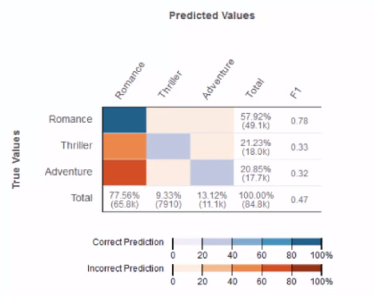
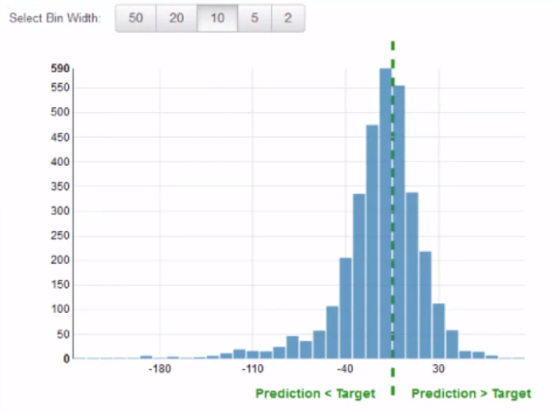

# Intro to the Principles and Practices of Amazon Machine Learning

<br/>

## Intro

### Course Intro

Topics covered:
- Types of problems that machine learning can solve
- Situations when you should use machine learning
- Machine Learning services offered by Amazon as part of AWS
- Steps required to frame a Machine Learning problem
- Data preparation for use with Amazon Machine Learning,
- Feature engineering
- Model creation in Amazon ML
- Model Evaluation/Improvement
- Prediction generation
  - Batch and real-time

**Intro to Machine Learning**

Machine Learning helps you to use historical data to make better business decisions. ML algorithms discover patterns
in data and construct a mathematical model, to represent the data, based on these discoveries. This model can be used
to make predictions based on probability.

Machine learning lets you make your decisions based on what is likely to happen, not on what is already happened. More
formally, machine learning is the ability of computer systems to gain knowledge from experience.

A machine learning system consists of the model created by a machine learning algorithm and data. To create the model,
you feed input data into statistical and data mining algorithms. In the past, building a machine learning solution
required specialized knowledge and custom software. These factors combine to increase the expense of implementing
these solutions. However, services like Amazon Machine Learning, another cloud-based offerings have open the door to
low-cost accessible solutions.

Machine Learning differs from traditional *business analytics* and the type of questions that it can answer. A typical
business analytic question concerns known information. For example, we might ask, what was the most common female baby
name in the United States during the 21st century. It may take some time to gather, process and query this data, but
in the end, you will find a *definite answer* to the question. Business analytics answer questions about past events.

On the other hand, *machine learning* models answer different types of questions including predictive analytics and
classification. Predictive analytics aim to find answers to business questions *based on probability*. For example, we
might ask, how likely is it that a newborn baby girl will be named Elsa in 2015.

However, you might want to be even more specific and include demographic data about the parents. A simple example
would be how likely is it that a newborn baby girl with middle-class suburban parents in their early 20s will be named
Elsa in 2015. Predictive analytics are used to analyze questions about expected or future events. Classification
questions use experience with previous examples to classify new examples. For instance, you can take collections of
animal pictures and divide them into three groups: cat, dog and other.

Then you can analyze these groups with a machine learning system to create a model that will be able to classify new
pictures into these groups. Classification problems work with probabilities just like predictive problems do. In this
case, a probability for each animal type is assigned to the new picture and the picture is categorized or labeled with
the type that has the highest probability.

To create machine learning systems capable of answering these types of questions, we follow three steps: gather data,
create model and perform predictions. Data can be gathered from our existing historical systems, or we can design a
new data capturing system to feed into our ML algorithm. We usually need to format and clean our data to make it ready
as a learning source. This includes removing incomplete records or filling in valid data for missing or incorrect
variables. We may also combine analyze or group variables in order to express relationships not readily apparent in the data such
as sorting ages into bins or creating a product that combines job title and income.

Next, we select an algorithm to analyze the data and produce a model. We train a model by feeding the input data into
the machine learning algorithm. In order to evaluate our model, we hold back some of the data where we already know
the correct answer. Once the model was created, we can use the held back data to evaluate the model's predictions
against the ground truth values. If our model does not perform well, we need to re-examine our data and algorithms and
then try again after making adjustments.

Finally when we have a model that performs well, we can use it to make predictions against new data. The remainder of
this series will focus on the specific steps necessary to build a model, and use it to make predictions using the
Machine Learning web service offered by Amazon.

### Problem Types

**Supervised and Unsupervised Learning**
- Supervised has answers in dataset (so we can compare our prediction to reality to assess accuracy) and
unsupervised does not

**Problem types**
1. Binary Classification
  - each conservation falls into one of 2 categories
  - we predict the probability of the observation falling into that category
2. Multiclass Classification
  - each observation can be categorized into many categories
  - We predict the probability that the observation falls into each of the categories
3. Regression
  - Predict continuous real number outputs

### When to use Machine Learning

**When to use Machine Learning**
- If you can quickly and robustly cover all possible cases with simple rules, then you don't necessarily need a
machine learning system
- If rules are too difficult to code then Machine Learning might be a good solution.
- Use ML when other solutions are too expensive.

**Common Use Cases:**
1. Fraud Detection
2. Recommendation Engine
3. Customer Churn Analysis
4. Target Marketing
5. Document Classification
6. Customer Outreach

### Framing Problems

Framing a machine learning problem for Amazon ML boils down to two considerations.
1. you must determine what you have observed in the past.
  - Without data to process you cannot find patterns that help make predictions so you either need historical data or
  plan to begin gathering data.
2. Then you have to decide which you would like to predict.
  - The data that you would like to predict is often called your label or target answer.
  - You might want to predict numeric (continuous) or categorical target requiring a regression or classification model
  respectively.

<br/>

## Working with Data Sources

### Acquiring Data

- Amazon ML only accepts CSV files
  - delimiter must be a `,`!!
- column one is the (target or label)
  - target must be 0 or 1
- each row is one observation
- each column is a feature (other than the target)
- row one as header

[AWS File Format Documentation](https://docs.aws.amazon.com/machine-learning/latest/dg/understanding-the-data-format-for-amazon-ml.html)

### CSV Cleanup

DEMO

<br/>

## Data Manipulation within Amazon Machine Learning

### Analyzing Data

**Gaining Insight into Data**
- EDA:
  - Visualizations and descriptive statistics help you understand your data
  - What you learn can help you make a better model

Amazon ML Provides:

| Analysis                | Numeric | Binary | Categorical | Text |
|-------------------------|---------|--------|-------------|------|
| Histogram               |    x    |   x    |     x       |      |
| Descriptive Statistics  |    x    |   x    |     x       |  x   |
| Correlation to Target   |    x    |   x    |     x       |  x   |

**Identify Issues**
- Does the data meet my expectations?
  - Class imbalance
- Missing values
- Invalid values
- Noise in data
  - Could be from features with low correlation to target

### Data Insight

DEMO

<br/>

## Working with Machine Learning Modules

### Machine Learning Algorithms

Amazon ML only has linear models.

**Linear Models**
- Features combined with Linear Equations
- Training to find Weights
- Loss Function
  - Evaluates predictions vs targets
  - Amazon ML *ONLY* has three loss functions--one per model type.
  - Binary classification: logistic loss function
  - Multiclass classification multinomial logistic loss function
  - Regression: squared loss function.
- Optimization Technique
  - Minimizes loss (error form loss function)
  - Amazon ML *ONLY* has Stochastic Gradient Descent (SGD)

**Model Parameters**
- Regularization - Helps prevent overfitting (reduces variance) by penalizing extreme weight values.
  - L1 (LASSO) - Reduces number of features considered by the model--by reducing low weighted values to zero.
  - L2 (Ridge) - Reduces weights
  - L2 is set by default with a value of 0.000001
- Number of Passes
  - Influences the behavior of SGD
  - Control the number of learning cycles the algorithm makes over the training data.
  - The number of passes is typically inversely related to the number of observations.
    - With enough data you might not need many passes.
  - Allows 1 to 100 passes
- Model Size
  - Amazon allows models to range in size between 100 kilobytes and 2 gigabytes.
  - 2 GB is a hard limit.

### Feature Processing

- Feature Engineering
  - Extract meaningful data from unhelpful
    - Ex. Timestamp might not help us but the hour of the day, day of week, or month might
- Missing or invalid data
  - Be careful when adding missing data
  - impute data
  - remove or change invalid data
- Binning
  - Convert continuous numerical value to categorical
- Text
  - n-grams. Supports up to 10 words per gram
  - Amazon will do this automatically

Feature processing provided by Amazon ML:


### Create a Model

DEMO

### Model Evaluation

**Evaluation Process**
- Train Test Split
- Trian Model
- Make Predictions
- Compare with Test Set

**Evaluation Metrics**
- Binary Classification
  - Model outputs the probability that the observation falls into a positive (or True) class.
  - The set threshold dictates if that predicted probability is translated to a positive or negative class prediction.
  - Those predictions fall into four categories: True Positive, True Negative, False Positive and False Negative.
    - *True Positive* -> Model predicts *Positive* and that is *True*
  - Accuracy measures the fraction of correct predictions -> ( TP + TN ) / ( TP + TN + FP + FN )
  - Precision is the ratio of TP to FP. -> TP / ( TP + FP )
  - Recall measures how many TP the model predicts as positives, -> TP / ( TP + FN )
  - F1 is the harmonic mean of precision and recall. -> F1 = 2 * ( Precision * Recall ) / ( Precision + Recall )
    - Might be a better measure if we seek a balance between precision and recall and there is an uneven class
    distribution.
  - Area Under the Curve (AUC), or really Area Under the ROC Curve (AUC ROC), measures the ability of a model to
  predict a higher score on TPs compared to TN.
    - It is independent of threshold, so AUC doesn't involve comparing false predictions to true predictions the way
    that other measures do.
    - The Area Under the Curve is literally the area under the ROC curve and the value shows the models performance
    at all thresholds.
    - The closer the ROC curve gets to the top left where TPR = 1 and FPR = 0 the better and the higher the AUC score
    will be.


- Multiclass Classification
  - Measures are calculated the same way as in binary classification where the correct class is considered
   a True and any other class is a False.  
  - Thresholds are not always used here.  Usually the prediction is based on the class with the highest probability.
  - In the plot below
    - we can see that he model easily (and overly) predict romance.
    - A perfect model would have dark blue boxes along the diagonal.



- Regression
  - Root Mean Squared Error (RMSE)
  - Mean Absolute Percentage Error (MAPE)
    - These metrics measure the distance from the predicted values to the actual values.
  - Below is a residual plot
    - The plot should be normally distributed and zero centered



### Evaluate a Model

DEMO

### Improve a Model

**Improvement Process**

- Evaluate Model
- Increase number of observations
  - More data
- Add more variables (features)
- Tune Model Parameters
  - more iterations may be needed before optimization reduced error to a minimum
- Repeat

**Model Fitness**

Since there are only Linear models in Amazon ML there are only 3 possible outcomes:
1. Underfitting
2. Balanced
3. Overfitting

**Underfitting**

*Underfit models have both low training and test scores.* If both the training and test scores are poor but close it
is a good indication that the model is underfit.  They do not fit the known data well enough to find the
underlying signal therefore won't work well on unknown data either.  

*Underfit models have high bias and low variance.*

- Add more variables (features) to the input data
  - This would decrease Bias and increase variance
- Add more cartesian products?
- Tweaking feature processing parameters (Feature engineering)
  - Increase n-gram size (essentially increasing features for an NLP model)
- Decrease model regularization
  - Regularization helps balance this bias variance trade-off.  Too much regularization can drop out or decrease the
  influence of too many features so that the model is only relying on the few that remain making it hard to find any
  nuance in the underlying signal.

**Overfitting**

*Overfit models have a high training score and a low test score.*  If a high delta between the test and training
scores is observed that is a good indication that the model is overfit.  These models fit the known data too well but
are not generalizable enough to unknown data.

*Overfit models have high variance and low bias.*

- Remove variables (features) from the input data
  - This would increase bias and decrease variance
- Discard cartesian products? or numeric bins
- Tweaking feature processing parameters (Feature engineering)
  - Decrease n-gram size (essentially decreasing features for an NLP model)
- Increase model regularization
  - Regularization helps balance this bias variance trade-off. Not enough regularization will not reduce the variance
  from the noisy data enough to make the model generalizable to new data.  In this case we want the model to be a
  little more biased to the features with the most predictive power.

<br/>

## Predictions

### Understanding Predictions

**Batch Predictions**
- Prediction results given as CSV in S3 bucket.
- Columns vary by model type but first row is always column headers.
- Output data in the same order as the input but with only the row_id from the input as well as
the prediction columns (detailed below).
- If there is an error for an observation the prediction columns for that row will be blank.
- Columns vary by model type

*Binary Batches:*
- Two columns:
  - `bestAnswer` - prediction label
  - `score` - probability of True class

*Multiclass Batches:*
- Many columns
  - `bestAnswer` - predicted label
  - One score column per class - probability that the observation the class

*Regression:*
- One column
  - `score` - numeric prediction

**Real-time Predictions**

- *JSON* data from the API endpoint
- One-in One-out
  - Provide single input observation and a response is given
  - You request a real time prediction by sending unlabeled data to an API endpoint in the form of JSON data.
  - Likewise, Amazon responds with JSON data containing the prediction.
- Low latency predictions
  - Designed to respond within 100MS
- Response varies by model type

*Binary Responses:*
- Label found in `predictedLabel`
- Raw score found in `predictedScores`

*Multiclass Responses:*
- Label found in `predictedLabel`
- Raw scores for each class found in `predictedScores`
  - with classes as the keys and scores as the values

*Regression Response:*
- Score found in `predictedValue`

### Batch Predictions

DEMO

### Real-Time Predictions

DEMO

Used boto3 to access API

```py
import config
import json
from boto3.session import Session

session = Session(aws_access_key=config.get_key_id(), aws_secret_access_key=config.get_secret_key())
ml = session.client('machinelearning', region_name='us-east-1')  # Only region with Amazon ML at the moment is us-east-1

with open('data/sample.json', 'r') as f:
  data = f.read()

customers = json.loads(data) # converting our training set from listed dict format converted to json

try:
  model_id = 'ml-VOWszMubVse' # obtained from Amazon ML in our model details
  model = ml.get_ml_model(MLModelId=model_id)
  endpoint = model.get('EndpointInfo').get('EndpointUrl')

  response = ml.predict(MLModelId=model_id, Record=customers[0], PredictEndpoint=endpoint)
  # With real-time we can only request one observation at a time so just grabbing the first for this example.
  prediction = response.get('Prediction')
  label = prediction.get('predictedLabel')

  # For a real app we would do something with the prediction but for this example we will just print it.
  print(json.dumps(prediction, indent=2))
  print("The model predicts this customer is likely to say {}".format('yes' if label == 1 else 'no'))

except Exception as e:
  print(e)
  raise Exception
```

---