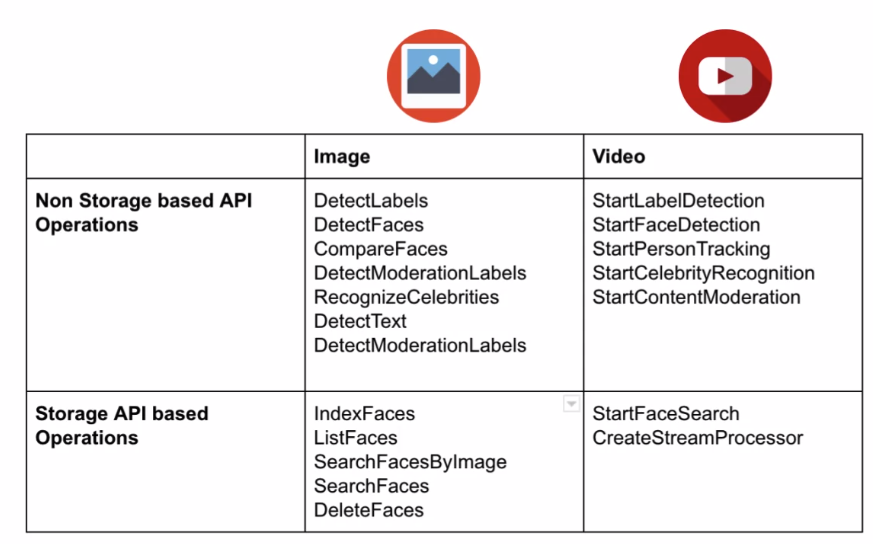
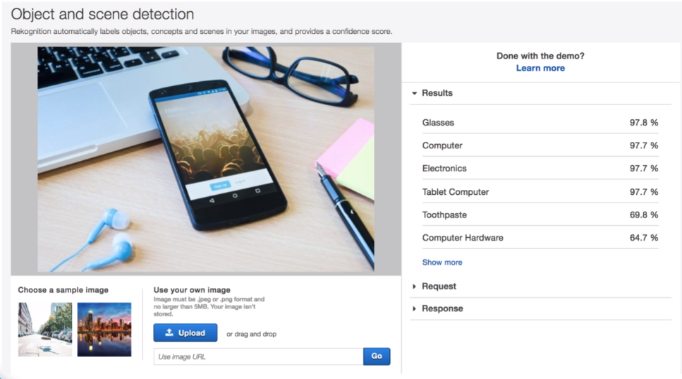
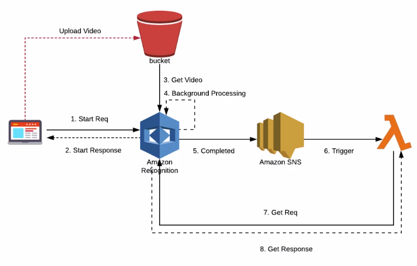
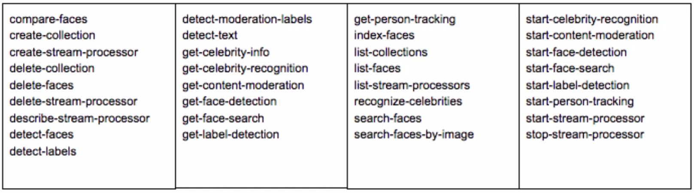
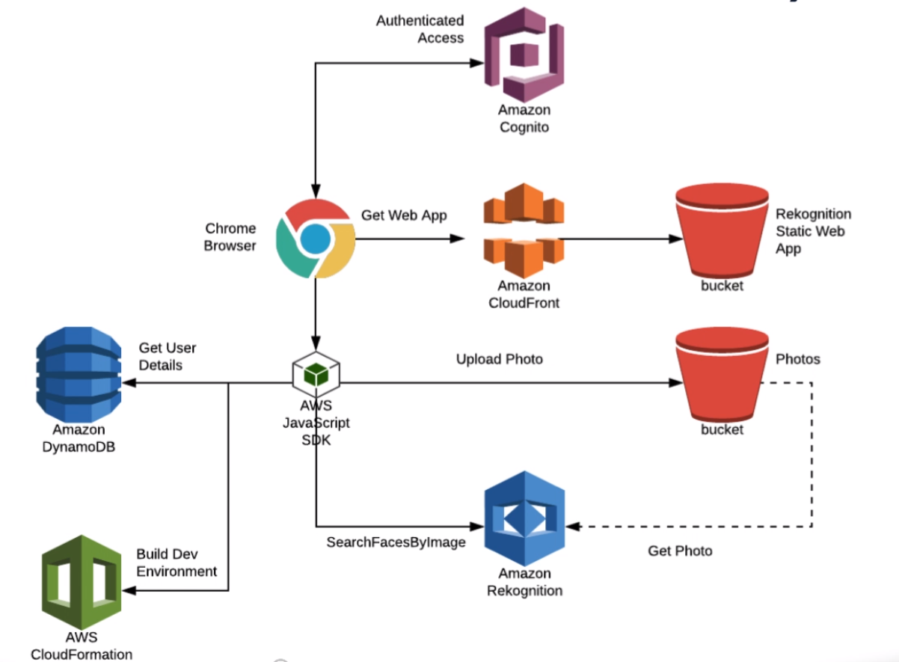
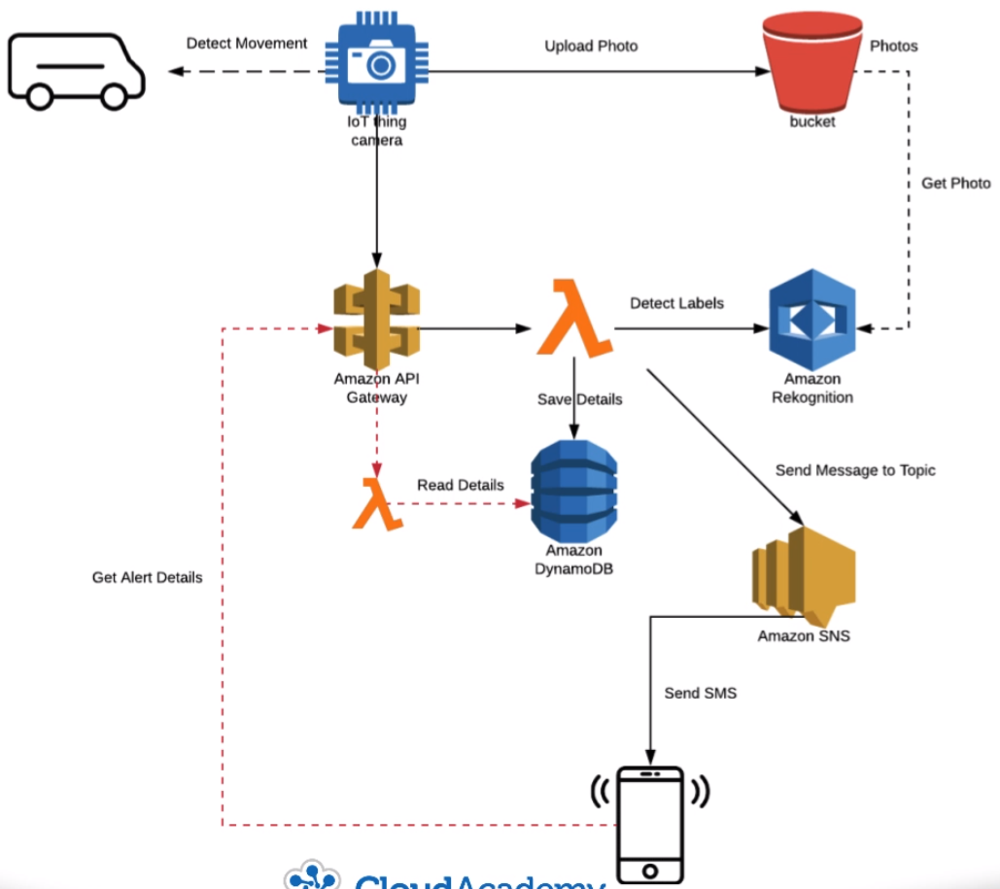
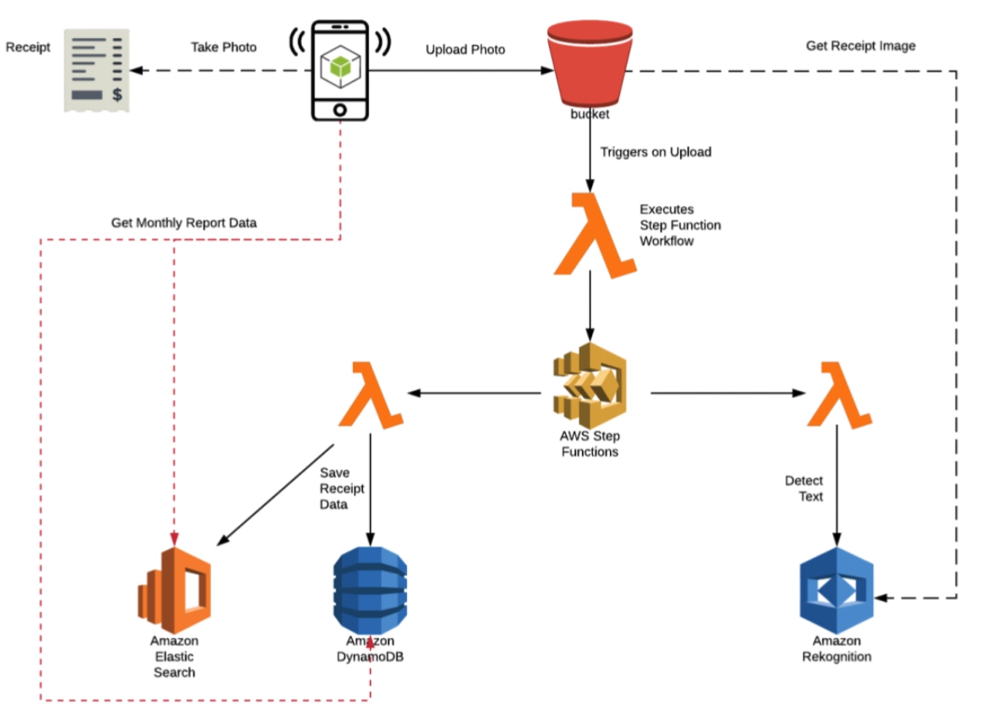
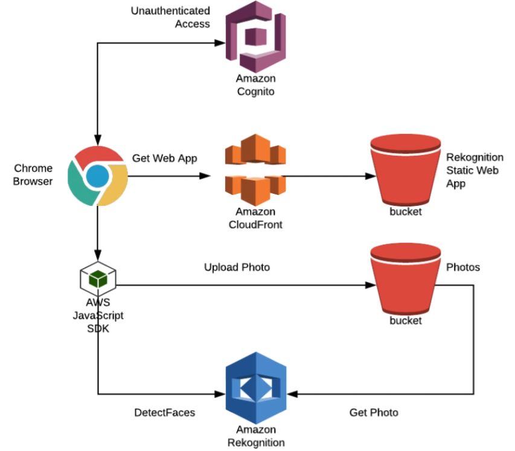
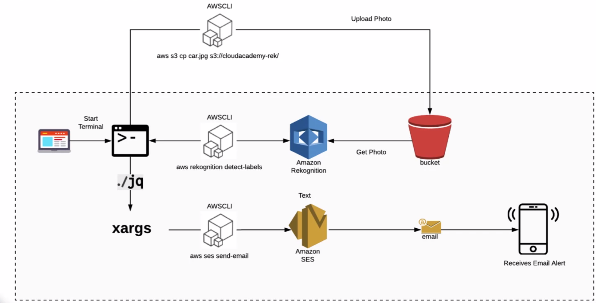

# Intro to Amazon Rekognition

<br/>

## Course Intro

**Learning Objectives**

- Understand what Amazon Rekognition is and what it offers
- Understand the benefits of using the Amazon Rekognition service
- Understand how to use Amazon Rekognition APIs to process both images and videos
- Understand how to use Collections and the storage based API set
- Understand business use cases and scenarios that can benefit from using the Amazon Rekognition service
- Be able to architect and integrate Amazon Rekognition into your own applications

<br/>

## Amazon Rekognition

Amazon Rekognition is a service that enables you to quickly and easily integrate computer version features directly
into your own applications.

At its core, the rekogntion service provides an **API** to utilize a **pre-trained Convolutional Neural Network (CNN)**
that you submit images and or videos to perform a specific analysis on the media. The analysis can be anything from
detecting faces with an image to extracting labels or features from a video.

Under the hood, Amazon Rekognition uses deep learning technology. The service employs a CNN, having been pre-trained on
a massive amount of labeled data. Amazon takes ownership to build and train the underlying models--which are both time
consuming and computationally expensive tasks.The end result enables you to leverage the computer version features that
Amazon Rekognition provides, without having to build your own deep learning models, nor having to consider or
understand the complexities involved in operating a GPU enable cluster to build them.

Amazon Rekognition is separated into image and video processing, each with their own API. The main difference between
these two sets of APIs is that the image processing APIs follow a synchronize pattern, where has the video processing
 APIs follow an asynchronize pattern for calling.

Additionally, the rekognition API operations are grouped into those that are considered storage based and those that
aren't. The storage based APIs support persisting certain facial features in server side containers known as
collections.

**Non Storage Based & Storage Based APIs**



<br/>

## Image Processing - API

**Image Processing APIs**

- Facial Analysis
- Face Comparison
- Celebrity Detection
- Text Extraction
- Content Moderation
- Feature Extraction

**Facial Analysis**

Facial Analysis provides the capability to perform an analysis on an image to detect the position of faces and facial
features within.

The detect faces API action will return a list of the 100 largest faces detected within an image. For each detected
face within the list, the facial composition is also provided as a set of attributes.

Two ways to submit images:
1. The most common approach is to store the image file within an S3 bucket and then provide the S3 location of the
image to the recognition service.
2. base64-encode the image data and supply this as an input parameter to the API operation.

Assuming a face is seen within the image then the expected response would be returned with the location or bounding
box of the face within the image as well as a set of attributes determining the location of the eyes, nose, and mouth,
etc. Additionally, the response will contain information regarding the emotional state of the face. For example, are
they happy, sad, or angry? The response will also return whether the person is male or female.

Other features can be detected and returned such as to whether the user has a beard or mustache or is wearing
sunglasses or not. For each of these detections, a confidence score is provided.

*Facial Analysis API Request Example:*

```JSON
{
  "Attributes": ["All"],
  "Image": {
    "S3Object": {
      "Bucket": "cloudacademy-detectfaces",
      "Name": "john.png"
    }
  }
}
```

*Facial Analysis API Response Example:*

```JSON
{
  "FaceDetails": [
    {
      "BoundingBox": {
        "Width": 0.239939849275834578934,
        "Height": 0.417982437893744239322,
        "Left": 0.374737958947502783043,
        "Top": 0.262673427649372893749
      },
      "AgeRange": {
        "Low": 20,
        "High": 38
      },
      "Smile": {
        "Value": true,
        "Confidence": 97.4782374892374928
      },
      "Eyeglasses": {
        "Value": false,
        "Confidence": 99.9399328442308932
      },
      "Sunglasses": {
        "Value": false,
        "Confidence": 99.9399328442308932
      },
      "Gender": {
        "Value": "Male",
        "Confidence": 99.9399328442308932
      },
      ...
    }
  ]
}
```

**Face Comparison**

The Face Comparison service provides the ability to recognize and compare faces--in other words provide facial
comparison between two faces. Is the person in the first image the same as the person in second image? The compare
faces API operation will return an ordered list of the 100 largest faces detected within an image and for which match
closest in similarity to the target image. The similarity threshold can be applied to the request to control the
behavior of the matching algorithm. For each matching face within the returned list, the facial composition is also
provided as a set of attributes.

Additionally, a list of non matching faces found within the submitted image is also returned. Both the source and
targeted images are submitted to the compare faces API service.

Two ways to submit images:
1. Store the image files within an S3 bucket and then provide the S3 location of the source and target
2. base64-encode the image data and supply this as an input parameter to the API operation.

*Face Comparison APU Request Example*

images both target and source are provided in-line using base64-encoding

```JSON
{
  "SimilarityThreshold": number,
  "SourceImage": {
    "Bytes": blob
  },
  "TargetImage": {
    "Bytes": blob
  }
}
```

*Face Comparison APU Response Example*

This partial response would have been returned for the previous request and confirms that the person in the source
and target photos are of the same person. Additionally, a confidence level of similarities provided together with the
bounding box attributes of where the source face was detected.

```JSON
{
  "SourceImageFace": {
      "BoundingBox": {
        "Width": 0.239939849275834578934,
        "Height": 0.417982437893744239322,
        "Left": 0.374737958947502783043,
        "Top": 0.262673427649372893749
      },
      "Confidence": 99.992747347278368
    },
    "FaceMatches": [
      {
        "Similarity": 93,
        "Face": {
          "BoundingBox": {
            "Width": 0.239939849275834578934,
            "Height": 0.417982437893744239322,
            "Left": 0.374737958947502783043,
            "Top": 0.262673427649372893749
        },
        "Confidence": 99.992747347278368,
        "Landmarks": [
          {
            "Type": "eyeLeft",
            "X": 0.5512989547348989,
            "Y": 0.3233485749379355
          },
          ...
        ]
      }
    }
  ]
}
```

**Celebrity Detection**

The recognized celebrities API operation will return the 100 largest faces detected within an image. The 100 largest
faces are divided into those with a detected face is determined to be that of a known celebrity and then the remainder
of those which are determined to not be of any known celebrity. For each returned celebrity matching face, the name of
the celebrity is provided, an ID, and a list of URLs for which extra information can be consulted for the celebrity in
question.

Two ways to submit images:
1. Store the image files within an S3 bucket and then provide the S3 location of the source and target
2. base64-encode the image data and supply this as an input parameter to the API operation.

*Celebrity Detection API Response Example*

```JSON
{
  "CelebrityFaces": [
    {
      "Urls": [
        "www.imdb.com/name/nm1682433"
      ],
      "Name": "Barack Obama",
      "Id": "3R3sg9u",
      "Face": {
        "BoundingBox": {
          "Width": 0.239939849275834578934,
          "Height": 0.417982437893744239322,
          "Left": 0.374737958947502783043,
          "Top": 0.262673427649372893749
        },
        "Confidence": 99.992747347278368,
        "Landmarks": [
          {
            "Type": "eyeLeft",
            "X": 0.5512989547348989,
            "Y": 0.3233485749379355
          },
          {
            "Type": "eyeRight",
            "X": 0.89412989547348989,
            "Y": 0.3433485749379355
          },
          ...
        ]        
      }
    }
  ]
}
```

**Text Extraction**

Text Extraction provides the ability to detect and return text found within an image. The detect text API operation
allows you, for example, to extract the text used with a name marketing brochure or the text from an image of a
business receipt or the flight numbers listed within an image of an arrivals board at an airport.

Depending on how the layout of the text within the image occurs, a list of single words, and or lines of equally spaced
words is returned.

Two ways to submit images:
1. Store the image files within an S3 bucket and then provide the S3 location of the source and target
2. base64-encode the image data and supply this as an input parameter to the API operation.

*Text Extraction API Response Example*
partial response would have been returned for the previous request and provides the text extracted from within the
sample driver's license. The details extracted from the driver include their name, address, date of birth, etc. For
each detected single word, and or line of words, the geometry and bounding box is provided as to the location of the
text that was detected within the image.

```JSON
{
  "TextDetections": [
    {
      "Confidence": 94.47832643782749823,
      "DetectedText": "Drivers License",
      "Geometry": {
        "BoundingBox": {
          "Width": 0.239939849275834578934,
          "Height": 0.417982437893744239322,
          "Left": 0.374737958947502783043,
          "Top": 0.262673427649372893749
        },
        "Polygon": [
          {
            "X": 0.5512989547348989,
            "Y": 0.3233485749379355
          },
          {
            "X": 0.89412989547348989,
            "Y": 0.3433485749379355
          },
          ...
        ]        
      }
    }
  ]
}
```

**Content Moderation**

Content Moderation API provides ability to perform content moderation to determine whether the image in question
contains content that could be considered inappropriate.

The Detect Moderation labels API operation allows you to submit an image for content moderation analysis. The operation
will in turn respond with labels representing those features within the image that are deemed to be objectionable.
The moderation labels returned follow a two level hierarchy. At the top level there are two possible levels, explicit
nudity and suggestive. Beneath this level are more granule labels.

Two ways to submit images:
1. Store the image files within an S3 bucket and then provide the S3 location of the source and target
2. base64-encode the image data and supply this as an input parameter to the API operation.

*Content Moderation API Response Example*

The following partial response would have been returned for the previous request (an image containing a person in
swimwear) and provides the detected moderation labels. Each moderation label provided has a confidence score providing
 a degree of certainty about the label.

```JSON
{
  "ModerationLabels": [
    {
      "Confidence": 87.42389749823742,
      "Name": "Suggestive",
      "ParentName": ""
    },
    {
      "Confidence": 87.42367846239324,
      "Name": "Female Swimwear Or Underwear",
      "ParentName": "Suggestive"  
    }
  ]
}
```

**Feature Extraction**

Feature Extraction detects interesting features exist within an image. The detect labels API operation is concerned
with the discovering features and providing them back as labels with the confidence number. For example, using detect
labels on the images seen here, results in the detection of glasses, a computer, and a electronics as the top three
labels based on confidence. Overall, 13 features were detected and returned.



Two ways to submit images:
1. Store the image files within an S3 bucket and then provide the S3 location of the source and target
2. base64-encode the image data and supply this as an input parameter to the API operation.

*Feature Extraction API Response Example*

The following response would have been returned for the previous request and provides the detected labels. Each feature
label provided has a confidence score providing a degree of certainty.

```JSON
{
  "Labels": [
    {
      "Name": "Glasses",
      "Confidence": 97.882263
    },
    {
      "Name": "Computer",
      "Confidence": 97.7576
    },
    {
      "Name": "Electronics",
      "Confidence": 97.7576
    },
    {
      "Name": "Tablet Computer",
      "Confidence": 97.7576
    },
    {
      "Name": "Toothpaste",
      "Confidence": 69.8904
    },
    {
      "Name": "Computer Hardware",
      "Confidence": 64.7136
    },
    ...
  ]
}
```

<br/>

## Video Processing - API

The Rekognition Video Service provides API operations specific to processing videos and video streams.

**Video Processing APIs**

| Detection          | Start Operation           | Get Operation           |
|--------------------|---------------------------|-------------------------|
| People             | StartPersonTracking       | GetPersonTracking       |
| Faces              | StartFaceDetection        | GetFaceDetection        |
| Labels             | StartLabelDetection       | GetLabelDetection       |
| Celebrities        | StartCelebrityRecognition | GetCelebrityRecognition |
| Content Moderation | StartContentModeration    | GetContentModeration    |

Processing video files imposes extra demand on the backend compute resource and therefore several of the Rekognition
Video API operations are provided in asynchronous form. These async operations appear together with other operations
allowing you to retrieve the async processing results.

The Rekognition Video Service adopts an async model for performing video analysis. The general pattern is to make a
call to the relevant start API operation. This call will kick off the requested processing and return control back
immediately to the caller. The Rekognition service will perform the requested processing in the background and later
upon completion post a completion status to an SNS topic. The completion status can then trigger a lambda function
which in turn can trigger a separate call to retrieve the processing results by using the paired get API operation.



The same async pattern is used for the people, faces, labels, celebrities, and content moderation detection functions.
Every start operation returns a job ID which is an identifier for the job question. When performing the paired get
operation, you pass in the job ID to retrieve the video processing results.

With the video processing APIs you always host the **video** to be processed as a file **in an S3 bucket**. You then
supply the S3 file location as an input parameter to the respective start operation.

**Person Tracking**

Rekognition Video Service can be used to track people within a video.

*StartPersonTracking*

```JSON
{
  "ClientRequestToken": "string",
  "JobTag": "string",
  "NotificationChannel": {
    "RoleArn": "string",
    "SNSTopicArn": "string"
  },
  "Video": {
    "S3Object": {
      "Bucket": "string",
      "Name": "string",
      "Version": "string"
    }
  }
}
```

*GetPersonTracking*

```JSON
{
  "JobId": "string",
  "MaxResults": number,
  "NextToken": "string",
  "SortBy": "string"
}
```

The GetPersonTracking API response contains typical information , according to the provided JobId, such as the bounding
box and facial features but also additionally tags each person detection with the timestamp of when the detection
occurred within the video in milliseconds from the start of the video.

**Face Detection**

Rekognition Video Service can be used to track faces within a video.

*StartFaceDetection*

```JSON
{
  "ClientRequestToken": "string",
  "FaceAttributes": "string",
  "JobTag": "string",
  "NotificationChannel": {
    "RoleArn": "string",
    "SNSTopicArn": "string"
  },
  "Video": {
    "S3Object": {
      "Bucket": "string",
      "Name": "string",
      "Version": "string"
    }
  }
}
```

*GetFaceDetection*

```JSON
{
  "JobId": "string",
  "MaxResults": number,
  "NextToken": "string"
}
```

The GetFaceDetection API response contains typical information, according to the provided JobId, such as the bounding
box and facial features but also additionally tags each face detection with a timestamp of when the detection occurred
within the video in milliseconds from the start of the video.

**Labels**

Rekognition Video Service can be used to object and feature detection within a video--such as finding cars, buildings,
trees etc.

*StartLabelDetection*

```JSON
{
  "ClientRequestToken": "string",
  "JobTag": "string",
  "MinConfidence": number,
  "NotificationChannel": {
    "RoleArn": "string",
    "SNSTopicArn": "string"
  },
  "Video": {
    "S3Object": {
      "Bucket": "string",
      "Name": "string",
      "Version": "string"
    }
  }
}
```

*GetLabelTracking*

```JSON
{
  "JobId": "string",
  "MaxResults": number,
  "NextToken": "string",
  "SortBy": "string"
}
```

The GetLabelDetection API response, according to the provided JobId, contains the label name and confidence value but
also additionally tags each object and feature label detection with a timestamp of when the detection occurred within
the video in milliseconds from the start of the video.

**Celebrities**

Rekognition Video Service can be used to detect celebrities within a video--such as famous movie actors and/or
politicians etc.

*StartCelebrityRecognition*

```JSON
{
  "ClientRequestToken": "string",
  "JobTag": "string",
  "MinConfidence": number,
  "NotificationChannel": {
    "RoleArn": "string",
    "SNSTopicArn": "string"
  },
  "Video": {
    "S3Object": {
      "Bucket": "string",
      "Name": "string",
      "Version": "string"
    }
  }
}
```

*GetCelebrityRecognition*

```JSON
{
  "JobId": "string",
  "MaxResults": number,
  "NextToken": "string",
  "SortBy": "string"
}
```

The GetCelebrityRecognition API response contains typical information, according to the provided JobId, such the
bounding box and facial features but also additionally tags each celebrity detection with a timestamp of when the
detection occurred within the video in milliseconds from the start of the video.

**Content Moderation**

Rekognition Video Service can be used to perform content moderation within a video.

*StartContentModeration*

```JSON
{
  "ClientRequestToken": "string",
  "JobTag": "string",
  "MinConfidence": number,
  "NotificationChannel": {
    "RoleArn": "string",
    "SNSTopicArn": "string"
  },
  "Video": {
    "S3Object": {
      "Bucket": "string",
      "Name": "string",
      "Version": "string"
    }
  }
}
```

*GetContentModeration*

```JSON
{
  "JobId": "string",
  "MaxResults": number,
  "NextToken": "string",
  "SortBy": "string"
}
```

The GetContentModeration API response, according to the provided JobId, contains moderation label and confidence value
but also additionally tags each content moderation detection with the timestamp of when the detection occurred within
the video in milliseconds from the start of the video.

<br/>

## Collections - Storage Based API Operations

The Rekognition service allows you to create service side containers called *collections*. Within these collections
you can **store faces** or, more explicitly, a **vector of facial features**, one vector with multiple facial attributes
per face.

An example where you might use collections would be authenticating users by facial recognition. You would create and
populate a collection with a scene of faces, one per person within your company. When each employee arrives at work, a
capture of their face is taken and a search is done within the collection to find a match. Depending on outcome, match
or not, the employee is allowed into the office or not.

**Creating Collections**

Creating a collection is easy, you simply call the *CreateCollection* API operation and provide a string as an
identifier for the new collection. Additionally, you can also call the *list collections* and/or *delete collection* to
*manage the collections* you have already created.

*CreateCollection*

```JSON
{
  "CollectionId": "string"
}
```

You can set up multiple collections. Each collection is later referenced by the `CollectionId` assigned at time of
creation.

**Adding to Collections**

To add faces to the collection, you call the *IndexFaces* operation on an image containing faces. Each
detected face within the image will result in the facial features and metadata being stored within a vector which in
itself is added to the collection.

When you call the *IndexFaces* operation, you pass in the *CollectionId* for the specific collection you want to add
into. You can call the IndexFaces operation on *multiple different image files* with the same CollectionID. When doing
so, make sure to specify a unique, external image ID value as this will help later on when performing searches on a
collection and knowing what image a matching face was originally from. As expected, there are also *list* and *delete*
operations `ListFaces` and `DeleteFaces`, respectively, that allow you to *manage the faces within a particular
collection*.

**Searching Collections**

Two approaches:
1. Search by an image
2. Search by FaceID

*SearchFacesByImage Request Example*

```JSON
{
  "Collection": "string",
  "FaceMatchThreshold": number,
  "Image": {
    "Bytes": blob,
    "S3Object": {
      "Bucket": "string",
      "Name": "string",
      "Version": "string"
    }
  },
  "MaxFaces": number
}
```

Given an input image containing a face, you can search an existing collection for any matching faces. To perform this
type of search, you make a call to the *SearchFacesByImage* API operation passing in the *CollectionId* and an image
either by S3 location or Base64 encoding.

The matching faces within the collection will be returned in this format.

*SearchFacesByImage Response Example*

```JSON
{
  "FaceMatches": [
    {
      "Face": {
        "BoundingBox": {
          "Height": number,
          "Width": number,
          "Top": number,
          "Left": number
        },
        "Confidence": number,
        "ExternalImageId": "string",
        "FaceId": "string",
        "ImageId": "string"
      },
      "Similarity": number
    }
  ],
  "FaceModelVersion": "string",
  "SearchedFaceBoundingBox": {
    "Height": number,
    "Width": number,
    "Top": number,
    "Left": number
  },
  "SearchedFaceConfidence": number
}
```

Special mention to the *ExternalImageId* attribute tracked on each and every matching face object, this is an attribute
that you assign when calling the *IndexFaces* operation and can be used to determine which image the matching face
belongs to.

<br/>

## Console, SDKs and CLI

**AWS Management Console**

**SDKs**

Amazon provides SDK APIs for all common programming languages.
  - JavaScript, Python, PHP, .NET, Ruby, Java, Go, Node.js, C++

*JavaScript Example*

In the sample code below, the AWS JavaScript SDK si used to interact with both the S3 and the Rekognition services.
The code first uploads an image into a named S3 bucket. If the transfer completes successfully, the Rekognition service
is used to detect faces within the image.

```JavaScript
s3.upload(params, function(err, data) {
    var params = {
      Image: {
        S3Object: {
          Bucket: bucketName,
          Name: fileName
        }
      }
    };

var rek = new AWS.Rekognition();
rek.detectFaces(params, function(err, data) {
    if (err)
      console.log(err, err.stack);
    else {
      result.innerHTML = data;
    }
  });
});
```

**AWS CLI**

The AWS CLI supports all recognition API operations (below).



*AWS CLI Example*

In this scenario, a video camera is set up to detect movement in front of a home. Whenever movement is detected, a
picture is taken and uploaded into an S3 bucket. We then invoke the Rekognition `detect-labels` command using the AWS
CLI to determine if someone is present. If confirmed, an email is sent to alert the homeowner.

```bash
aws rekognition detect-labels --image "S3Object={Bucket=cloudacademy-rek, Name=frontdoor.jpg}" --region us-east-1 |
jq -c 'Labels[] | select(.Name | contains("People","Person","Human"))' | paste -sd, - | ./sendmail.sh bob123@gmail.com
```

First call the `detect-labels` command to perform feature extraction on the picture stored in S3. The response is then
filtered searching for labels of interest--people, person and/or human.  If any of these labels exist, an email is sent
by piping the filtered output into a Bash script that then creates and sends an email.

<br/>

## Use Cases and Scenarios

**Use Case 1 - Authentication Entry****

A static web app is served up from *CloudFront* and *S3*. The web app allows a user to take a picture of themselves
using the HTML5 video capability. The web app uses the AWS *JavaScript SDK* and utilizes *Cognito* for authentication.

The picture is uploaded into *S3* and then *Rekognition* is used to determine whether the user exists within your
*collection* or not. If a match is found, the user's details are retrieved from a *DynamoDB* database. The user is
allowed into the office, at the same time, the user's development environment is started up using the *CloudFormation*
service.



**Use Case 2 - Motion Sensor**

An IoT camera is used to detect movement. If movement is detected, an image is taken and uploaded into *S3*. A call is
then made via *API gateway* to a backend *lambda function*. The *lambda function* invokes *Rekognition* to perform
*object* and *feature extraction* to determine what caused the detected motion. Based on results returned from the
*Rekognition* service, the *lambda function* will write a message to an *SNS* topic. An SMS message will then be sent
to a subscribing mobile phone to alert the user. The user can then dial back into the service.



**Use Case 3 - Expenditure Reporting**

A mobile app that allows users to take photos of purchase receipts. The photos are uploaded into *S3*. This triggers a
*lambda function* which in turn kicks off a state function state machine. The state machine orchestrates the workflow
where *Rekognition* is used to perform *text extraction* on the purchase receipt. The extracted text is then filtered,
formatted and recorded into both *DynamoDB* and *Elastic Search* databases. Users can then perform reporting on the
monthly expenditure patterns etc. via their mobile app which dials back into the *DynamoD*B and *Elastic Search*
databases.



<br/>

## Demonstrations

The code for these demonstrations is located in
[CloudAcademy's machine learning GitHub repo](https://github.com/cloudacademy/aws-machinelearning).

**Facial Analysis Web App**

Repo Directory: `aws-machinelearning/rekognition/demo_sdk`

We will deploy our static web app files into an *S3* bucket then set up a *CloudFront* distribution in front of it.
Then ee'll configure Amazon *Cognito* and create an identity pool. Within this identity pool, we'll enable access to
unauthenticated identities. As this is an example, we'll bypass setting up authentication--unauthenticated identities
will be good enough for this example. We'll then set up *IAM policies* or permissions that will allow this user to
upload files to an *S3* bucket and then call the *Rekognition* service to perform `DetectFaces` operation on it. It
leverages the AWS *JavaScript* SDK to integrate with both the *S3* servers for uploading photos and the *Rekognition*
service for performing facial analysis on those photos.

*Architecture*



**AWSCLI Feature Extraction**

Repo Directory: `aws-machinelearning/rekognition/demo_cli`

We will create a command line script, using the AWSCLI, that performs object and feature detection with recognition.

The design of this demonstration is centered on using the AWSCLI, which is a command line interface that Amazon
provides, to allow you to integrate and operate for all of the AWS services.

We'll use the *AWSCLI*, to upload an image of a car into an *S3* bucket. The main part of our demonstration involves
using the *AWSCLI* to make a request of *Rekognition* to perform *object and feature detection* on the car image
uploaded into *S3*. We'll take the standard output received when we call the AWS *Rekognition* detect labels command
and pipe it through a number of utilities. Resulting, finally, in an email being generated and sent via *SES*--the
Amazon Simple Email Service.

*Architecture*



---
