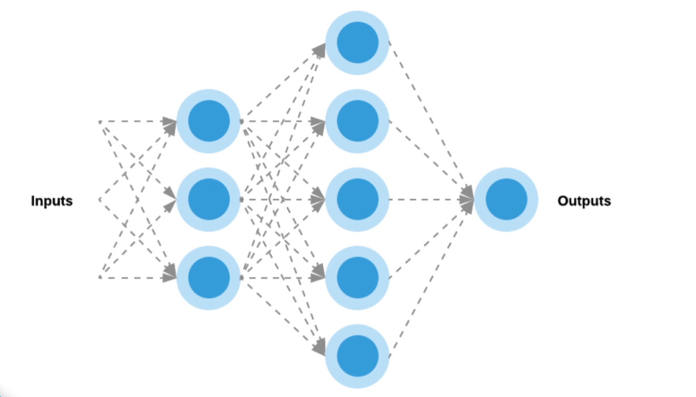

# Intro to Machine Learning Concepts

 

### Course Intro

**Learning Objectives**
- Understand Machine Learning Benefits
- Understand Business use Cases
- Understand Different Machine Learning Training Techniques
- Understand Supervised and Unsupervised Training
- Understand Classification and Regression
- Familiarity with popular Machine Learning Algorithms
- Understanding Basic Deep Learning Principles

 

## Basic Concepts

**Machine Learning Definition**
- Field of study that allows computers to learn without being explicitly programmed.

**Industry Applications**
- Recommendation Engines
- Demand Forecasting
- Computer Vision
- Fraud Detection
- Medical Diagnosis
- Stock Market Forecasting
- Sentiment Analysis

**Terminology**
*Features* - each item or piece of data is described by a number of features.
*Labels* - again, each item or piece of data may be tagged with a known classification result.
*Instances* - an instance (sample/observation) is an item within the dataset, each instance will have a set of features,
 and may also have a label assigned to it.

**Machine Learning Phases**
1. Dataset Collection
2. Featurization
3. Model Training
4. Model Testing
  - Repeat 3 and 4 until model produces useful and accurate results
5. Model Deployment

**Machine Learning Types**
1. *Supervised* - Create predictive model using features and labels (we have the answers which we are trying to predict)
  - Classification
  - Regression
2. *Unsupervised* - group and discover patterns based on only features (we DO NOT have the answers which we are trying to predict)

 

## Supervised Learning

*Supervised Learning* involves using some sort of algorithm to analyze and learn from past observations, enabling you
to then predict future events. The goal of Supervised Learning is to come up with, or infer, an approximate mapping
*function* that represents the data, can be applied to one or more input variables, and produce an output variable
or result. The training process involves taking a supervised training data set with known features and labels
(continuous or categorical). The goal is to build a machine learning model that can accurately predict future outcomes.

**Train Test Split**
Set aside a portion of the dataset for training and the rest for testing.

**Classification vs Regression**
A Supervised Learning algorithm analyzes the training data, and produces a mapping function, which is called a
*classifier* if the output is *discrete*, or a *regression function* if the output is *continuous*.

**Some Supervised Learning Algorithms**
1. Classification
  - Logistic Regression
  - Support Vector Machines
  - Naive Bayes
  - K Nearest Neighbors
  - Decision Trees
  - Random Forest
2. Regression
  - Linear Regression
  - Decision Trees
  - Random Forest

**Supervised Training Process**
- The training phase requires you to perform
- Feature extraction to establish feature vectors.
- The chosen supervised training algorithm takes both the feature vectors and labels and builds a predictive model.
- Train test split
- The predictive model is then tested for accuracy.
  - Find train and test accuracy
- Deploy the model and begin to predicting on new data.

 

## Unsupervised Learning

Unlabeled data (No answers)

*Clustering* is concerned with finding similar instances.
*Anomaly detection* is concerned with finding unusual instances, and
*Association discovery* is concerned with finding feature rules that may exist between and across observations.

**Some Unsupervised Learning Algorithms**
1. Clustering
  - K Means
  - Heirarchical
  - Gaussian Mixture

  **Unsupervised Training Process**
  - The training phase requires you to perform
  - Feature extraction to establish feature vectors.
  - The chosen unsupervised training algorithm takes both the feature vectors
  - Train test split
  - The predictive model is then tested for inter/intra cluster distance
    - Find train and test accuracy
  - Deploy the model and begin to predicting on new data.

**Use Cases**
- Customer similarities
- Fraud detection
- Purchasing patterns

 

## Machine Learning Algorithms

**Considerations when Choosing an algorithm**
- Size, quality and nature of the data.
- Available computational time
- Urgency of the task
- Data analysis requirements

More often than not, you will need to experiment with your data to determine which algorithm gives the best results.

**Linear Regression**

- Supervised Learning
- Regression Algorithm
- `y = mx+b`
  - `m` = slope (gradient)
  - `b` = y intercept
  - Basic calculus applied to the data set in question to the values of `m`, the gradient, and `c`, the Y axis
    intercept.
- Simple or Multiple Linear Regression
  - Simple - only one independent variable is used
  - Multiple - multiple independent variables are defined
    - `f(x) = m1 * x1 + m2 * x2 + ... + b`

**Logistic Regression**

- Supervised Learning
- Classification Algorithm
- S-curve
  - Sigmoid Function - Transforms the linear function to bound results between 0 and 1 representing the probability
  of the outcome.  
- Binary Classification
  - can be used for multi class classification as well

**Decision Trees**

- Supervise Learning
- Classification or Regression
- Easy to interpret

**Random Forest**

- Supervised Learning
- Classification or Regression Algorithm
- Collection of Decision trees
  -  Each tree predicts an outcome
- The Majority prediction wins
- Each tree is created using a different, randomly selected, portions of the training data set.

**Naive Bayes**

Bayes Theorem:
`P(c|x) = ( P(x|c) * P(c) ) / P(x)`

The conditional probability of c given x is equal to the conditional probability of x given c times the prior
probability of c divided by the total probability of x.

- Supervised Learning
- Classification Algorithm
- Based on Bayes Theorem and probability

Useful for text classification.

Naive Bayes Formula:

` P(Class A| F1, F2) = ( P(F1|Class A) * P(F2|Class A) * P(Class A) ) / ( P(F1) * P(F2) )`

The probability of the text being of Class A given it contains features 1 and 2 (in this case that usually means it
contains words or sequence 1 and 2) equals the probability that feature 1 is in Class A times the probability that
feature 2 is in Class A times the probability that a text is of class A all divided by the product of probability of
feature 1 and 2 appearing in a text (or document).

**Support Vector Machine (SVM)**

- Supervised Learning
- Classification Algorithm

With SVM, you take a plot of data points in n-dimensional space--where n is the number of features. The algorithm
attempts to find a line (called a support vector) that separates and classifies the data points in such a way that the
chosen line maximizes the separation of the nearest data points within each class to the line itself. The SVM lines
are known as classifiers.

**K-Nearest Neighbors kNN**

- Supervised Learning
- Classification or Regression Algorithm
- Finds the K (given number) of neighbors that are closest to the given observation based on a given distance metric.
- Can be used to impute or predict the value or class of an observation based on the most similar observations in
the dataset.
  - With regression you can take the average of the neighbors as the value
  - or, with classification you can take the most common label of the neighbors as the observation label.

**K-Means Clustering**

- Unsupervised Learning
- Classification Algorithm

Finds the K (given number of) clusters in a dataset by comparing the distance between each observation.  The
observations are grouped in such a way to minimize the intra cluster distance and maximize the inter cluster distance.  
This algorithm is non-deterministic meaning that it the outcome may vary each time.

 

## Deep Learning and Deep Neural Networks

**Deep Learning**

Algorithms are known as Artificial neural networks. At its core a neural network is made up of multiple layers of
connected neurons which contain an activation function that transforms inputs from the previous layer, and produces an
output value passed along to the neurons in the next layer.

**Neurons**

A neuron takes several weighted inputs--which are randomly assigned when the neural network in initialized. The neuron
performs a summing function across all the individual products of the inputs X, and weights, W. The summing function
result is then passed through an activation function. To produce an output, Y.

**Layers**

A deep neural network has hidden layers and the more hidden layers the 'deeper' the network is.  The nodes of the
input layer are passive--meaning they do not modify the data. While, the nodes of the hidden, and output layers are
considered active.--meaning they modify the data as per the summing, and activation functions in each neuron.

**Activation Functions**

The role of the activation function is to add non-linearity into the system--so complex problems can be solved.

Activation functions need to be differentiable so that the weights can be updated during back-propagation.

*Aside: Back-propagation*
- Training a deep neural network involves multiple forward, and backward passes. The backward pass involves a process
called back propagation, 0r gradient descent, where the weights on the network are adjusted in order to have the
neural network learn or converge to an optimal solution.

1. *Sigmoid Function*
  - Takes a real value number and squishes it between 0 and 1.  Based on the input data the smallest numbers are
  relatively closer to one and the largest number are relatively closer to 1.  As data is 'squished' this also keep
  the data distributed between 0 and 1 to prevent all the data from converging.
  - A downfall of the sigmoid function is that it is not zero-centers making it harder for optimization.
2. *tanH*
  - Similar to the sigmoid but is zero centered.
3. *ReLU*
  - Rectified Linear Unit
  - Gradient computation is very quick (differentiation during back propagation) as it is either 0 or 1.

**Loss Function**

ex. MSE

Loss functions measure accuracy of the network predictions.  During optimization, cycles are run, updating the weights
in each neuron, until the loss function becomes stable--i.e. our predictions are not getting any better, hence,
they are optimized.

**Forward Propagation**

The goal of Forward propagation, is to perform calculations on data that is fed forward through the layers and through
each of the connected neurons. The calculations are continually done in sequence through the network, layer by layer,
until we reach the final output layer, which outputs a prediction.

**Back Propagation**

The goal of back propagation, is to in turn, and adjust each weights in the network in proportion to how much they
contributed to the overall error--measured in the loss function. Iteratively reducing each weight's error margin
eventually allows the network to converge to an optimal solution, allowing it to produce accurate predictions.
This process is how the neural network learns.

**Epoch**

A single forward and backward propagation cycle is called an *epoch*. Neural networks converge on the optimal solution
after many epochs.

---
