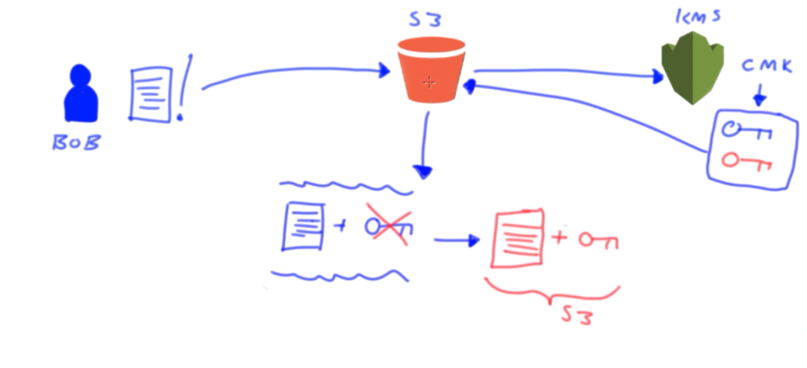
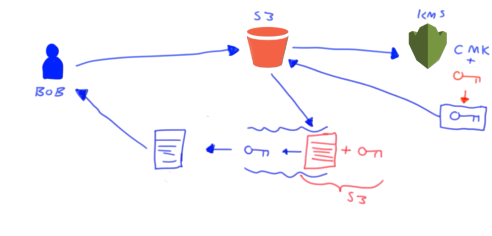
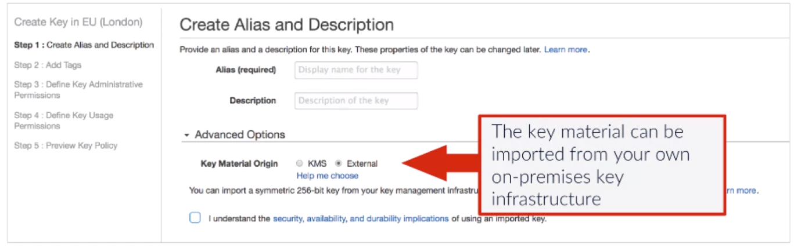

# How to use KMS Key Encryption to Protect Your Data

[AWS KMS Documentation](https://docs.aws.amazon.com/kms/index.html)

<br/>

## Introduction

- What is KMS
  - High-level overview of encryption
  - What the KMS service is, and what it is used for
- Components of KMS
  - Different components that make up the service
- Understanding Permissions & Key Policies
  -  How to grant access to specific keys
- Key Management
  - Some security best practices

Goals:
- Define how the Key encryption process works
- Explain the differences between the key types
- Create and modify Key policies
- Understand how to rotate, delete and reinstate keys
- Define how to import your own Key material

<br/>

## What is KMS

**Overview of Encryption**

Unencrypted data can be read by anyone who has access to it.

**What is data encryption?**

- Data is altered from plaintext to unreadable ciphertext through mathematical algorithms and encryption keys.
- An encryption key is required to revert the ciphertext back to plaintext.
- A key is a string of character; the longer the key, the more robust the encryption.
- This encryption can be categorized by symmetric or asymmetric cryptography.
  - AWS only used symmetric cryptography

*Plaintext*

```
This is plaintext data!
Anyone can read it.

You can use data
encryption to turn it
into ciphertext!
```

*Key*: `k15RSEVL3yFSEAQ8`

*Ciphertext*

```
jlsudVjPR5FupAYHm
JgPF 2V62fYT1gw

OxPyqXkAiW vQ
4yMkDf6Z1RJa6Lq
53ERO2CguTk
```

**Symmetric cryptography**

- A single key is used to both encrypt and decrypt the data.
- If the data was being read by a different person, that person would need to be issued the same key.
- If the key is intercepted during transmission, any data associated could easily be decrypted.
  - *AWS KMS* resolves this issue by acting as a central repository, governing and storing the keys required and
    only issues the decryption keys to those who have sufficient permissions to do so.
- Some common symmetric cryptography algorithms are:
  - AES
    - Advanced Encryption System
  - DES
  - Triple-DES
  - Blowfish

**Asymmetric cryptography**

- Two separate keys, one to encrypt and another to decrypt, created at the same time and linked with a mathematical
  algorithm.
- Private keys (one of the two keys) should be kept by a single party and should never be shared.
- Public keys (the other key) can be shared with anyone and without a secure transmission.
- Both keys are required to decrypt the data.
- Some common asymmetric cryptography algorithms are:
  - RSA - Rivet-Shamir-Adleman
  - Diffie-Hellman
  - Digital Signature Algorithm

If some one wanted to send you an encrypted message or data, they would encrypt the message using your own public key
which can be made freely available to anyone--it's public for a reason. The message is then sent to you where you will
use your private key, which has that mathematical relationship with your public key, to decrypt the data. This allows
you to send encrypted data to anyone without the risk of exposing your private key, resolving the issue highlighted
with symmetric encryption.

**Symmetric vs Asymmetric cryptography**

Symmetric encryption is a lot faster than asymmetric but it carries greater risk.

**Key Management Service (KMS)**

KMS is a managed service used to store and generate encryption keys that are used by other AWS services and
applications.
- S3 may use the KMS to enable S3 to offer and perform server-side encryption using *SSE-KMS*

KMS contains the leys to decrypt your private data
- Admins at AWS do not have access to your keys within KMS
- All admin actions require dual authentication by two Amazon admins
- It is the customer's responsibility to administer out own encryption keys

The KMS service is for encryption at rest.
- To encrypt data while in transit you would need to use a different method, such as SSL
- However, if your data was encrypted at rest using KMS, then when it was sent from one source to another, that data
  would be ciphertext which could only be converted to plaintext with the corresponding key.

*Server Side Encryption*
- Encryption done by the server
- Back end servers that encrypt the data as it arrives transparent to the end user
- The over head of performing the encryption and managing the keys is handled by the server

*Client Side Encryption*
- Encryption done by the end user
- Requires the user to interact with the data to encrypt it
- The overhead of the encryption process is on the client

**Compliance and Regulations**

KMS works seamlessly with the *AWS CloudTrail* to audit and track how your encryption keys are being used and by whom.

The *CloudTrail logs* that are stored in *S3* record *KMS* API calls such as `Decrypt`, `Encrypt`, `GenerateDataKey` and
`GetKeyPolicy`, etc.

**Regions**

*KMS* is **NOT** a multi-region service, it is region specific. Therefore, if you are working in a multi-region system
a *Key Management Service* must be established in each region that you want to encrypt data.

<br/>

## Components of KMS

### Key Components of KMS
- Customer Master Keys (CMK)
- Data Encryption Keys (DEK)
- Key Policies
- Grants

### Customer Master Keys (CMK)
- Main key type within KMS
- Can encrypt data up to 4KB in size
- Typically used in relation to DEKs
- Can generate, encrypt and decrypt these DEKs

*2 Types*:
1. Customer managed CMKs
   - These provide the ability to implement greater flexibility
   - You can perform rotation, governing access and key policy configuration
   - You are able to enable and disable the key when it is no longer required
2. AWS managed CMKs
   - Used by other AWS services that interact with KMS to encrypt data
   - They can only be used by the service that created them within a particular region
     - AWS MKS is a regional service
   - Used by the services and are created the first time you implement encryption using that service

AWS services can also be configured to use your own customer CMKs.

Any CMK created within KMS are protected by [FIPS 140-2 validated cryptography modules](https://csrc.nist.gov/projects/cryptographic-module-validation-program/Certificate/3139).

### Data Encryption Keys (DEK)

Data keys are used to encrypt your data of any size.

When a request to generate a key is issued, the CMK specified in the request will create a *plain text data encryption
key* and an *encrypted version* of the same data encryption key. Both of these keys are then used to complete the
encryption process. As a part of this process, your *plain text data* is *encrypted* with the *plain text data key*
using an encryption algorithm. *Once encrypted*, the *plain text data* is *deleted* from memory and the *encrypted data
key* is *stored* alongside the encrypted data.

If anyone gains access to the encrypted data, they will not be able to decrypt it, even if they have access to the
encrypted key, as this key was encrypted by the *CMK*--which *remains within* the *KMS* service.

This process of having *one key encrypted by another key* is known as *envelope encryption*.

The *only way* you would be able *to decrypt* the object is if you have the relevant *decrypt permission* for that
*CMK* that the data keys are associated to.

#### SSE-KMS Sketch Demonstration

S3 Server-side encryption using KMS keys.

**Encryption Process**

Our user, called Bob, has a document that he wants to encrypt and store on S3.

By selecting *SSE-KMS*, when the document is *uploaded*, *S3* will handle the *encryption* using keys generated by KMS.
So, S3 makes a *request to KMS* to *generate* some *keys*. *KMS* uses the *CM* to generate two keys: a *plain text data
key* and an *encrypted version* of the same key.

*Both keys* are then *sent* back *to S3*--all the keys it needs to perform the encryption process. So S3 will take the
*document* uploaded by Bob and *combine* this with the *plain text data key* *generating* an*encrypted version* using
an encryption algorithm.

Now the *encrypted document* and the *encrypted plain text key* are *stored in S3*.  Meanwhile, the plain text data key is then deleted from memory.



**Decryption Process**

Bob will *request* the object from *S3*. S3 knows that the object is encrypted and that it has the associated encrypted
data key. So, it *sends* that associated *encrypted data key over to KMS*, and it asks *KMS* to *generate a plain text
data key*. It will use the same *CMK* plus the *encrypted data key* and *generate* a *plain text version* of that *data
key* then just the *plain text data key* is then *returned to S3*. S3 can now access the encrypted object and use the
*plain text data key* to *decrypt the object*--by perform an encryption algorithm again--*generating a plain text
version* of the object to be returned to Bob.



### Key Policies

[AWS KeyPolicy Documentation](https://docs.aws.amazon.com/kms/latest/developerguide/key-policies.html)

The key policies allow you to define who can use and access a key in KMS.
- These policies are tied to the CMKs, they are resource based policies.
- Different key policies can be created for different CMKs.
- These permissions are defined within a key policy JSON document.

### Grants

Grants are another method of controlling access and use of CMKs held within KMS.
- They allow you to delegate a subset of your own access to a CMK for principals.
- There is less risk of someone altering the access control permissions for that CMK.
- Grants eliminate the possibility of anyone using the permission `kms:PutKeyPolicy`

<br/>

## Understanding Permissions & Key Policies

### Permissions and Key Policies

*Access control* for most services can be completely controlled and governed using *IAM* alone. However, for *KMS* this
is not the case.

To manage access to your *CMKs*, you **must** use a *Key policy* associated to your *CMK*.

Ways to control access to your keys in KMS:
1. Key Policies
2. Key Policies with IAM
3. Key Policies with Grants

### Using Key Policies

*Key policies* are resource based policies which are tied to you *CMK*.  For a principal to access your CMK a key
policy must be in place.

- A key policy is a JSON based document much like IAM policies.
- Elements:
  - **Sid**
      - (Optional) Statement Identifier
  - **Effect**
      - specifies whether to allow or deny the permissions in the policy statement.
  - **Principal**
    - the identity that gets the permissions specified in the policy statement. You can specify AWS accounts (root), IAM users, IAM roles, and some AWS services as principals in a key policy. IAM groups are not valid principals.
  - **Action**
    - Actions specify the API operations to allow or deny.
  - **Resource**
      - in a key policy, you use `"*"` for the resource, which means "this CMK." A key policy applies only to the CMK it is attached to.
  - **Conditions**
      - (Optional) specify requirements that must be met for a key policy to take effect.

*Key Policy Example*

```JSON
{
  "Version": "2012-10-17",
  "Statement": [{
    "Sid": "Statement identifier",
    "Effect": "effect",
    "Principal": "principal",
    "Action": "action",
    "Resource": "resource",
    "Condition": {"condition operator": {"condition context key": "context key value"}}
    }]
}
```

- Whether a key is created through the AWS management console or programmatically, a *default key policy* will be created
to allow principals to use the CMK.
  - A key policy is required for all CMKs!
- KMS configures the root user of the AWS account full access to the CMK.
- If the full access user was deleted from IAM, you would need to contact AWS Support to regain the control.

When the root account has full access to the key policy, access to he CMK can be given by normal IAM policies for
users and roles.
- Without the root account having full access in the Key policy, IAM can't be used to manage access for other users.
- The sections would look as shown below.
- The "Resource" section means 'this CMK' that the key policy is being applied to.

```JSON
{
  "Sid": "Enable IAM User Permissions",
  "Effect": "Allow",
  "Principal": {"AWS": "arn:aws:iam::123456789123:root"},
  "Action": "kms:*",
  "Resource":"*"
}
```

*Creating* a *CMK* through the *Management Console* gives you the chance to configure different permissions sets:
- Define the Key admins
- Principal scan only administer the CMK, not use it to perform and encryption function
- You can also specify whether you would like them to be able to delete the key
- These key admins have access to update the associated key policy
- Define the CMK users
  - Which users should be allowed to perform any encryption using the CMK
  - Every user or role, selected as a user of the key, will be displayed within the principal section
- Users can also use Grants to delegate a subset of their own permissions to another principal, such as a service
  integrated with KMS or another user
- Permissions given to use the key for any user selected
- You man also restrict access to CMKs with: `"Effect": "Deny"`

```JSON
"kms:Create*",
"kms:Describe*",
"kms:Enable*",
"kms:List*",
"kms:Put*",
"kms:Update*",
"kms:Revoke*",
"kms:Disable*",
"kms:Get*",
"kms:Delete*",
"kms:TagResource*",
"kms:UntagResource*",
"kms:ScheduleKeyDeletion*",
"kms:CancelKeyDeletion*"
```

*Grant permissions in a Key Policy example*

```JSON
{
  "Sid": "Allow attachment of persistent resource",
  "Effect": "Allow",
  "Principal": {
    "AWS": [
      "arn:aws:iam::730739171055:user/Cloudacademy"
    ]
  },
  "Action": [
    "kms:CreateGrant",
    "kms:ListGrants",
    "kms:RevokeGrant"
  ],
  "Resource": "*",
  "Condition": {
    "Bool": {
      "kms:GrantIsForAWSResource": true
    }
  }
}
```


Permissions given to use the key for any user selected:

```JSON
"kms:Encrypt",
"kms:Decrypt",
"kms:ReEncrypt",
"kms:GenerateDataKey",
"kms:DescribeKey"
```

### Using Key Policies with IAM Policies

You must have the following entry within the Key policy allowing the root full KMS access to the CMK. Doing so enables
centralization of permissions administration from within IAM as you would likely be doing for many other AWS services.
This would mean you can configure your IAM policies to allow users, groups and roles to perform the encryption and
decryption process, for example using the KMS Encrypt and KMS Decrypt permissions.

```JSON
{
  "Sid": "Enable IAM User Permissions",
  "Effect": "Allow",
  "Principal": {"AWS": "arm:aws:iam::123456789123:root"},
  "Action": "kms:*",
  "Resource": "*"
}
```

Using the resource component within the policy, you can also specify which CMKs the user, group or role can use to
perform the encryption and decryption process.

In the example below, we can see that the policy will allow the identity associated with the policy to use two
different CMKs to encrypt and decrypt data. The first CMK is within the `us-east-1` region and the second CMK is within
the `eu-west-2` region.

```JSON
{
  "Version": "2012-10-17",
  "Statement": {
    "Effect": "Allow",
    "Action": [
      "kms:Encrypt",
      "kms:Decrypt"
    ],
    "Resource": [
      "arn:aws:kms:us-east-1:123456789012:key/1234abcd-12ab-34cd-56ef-123456789ab",
      "arn:aws:kms:eu-west-2:123456789012:key/0987dcba-09fe-87dc-65ba-ab0987654321"
    ]
  }
}
```

### Using Key Policies with Grants

They allow you to delegate your permissions to another AWS principal within you AWS account.
- Grants are another resource based method of access control to the CMKs.
- They need to be created using the AWS KMS APIs.
  - Cannot be created using the AWS management console.
- Grants are connected to the CMK--much like key policies.
- Different parameters are also issued such as the CMK identifiers the grantee principal and the required level of
  operations.
- After the Grant has been created a GrantToken and a GrantID are issued.

*Key Policy with Grants example*
```JSON
{
  "Sid": "Allow attachement of persistent resources",
  "Effect": "Allow",
  "Principal": {
    "AWS": [
      "arn:aws:iam::739739171055:user/Cloudacademy"
    ]
  },
  "Action": [
    "kms:CreateGrant",
    "kms:ListGrants",
    "kms:RevokeGrant"
  ],
  "Resource": "*",
  "Condition": {
    "Bool": {
      "kms:grnatIsForAWSResource": true
    }
  }
}
```

When issuing the *CreateGrant API*, a number of *different parameters* are also issued such as the *CMK identifier*,
the grantee *Principal* and the *Actions* that the grantee can perform, include the following:

```
Decrypt
Encrypt
GenerateDataKey
GenerateDataKeyWithoutPlaintext
ReEncryptFrom
ReEncryptTo
CreateGrant
RetireGrant
DescribeKey
```

*Once the grant is active*, the *principal* or grantee can then *adopt the permissions programmatically* based on the
level of access provided within the grant. Also, after the grant has been created, a **GrantToken** and a **GrantID**
are issued.

There may be a delay in being able to use the permissions, after a grant is created, due to the fact that
eventual consistency has to take place. To get around this, you can use the *GrantToken* with some *APIs* which would
allow the grantee to perform the operation specified within the grant with *immediate effect* without having to wait
for eventual consistency to complete.

### Demonstration of how the grantee can be an IAM user

We have two different users, Alice has access to *user CMK* and `CreateGrant` and Bob who has no IAM policies at all
and isn't explicitly allowed access within the CMK policy.

On the IAM console go to `Encryption keys` to look at our CMK.

The policy of this CMK shows the users within this policy--her ewe can see Alice and her permissions to `CreateaGrant`.

Now we create a new user, Bob, with no permissions at all. We'll give them programmatic access because we'll be using
the AWS CLI. In the terminal we are going to **set up Bob's profile on the AWS CLI**.

```sh
$ aws configure --profile Bob
AWS Access Key ID [****************XOCQ]: FJKSDHGIWBCSMBFAS
AWS Secret Access Key [****************akrc]: JBFAJKLhsdahf7af9sfyhkj43h79
Default region name [us-east-1]: y
Default output format [None]: y
```

Quick test with Bob. We'll try and encrypt something using the CMK ID and it will fail.

```sh
$ aws kms encrypt --plaintext "CloudAcademy" --key-id alias/DemoKey --profile Bob

An error occurred (AccessDeniedException) when calling the Encrypt operation: User: arn:aws:iam::730739171055:user/Bob is not authorized to perform: kms:Encrypt on resource: arn:aws:kms:us-east-1::730739171055:key/5c4f95e1-4d26-4a5b-800c-ac8689a0f648
```

Try to encrypt the plaintext "CloudAcademy", using the key-id alias of our CMK using the profile of Bob, an there we can see an error has occurred access denied. This is what we expect because Bob doesn't have any encrypt permissions.

If we try the same thing with Alice.

```sh
$ aws kms encrypt --plaintext "CloudAcademy" --key-id alias/DemoKey --profile Alice
{
  "KeyId": "arn:aws:kms:us-east-1::730739171055:key/5c4f95e1-4d26-4a5b-800c-ac8689a0f648",
  "CiphertextBlob": "JKFSHKDiofhdsa4093jrt;klfkhsa98yu0fjkhHOIHOHY890hkJHPUIHUOHGiohfosahfiuahf988Y&&TGUIH&Gv&G7gP7gG8OIHIOUGH9g9p78G7gpBuoVOUyfvOg867Fg8oVYgouYVyuoFuoyg78v8yg0b7VVBBTVvt760*"
}
```

This time it has encrypted the file using the `CiphertextBlob`.

So now we want to, as *Alice*, *use grants to allow Bob access to encrypt and decrypt data*.

```sh
$ aws kms create-grant --key-id arn:aws:kms:us-east-1::730739171055:key/5c4f95e1-4d26-4a5b-800c-ac8689a0f648 --grantee-principal arn:aws:iam::730739171055:user/Bob --operations "Encrypt" "Decrypt" --profile Alice
{
  "GrantToken": "AqpJFSIDUHmYhE43FHJHKnvj546njNKJNnUI98KJN98NKJgY78BJKBYgo6778hHHKHiuHiUhIh78NLkHOHohOIJoiHigh87868HkhIPIUgIGiGiuGH678HHKJHIHO878697yhLKHKJHLKHNOIuhoHUIHUOB67HLHOLiog9879HJBJKBLBIBiuG68HJKBLKBBYUV6876960685GHBVOUGY4824545GdSHOIhiGOIygOgPUIyPOIup",
  "GrantId": "a99664ebaes89798sfhkjhf87s98fhjkhf769shfushfdiuhsdfoh78sf696979870jfsh4"
}
```

We need the ARN of our key (from IAM console -> Encryption Keys -> select key) and the ARN of the user (IAM Console ->
Users -> Select Bob).

Then we need to specify the operations which is the actual access being given, we are granting Encrypt and Decrypt
access.

We are given a `GrantToken` and also a `GrantId` which Bob can use to perform encryption and decryption.

```sh
$ aws kms encrypt --plaintext "Friday" --key-id arn:aws:kms:us-east-1::730739171055:key/5c4f95e1-4d26-4a5b-800c-ac8689a0f648 --grant-tokens AqpJFSIDUHmYhE43FHJHKnvj546njNKJNnUI98KJN98NKJgY78BJKBYgo6778hHHKHiuHiUhIh78NLkHOHohOIJoiHigh87868HkhIPIUgIGiGiuGH678HHKJHIHO878697yhLKHKJHLKHNOIuhoHUIHUOB67HLHOLiog9879HJBJKBLBIBiuG68HJKBLKBBYUV6876960685GHBVOUGY4824545GdSHOIhiGOIygOgPUIyPOIup --profile Bob
{
  "KeyId": "arn:aws:kms:us-east-1::730739171055:key/5c4f95e1-4d26-4a5b-800c-ac8689a0f648",
  "CiphertextBlob": "JKFSHKDiofhdsa4093jrt;klfkhsa98yu0fjkhHOIHOHY890hkJHPUIHUOHGiohfosahfiuahf988Y&&TGUIH&Gv&G7gP7gG8OIHIOUGH9g9p78G7gpBuoVOUyfvOg867Fg8oVYgouYVyuoFuoyg78v8yg0b7VVBBTVvt760*"
}

```

We have successfully encrypted that file of Friday. So whereas before Bob was unable to encrypt, we have now used the
`GrantToken` which was generated by Alice to allow Bob access to encrypt data.

**Demonstration Summary**

We found Alice who is a user within the key policy of a CMK. We then created a new user Bob who had no IAM policies attached and he wasn't listed within the key policy. We then tested that Bob wasn't able to encrypt anything and confirmed that Alice could. We then created a grant using Alice's profile allowing access to Bob for encrypt and decrypt. We then used the `GrantToken` that was generated from the `create-grant` to allow Bob to encrypt a file using the new permissions that he gained through the grant.

### Demonstration - Creating a CMK using the Management Console

- What the final Key Policy looks like
- How key admins, users and grants all fit in

IAM console -> Encryption keys -> Create key

Steps:
1. Create Alias and Description
2. Add Tags
3. Define Key Administrative Permissions
   - Remember that key admins cannot use the key to encrypt and decrypt data
4. Define Key Usage Permissions
   - Choose IAM users and roles that can use this key to encrypt and decrypt data ...
5. Review Key Policy

*Key policy created based on inputs from steps above*

```JSON
{
  "Id": "key-consolepolicy-3",
  "Version": "2012-10-17",
  "Statement": [
    {
      "Sid": "Enable IAM User Permissions",
      "Effect": "Allow",
      "Principal": {
        "AWS": [
          "ars:aws:iam::730739177055:root"
        ]
      },
      "Action": "kms:*",
      "Resource": "*"
    },
    {
      "Sid": "Allow access for Key Administrators",
      "Effect": "Allow",
      "Principal": {
        "AWS": [
          "arn:aws:iam::730739177055:user/Cloudacademy",
          "arn:aws:iam::730739177055:user/Stuart"
        ]
      },
      "Action": [
        "kms:Create*",
        "kms:Describe*",
        "kms:Enable*",
        "kms:List*",
        "kms:Put*",
        "kms:Update*",
        "kms:Revoke*",
        "kms:Disable*",
        "kms:Get*",
        "kms:Delete*",
        "kms:TagResource",
        "kms:UntagResource",
        "kms:ScheduleKeyDeletion",
        "kms:CancelKeyDeletion"
      ],
      "Resource": "*"
    },
    {
      "Sid": "Allow use of the key",
      "Effect": "Allow",
      "Principal": {
        "AWS": [
          "arn:aws:iam::730739177055:user/Cloudacademy",
          "arn:aws:iam::730739177055:user/Stuart"
        ]
      },
      "Action": [
        "kms:Encrypt",
        "kms:Decrypt",
        "kms:ReEncrypt*",
        "kms:GenerateDataKey*",
        "kms:DescribeKey"
      ],
      "Resource": "*"
    },
    {
      "Sid": "Allow attachment of persistent resources",
      "Effect": "Allow",
      "Principal": {
        "AWS": [
          "arn:aws:iam::730739177055:user/Cloudacademy",
          "arn:aws:iam::730739177055:user/Stuart"
        ]
      },
      "Action": [
        "kms:CreateGrant",
        "kms:ListGrants",
        "kms:RevokeGrant"
      ],
      "Resource": "*",
      "Condition": {
        "Bool": {
          "kms:GrantIsForAWSResource": true
        }
      }
    }
  ]
}
```

**Section Descriptions:**

`"Sid": "Enable IAM User Permissions"`:
- Allow root account access (`"Effect": "Allow"`), all KMS access (`"Action": "kms:*"`) to this particular CMK
  (`"Resource": "*"`).
- This ensures that you can use *IAM policies* to *govern* access to this *CMK*.

`"Sid": "Allow access for Key Administrators"`
- Shows the key administrators for this CMK and here are the two identities selected during creation.
- There are a number of different KMS actions, but *no* `kms:Encrypt` or `kms:Decrypt` because the key administrators
  aren't actually able to use the key for encryption.

`"Sid": "Allow use of the key"`
- This section defines the actual users of the policy
  - Whoever is listed in the principal section can actually use this CMK to encrypt data and decrypt data.
- In `Actions`, we can see here `kms:Encrypt`, `kms:Decrypt` and` GenerateDataKeys`, etc.

`"Sid": "Allow attachment of persistent resources"`
- This section relates to *Grants*.
- Allows users defined in the Principal section to create grants and generate grants for the CMK.

### CMK Access

There are three potential ways of gaining access and use to a CMK, through the *Key policy*, with *IAM policies* and
also *Grants*.

**Example**:

*Three keys*:
1. CMK-A
   - Access to the root account (enables IAM Policies)
2. CMK-B key policy
   - Access to Bob and Charlie
3. CMK-C key policy
   - Access to the root account (denied to Bob, Charlie & David, full access is given to Alice)

*Four people*:
1. Alice
    - IAM policy allows actions to CMK-A and CMK-B
    - Access:
      - CMK-A - Access
        - Her IAM policy allows all KMS actions against CMK-A and CMK-A allows for IAM policies to be used.
      - CMK-B - No Access
        - The key policy for this CMK does not allow for IAM policies to be used.
      - CMK-C - Access
        - The key policy allows her access despite her having no IAM policy relating to permissions.
2. Bob
    - No IAM policy
    - Access:
      - CMK-A - No Access
        - There are no explicit entries in the key policy for Bob's access and he has no IAM policy.
      - CMK-B - Access
        - The key policy allows him access despite him having no IAM policy relating to permissions.
      - CMK-C - No Access
        - Explicit deny actions within the key policy and an explicit deny will always overrule any other allow.
3. Charlie
    - IAM policy allows `kms:Encrypt` to CMK-A
    - Access:
      - CMK-A - Access
        - Has encrypt access only which is given through his IAM policy and IAM policy permissions are allowed.
      - CMK-B - Access
        - The key policy allows him access. His IAM policy permissions are irrelevant as the CMK does not allow for IAM
          policies to be used.
      - CMK-C - No Access
        - The explicit deny actions within the key policy and an explicit deny will overrule any other allow.
4. David
    - IAM policy allows actions to CMK-B and CMK-C
    - Access:
      - CMK-A - No Access
        - Neither the key policy or his IAM policy provides permissions.
      - CMK-B - No Access
        - The key policy for this CMK does not allow for IAM policies to be used or provide him explicit access.
      - CMK-C - No Access
        - Explicit deny actions within the key policy.

<br/>

## Key Management

### Rotation of CMKs

It is a security best practice to *rotate* keys.

The longer the same key is left in place, the more data is encrypted with that key, and if that key is breached then
more data is at risk. Also, the longer they key is active the greater the probability of it being breached.

### Automatic Key Rotation

- KMS will rotate your keys every 365 days
- The only change is the backing key of the CMK
  - This backing key is the fundamental cryptographic element that is used when the encryption process is taking place.
  - Other details of the CMK remain the same, such as: CMK-ID and the ARN
- Older backing keys are retained to decrypt data that was encrypted prior to this rotation.

If a breach of the CMK occurs, rotating the key will **not** remove the threat but will prevent the attacker from
seeing anything encrypted after the rotation.

*Some points to keep in mind:*

- Automatic key rotation is not possible with imported key material
- The key rotation happens every 365 days and there is no way to alter that time frame
  - If these two points are an issue, then the only solution is to perform a manual key rotation
- If your CMK is in the state of disabled or is pending deletion, then KMS will not perform a key rotation until the
  CMK is re-enabled or the deletion is cancelled.
- It is not possible to manage the key rotation for any AWS managed CMKs, these are rotated every 1095 days (3 years)

### Manual Key Rotation

The process of manual key rotation requires a new CMK to be created.

- A new CMK-ID is created along with a new backing key.
- You will need to update any applications to reference the new CMK-ID.
- You could use Alias names for your keys and then simply update your alias target to point to the new CMK-ID.
- To do this you can use the update alias API

`aws kms update-alias --alias-name CloudAcademyCMK --target-key-id 1234aabc-32dc-81ac-66ba-cd3344225566`

Keep and CMKs that were used to encrypt data before the rotation so you can still decrypt any already encrypted data.

### Key Material

Key Material is essentially the backing key.

- When customer managed CMKs are generated and created within KMS the key material is automatically created for the CMK
- To create a CMK without material (image below)
- When using your own key material it becomes tied to that CMK and no other key material can be used for that CMK
  - This is why automatic key rotation cannot be used.
  - Only this single backing key or key material can ever be used for that CMK.



Steps:
1. Create your CMK with no key material generated by KMS
     - Choose External for the Key Material Origin in the Create Alias and Description Section
2. Download a wrapping key (public key) and an import token
    - This wrapping key is to allow you to upload your key material in an encrypted form.
    - When you import your key material, you do not want this to be in plain text format, so AWS KMS provides a means of
      encrypting it with this public/wrapping key.
    - You will be asked to select an encryption algorithm. The options for this are: *a)* RSAES_OAEPSHA_256, * )*
      RSAES_OAEPSHA_1 & *c)* RSAES_PKCS1_V1_5. AWS recommends that you select option A that's shown if possible.
    - The wrapping key then uses this method of encryption to encrypt your key material before it's uploaded.
    - The import token that is downloaded is used as a part of the import process when uploading your encrypted key
      material, to ensure that the process completes correctly.
    - Both the wrapping key and the import token are only active for 24 hours once you have downloaded it, so you need
      to ensure that you complete the process within this timeframe.
3. Encrypt key Material
    - The key material must be in binary format to allow you to use the wrapping key.
    - [Details on how to carry out this step](https://docs.aws.amazon.com/kms/latest/developerguide/importing-keys-encrypt-key-material.html)
4. Import your key material that is not encrypted into KMS and then associate it with your currently empty CMK.
    - Select your CMK
    - Select to import the key material along with the location of the import token
    - (Optional) Set an expiration of the key material being imported

There are some considerations of using your own key material:
- The key material created by KMS for customer CMKs have higher durability and availability
- You can set an expiration time for your own imported material
- In a region-wide failure, you must have the key material to import back into the CMK

### Delete a CMK

You may want to delete a CMK for security best practices and general housekeeping of your key infrastructure.
- KMS enforces a scheduled deletion process, which can range from 7 - 30 days.
- The CMK is taken out of action and put in a state of 'Pending deletion'.
- Keys in this state can't be used to perform encryption or decryption action, neither can the backing keys be rotated.

**Detecting use of a CMK**

You could analyze AWS CloudTrail event logs to look for the last time events on your CMK occurred.

AWS recommends that you set up a [CloudWatch alarm](https://docs.aws.amazon.com/kms/latest/developerguide/deleting-keys-creating-cloudwatch-alarm.html) to identify if anyone tries to use this key to perform encryption or
decryption requests.

If you are not confident that your CMK is no longer in use or that it should be deleted then *you can simply disable
the CMK*.

If you are using a CMK which has your own key material imported then *you can delete just the key material from the
CMK*.

To delete a CMK in the AWS Management console. Navigate to IAM -> Encryption keys -> select the key -> Key actions ->
Schedule key deletion -> enter a waiting period between 7 and 30 days -> Schedule deletion. The key will now be in the
'Pending Deletion' state and can no longer be used.  

If you decide not to go through with the deletion then you can select Cancel key deletion from the key actions drop
down. This will change the key's state to 'Disabled'. It can be enabled by selecting 'Enable' form the Key actions drop
down--making it fully operational again.   

<br/>

## Summary

### Overview of Cryptography

- Unencrypted data is known as **plaintext**
- Data encryption alters information, rendering the plaintext data in **ciphertext**
- To decrypt encrypted data an encryption key is required to revert the ciphertext back into a readable format of
  plaintext
- A key is a string of characters used in conjunction with the encryption algorithm
- AWS KMS only uses Symmetric cryptography
- Symmetric cryptography uses a single key
- Asymmetric cryptography uses two separate keys. One is used to encrypt the data (*public key*), and another separate
  key is used to decrypt the data (*private key*)

### KMS Overview

- KMS is used to store and generate encryption keys
- AWS administrators do not have access to your keys within KMS
- KMS is for encryption at rest only
- KMS works seamlessly with AWS CloudTrail
- KMS is not a multi-region service

### Key Components of KMS

- Customer Master Keys (CMKS) are the main key type in KMS
- CMKs can generate, encrypt and decrypt Data Encryption Keys (DEKs)
- DEKs are used outside of the KMS service by other AWS services to perform encryption

Two types of CMK:
1. AWS managed CMKs
2. Customer managed CMKs
   - They provide greater flexibility
   - You can perform rotation, governing access and key policy configuration
   - You can enable and disable the key when it is no longer required

Any CMKs created within KMS are protected by [FIPS 140-2 validated cryptographic modules](https://csrc.nist.gov/projects/cryptographic-module-validation-program/validated-modules)

### Data Encryption Keys (DEKs)

Data keys are used to encrypt your data of any size

The CMK can create a Plaintext DEK and an Encrypted version of that Plaintext DEK.

Plaintext data is encrypted with the plaintext DKE and then the plaintext DEK is deleted from memory.

envelope encryption is the process of having one key encrypted by another.

### Key Policies & Grants

**Key policies** are a security feature that allows you to define who an use and access a particular key within KMS.
  - Key policies are tied to CMKs as a resource based policy.

**Grants** allow you to delegate a subset of your own access to a CMK for principals.

### Permissions & Key Policies

 Access to use CMKs is given through key policies but can be linked with IAM policies.

 Three ways to allow access to a CMK:
 1. Key Policies
 2. Key Policies with IAM Policies
 3. Key Policies with Grants

### Key Policies

- They are resource based policies which are tied to you CMK
- JSON based much like IAM policies
- Syntax follows the same as IAM policies

A key policy is required for all CMKs
  - KMS configures the root user of the AWS account full access to the CMK
  - Without the root account having full access in the Key policy, IAM can't be used
  - Key Admins and Users can also be configured within the key policy
  - Key admins can only administer the CMK but not use it
  - Define which users should be allowed to perform and encryption using this CMK
  - Users are also able to use Grants


### Using Key Policies with IAM Policies

You must have the following entry within the Key Policy allowing the root full KMS access to the CMK

```JSON
{
  "Sid": "Enable IAM User Permissions",
  "Effect": "Allow",
  "Principal": {
    "AWS": [
      "ars:aws:iam::730739177055:root"
    ]
  },
  "Action": "kms:*",
  "Resource": "*"
}
```

### Using Key Policies with Grants

You can also assign permission using Grants alongside key policies.
  - Grants allow you to delegate your permissions to another AWS principal within your AWS account.
  - Grants need to be created using the AWS KMS APIs.
  - Grants are attached to a CMK, much like key policies are.
  - To create a grant use the `create-grant` API.
  - You need to specify the CMK identifier, the grantee principal and the required level of operations.
  - Permissions can then be adopted programmatically by the grantee.
  - Grants generates a `GrantToken` and a `GrantID`.
  - `GrantTokens` allow the grantee to perform the operations with immediate effect.

### Key Management

Key rotation follows security best practices

Automatic key rotation:
  - KMS will rotate your keys every 365 days
  - The only change is the backing key of the CMK
  - The backing key is the cryptographic element that is used in the encryption process.
  - All existing backing keys are retained during and after rotation.
    - Rotating keys does not resolve data breaches but only prevent attackers from accessing newly encrypted data.
  - Automatic key rotation is not possible with imported key material.
  - CMKs in the 'Disabled' or 'Pending Deletion' states will not be rotated.
  - It's not possible to manage the key rotation for any AWS managed CMKS, these are rotated every 1095 days (~3 years).

### Manual Key Rotation

The process of replacing the current CMK with a new CMK.

Any applications that reference the CMK-ID of the older must be updated to point to the new CMK-ID following a manual
rotation, or update the Alias name of the key within the new CMK-ID Target.

Key material is the backing key. It completes and implements the encryption and decryption process on behalf of the CMK
itself.

### Importing Key material

It is possible to create a CMK and import your own key material.

Process:
1. Create your CMK with no key material
2. Download a wrapping key (public key) and an import token. These will remain active for 24 hours.
3. Encrypt your key material using the wrapping key.
4. Import you key material that is now encrypted into KMS and associate it with your currently empty CMK.

### Deleting a CMK

Deleting a key can have significant impact against your data if there are services that are still using it without your
knowledge.
  - KMS enforces a scheduled deletion process, which can range from 7 - 30 days.
  - Keys in the state can't be used to perform encryption or decryption actions, neither can the backing keys be
    rotated.
  - Using CloudTrail logs can help you ascertain when the CMK was last used.
  - AWS also recommends that you set up a CloudWatch alarm to identify anyone trying to use this key.
  - Consider disabling a key instead of deleting a key, so you can reinstate it again if you need it.

---
