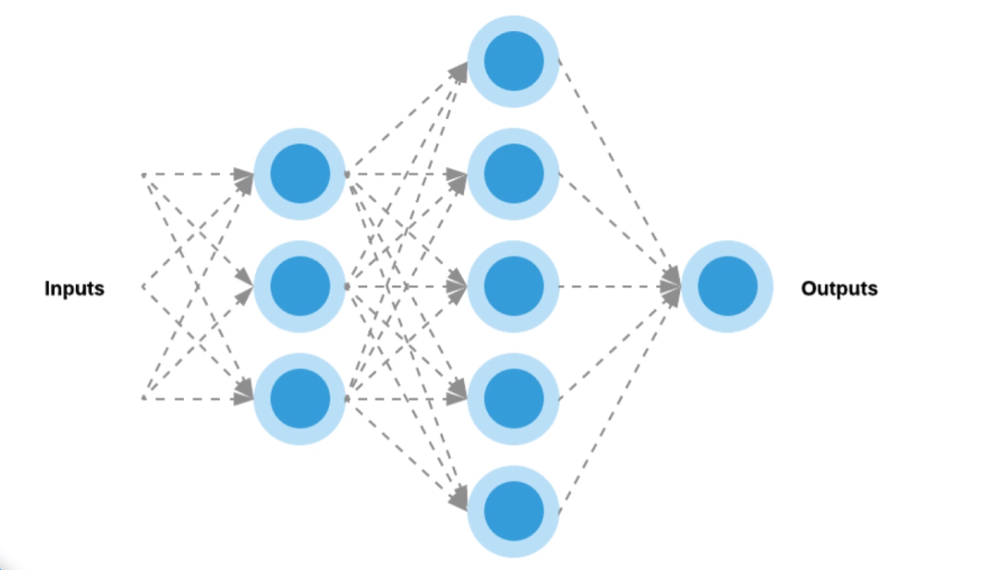
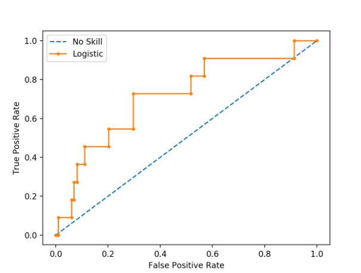
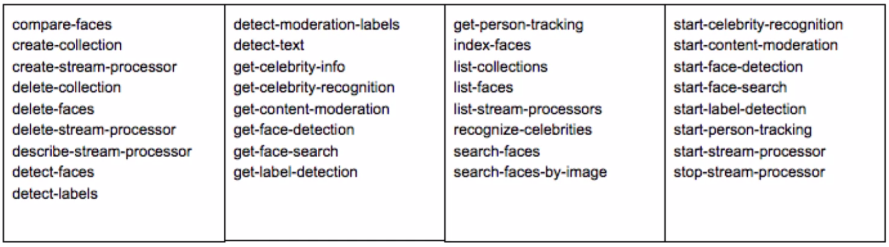
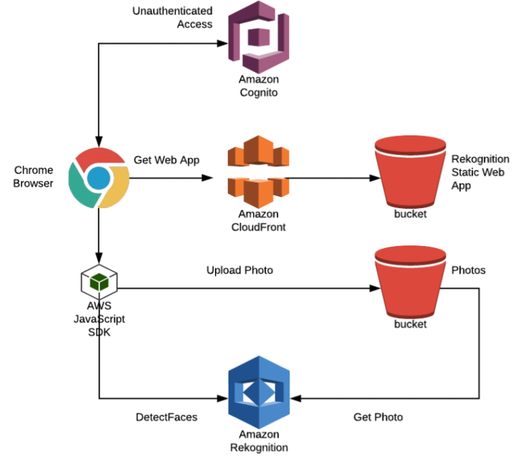
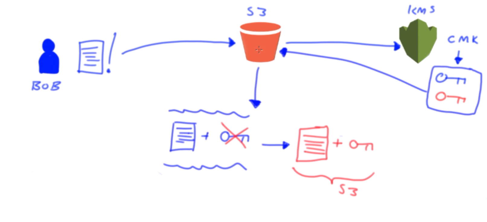
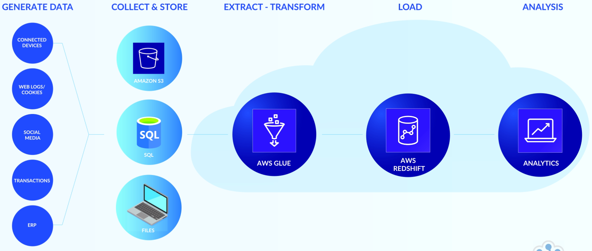

# AWC Machine Learning Notes

---

## TOC

<!-- TOC depthFrom:2 depthTo:2 withLinks:1 updateOnSave:1 orderedList:0 -->

- [Intro to Machine Learning Concepts](#intro-to-machine-learning-concepts)
- [Intro to the Principles and Practices of Amazon Machine Learning](#intro-to-the-principles-and-practices-of-amazon-machine-learning)
- [Working with Distributed Machine Learning](#working-with-distributed-machine-learning)
- [Intro to Amazon Rekognition](#intro-to-amazon-rekognition)
- [Working with Amazon Lex - Chatbots](#working-with-amazon-lex-chatbots)
- [Overview of AWS Identity and Access Management](#overview-of-aws-identity-and-access-management)
- [How to use KMS Key Encryption to Protect Your Data](#how-to-use-kms-key-encryption-to-protect-your-data)
- [Storage Fundamentals](#storage-fundamentals)
- [Developing Serverless ETL with AWS Glue](#developing-serverless-etl-with-aws-glue)

<!-- /TOC -->

<br/>

---

## Intro to Machine Learning Concepts

<br/>

### Course Intro

**Learning Objectives**
- Understand Machine Learning Benefits
- Understand Business use Cases
- Understand Different Machine Learning Training Techniques
- Understand Supervised and Unsupervised Training
- Understand Classification and Regression
- Familiarity with popular Machine Learning Algorithms
- Understanding Basic Deep Learning Principles

<br/>

### Basic Concepts

**Machine Learning Definition**
- Field of study that allows computers to learn without being explicitly programmed.

**Industry Applications**
- Recommendation Engines
- Demand Forecasting
- Computer Vision
- Fraud Detection
- Medical Diagnosis
- Stock Market Forecasting
- Sentiment Analysis

**Terminology**
*Features* - each item or piece of data is described by a number of features.
*Labels* - again, each item or piece of data may be tagged with a known classification result.
*Instances* - an instance (sample/observation) is an item within the dataset, each instance will have a set of features,
 and may also have a label assigned to it.

**Machine Learning Phases**
1. Dataset Collection
2. Featurization
3. Model Training
4. Model Testing
  - Repeat 3 and 4 until model produces useful and accurate results
5. Model Deployment

**Machine Learning Types**
1. *Supervised* - Create predictive model using features and labels (we have the answers which we are trying to predict)
  - Classification
  - Regression
2. *Unsupervised* - group and discover patterns based on only features (we DO NOT have the answers which we are trying to predict)

<br/>

### Supervised Learning

*Supervised Learning* involves using some sort of algorithm to analyze and learn from past observations, enabling you
to then predict future events. The goal of Supervised Learning is to come up with, or infer, an approximate mapping
*function* that represents the data, can be applied to one or more input variables, and produce an output variable
or result. The training process involves taking a supervised training data set with known features and labels
(continuous or categorical). The goal is to build a machine learning model that can accurately predict future outcomes.

**Train Test Split**
Set aside a portion of the dataset for training and the rest for testing.

**Classification vs Regression**
A Supervised Learning algorithm analyzes the training data, and produces a mapping function, which is called a
*classifier* if the output is *discrete*, or a *regression function* if the output is *continuous*.

**Some Supervised Learning Algorithms**
1. Classification
  - Logistic Regression
  - Support Vector Machines
  - Naive Bayes
  - K Nearest Neighbors
  - Decision Trees
  - Random Forest
2. Regression
  - Linear Regression
  - Decision Trees
  - Random Forest

**Supervised Training Process**
- The training phase requires you to perform
- Feature extraction to establish feature vectors.
- The chosen supervised training algorithm takes both the feature vectors and labels and builds a predictive model.
- Train test split
- The predictive model is then tested for accuracy.
  - Find train and test accuracy
- Deploy the model and begin to predicting on new data.

<br/>

### Unsupervised Learning

Unlabeled data (No answers)

*Clustering* is concerned with finding similar instances.
*Anomaly detection* is concerned with finding unusual instances, and
*Association discovery* is concerned with finding feature rules that may exist between and across observations.

**Some Unsupervised Learning Algorithms**
1. Clustering
  - K Means
  - Heirarchical
  - Gaussian Mixture

  **Unsupervised Training Process**
  - The training phase requires you to perform
  - Feature extraction to establish feature vectors.
  - The chosen unsupervised training algorithm takes both the feature vectors
  - Train test split
  - The predictive model is then tested for inter/intra cluster distance
    - Find train and test accuracy
  - Deploy the model and begin to predicting on new data.

**Use Cases**
- Customer similarities
- Fraud detection
- Purchasing patterns

<br/>

### Machine Learning Algorithms

**Considerations when Choosing an algorithm**
- Size, quality and nature of the data.
- Available computational time
- Urgency of the task
- Data analysis requirements

More often than not, you will need to experiment with your data to determine which algorithm gives the best results.

**Linear Regression**

- Supervised Learning
- Regression Algorithm
- `y = mx+b`
  - `m` = slope (gradient)
  - `b` = y intercept
  - Basic calculus applied to the data set in question to the values of `m`, the gradient, and `c`, the Y axis
    intercept.
- Simple or Multiple Linear Regression
  - Simple - only one independent variable is used
  - Multiple - multiple independent variables are defined
    - `f(x) = m1 * x1 + m2 * x2 + ... + b`

**Logistic Regression**

- Supervised Learning
- Classification Algorithm
- S-curve
  - Sigmoid Function - Transforms the linear function to bound results between 0 and 1 representing the probability
  of the outcome.  
- Binary Classification
  - can be used for multi class classification as well

**Decision Trees**

- Supervise Learning
- Classification or Regression
- Easy to interpret

**Random Forest**

- Supervised Learning
- Classification or Regression Algorithm
- Collection of Decision trees
  -  Each tree predicts an outcome
- The Majority prediction wins
- Each tree is created using a different, randomly selected, portions of the training data set.

**Naive Bayes**

Bayes Theorem:
`P(c|x) = ( P(x|c) * P(c) ) / P(x)`

The conditional probability of c given x is equal to the conditional probability of x given c times the prior
probability of c divided by the total probability of x.

- Supervised Learning
- Classification Algorithm
- Based on Bayes Theorem and probability

Useful for text classification.

Naive Bayes Formula:

` P(Class A| F1, F2) = ( P(F1|Class A) * P(F2|Class A) * P(Class A) ) / ( P(F1) * P(F2) )`

The probability of the text being of Class A given it contains features 1 and 2 (in this case that usually means it
contains words or sequence 1 and 2) equals the probability that feature 1 is in Class A times the probability that
feature 2 is in Class A times the probability that a text is of class A all divided by the product of probability of
feature 1 and 2 appearing in a text (or document).

**Support Vector Machine (SVM)**

- Supervised Learning
- Classification Algorithm

With SVM, you take a plot of data points in n-dimensional space--where n is the number of features. The algorithm
attempts to find a line (called a support vector) that separates and classifies the data points in such a way that the
chosen line maximizes the separation of the nearest data points within each class to the line itself. The SVM lines
are known as classifiers.

**K-Nearest Neighbors kNN**

- Supervised Learning
- Classification or Regression Algorithm
- Finds the K (given number) of neighbors that are closest to the given observation based on a given distance metric.
- Can be used to impute or predict the value or class of an observation based on the most similar observations in
the dataset.
  - With regression you can take the average of the neighbors as the value
  - or, with classification you can take the most common label of the neighbors as the observation label.

**K-Means Clustering**

- Unsupervised Learning
- Classification Algorithm

Finds the K (given number of) clusters in a dataset by comparing the distance between each observation.  The
observations are grouped in such a way to minimize the intra cluster distance and maximize the inter cluster distance.  
This algorithm is non-deterministic meaning that it the outcome may vary each time.

<br/>

### Deep Learning and Deep Neural Networks

**Deep Learning**

Algorithms are known as Artificial neural networks. At its core a neural network is made up of multiple layers of
connected neurons which contain an activation function that transforms inputs from the previous layer, and produces an
output value passed along to the neurons in the next layer.



**Neurons**


A neuron takes several weighted inputs--which are randomly assigned when the neural network in initialized. The neuron
performs a summing function across all the individual products of the inputs X, and weights, W. The summing function
result is then passed through an activation function. To produce an output, Y.

**Layers**


A deep neural network has hidden layers and the more hidden layers the 'deeper' the network is.  The nodes of the
input layer are passive--meaning they do not modify the data. While, the nodes of the hidden, and output layers are
considered active.--meaning they modify the data as per the summing, and activation functions in each neuron.

**Activation Functions**


The role of the activation function is to add non-linearity into the system--so complex problems can be solved.

Activation functions need to be differentiable so that the weights can be updated during back-propagation.

*Aside: Back-propagation*
- Training a deep neural network involves multiple forward, and backward passes. The backward pass involves a process
called back propagation, 0r gradient descent, where the weights on the network are adjusted in order to have the
neural network learn or converge to an optimal solution.

1. *Sigmoid Function*
  - Takes a real value number and squishes it between 0 and 1.  Based on the input data the smallest numbers are
  relatively closer to one and the largest number are relatively closer to 1.  As data is 'squished' this also keep
  the data distributed between 0 and 1 to prevent all the data from converging.
  - A downfall of the sigmoid function is that it is not zero-centers making it harder for optimization.
2. *tanH*
  - Similar to the sigmoid but is zero centered.
3. *ReLU*
  - Rectified Linear Unit
  - Gradient computation is very quick (differentiation during back propagation) as it is either 0 or 1.

**Loss Function**

ex. MSE


Loss functions measure accuracy of the network predictions.  During optimization, cycles are run, updating the weights
in each neuron, until the loss function becomes stable--i.e. our predictions are not getting any better, hence,
they are optimized.

**Forward Propagation**

The goal of Forward propagation, is to perform calculations on data that is fed forward through the layers and through
each of the connected neurons. The calculations are continually done in sequence through the network, layer by layer,
until we reach the final output layer, which outputs a prediction.

**Back Propagation**

The goal of back propagation, is to in turn, and adjust each weights in the network in proportion to how much they
contributed to the overall error--measured in the loss function. Iteratively reducing each weight's error margin
eventually allows the network to converge to an optimal solution, allowing it to produce accurate predictions.
This process is how the neural network learns.

**Epoch**

A single forward and backward propagation cycle is called an *epoch*. Neural networks converge on the optimal solution
after many epochs.

---

<br/><br/>

## Intro to the Principles and Practices of Amazon Machine Learning

<br/>

### Intro

#### Course Intro

Topics covered:
- Types of problems that machine learning can solve
- Situations when you should use machine learning
- Machine Learning services offered by Amazon as part of AWS
- Steps required to frame a Machine Learning problem
- Data preparation for use with Amazon Machine Learning,
- Feature engineering
- Model creation in Amazon ML
- Model Evaluation/Improvement
- Prediction generation
  - Batch and real-time

**Intro to Machine Learning**

Machine Learning helps you to use historical data to make better business decisions. ML algorithms discover patterns
in data and construct a mathematical model, to represent the data, based on these discoveries. This model can be used
to make predictions based on probability.

Machine learning lets you make your decisions based on what is likely to happen, not on what is already happened. More
formally, machine learning is the ability of computer systems to gain knowledge from experience.

A machine learning system consists of the model created by a machine learning algorithm and data. To create the model,
you feed input data into statistical and data mining algorithms. In the past, building a machine learning solution
required specialized knowledge and custom software. These factors combine to increase the expense of implementing
these solutions. However, services like Amazon Machine Learning, another cloud-based offerings have open the door to
low-cost accessible solutions.

Machine Learning differs from traditional *business analytics* and the type of questions that it can answer. A typical
business analytic question concerns known information. For example, we might ask, what was the most common female baby
name in the United States during the 21st century. It may take some time to gather, process and query this data, but
in the end, you will find a *definite answer* to the question. Business analytics answer questions about past events.

On the other hand, *machine learning* models answer different types of questions including predictive analytics and
classification. Predictive analytics aim to find answers to business questions *based on probability*. For example, we
might ask, how likely is it that a newborn baby girl will be named Elsa in 2015.

However, you might want to be even more specific and include demographic data about the parents. A simple example
would be how likely is it that a newborn baby girl with middle-class suburban parents in their early 20s will be named
Elsa in 2015. Predictive analytics are used to analyze questions about expected or future events. Classification
questions use experience with previous examples to classify new examples. For instance, you can take collections of
animal pictures and divide them into three groups: cat, dog and other.

Then you can analyze these groups with a machine learning system to create a model that will be able to classify new
pictures into these groups. Classification problems work with probabilities just like predictive problems do. In this
case, a probability for each animal type is assigned to the new picture and the picture is categorized or labeled with
the type that has the highest probability.

To create machine learning systems capable of answering these types of questions, we follow three steps: gather data,
create model and perform predictions. Data can be gathered from our existing historical systems, or we can design a
new data capturing system to feed into our ML algorithm. We usually need to format and clean our data to make it ready
as a learning source. This includes removing incomplete records or filling in valid data for missing or incorrect
variables. We may also combine analyze or group variables in order to express relationships not readily apparent in the data such
as sorting ages into bins or creating a product that combines job title and income.

Next, we select an algorithm to analyze the data and produce a model. We train a model by feeding the input data into
the machine learning algorithm. In order to evaluate our model, we hold back some of the data where we already know
the correct answer. Once the model was created, we can use the held back data to evaluate the model's predictions
against the ground truth values. If our model does not perform well, we need to re-examine our data and algorithms and
then try again after making adjustments.

Finally when we have a model that performs well, we can use it to make predictions against new data. The remainder of
this series will focus on the specific steps necessary to build a model, and use it to make predictions using the
Machine Learning web service offered by Amazon.

#### Problem Types

**Supervised and Unsupervised Learning**
- Supervised has answers in dataset (so we can compare our prediction to reality to assess accuracy) and
unsupervised does not

**Problem types**
1. Binary Classification
  - each conservation falls into one of 2 categories
  - we predict the probability of the observation falling into that category
2. Multiclass Classification
  - each observation can be categorized into many categories
  - We predict the probability that the observation falls into each of the categories
3. Regression
  - Predict continuous real number outputs

#### When to use Machine Learning

**When to use Machine Learning**
- If you can quickly and robustly cover all possible cases with simple rules, then you don't necessarily need a
machine learning system
- If rules are too difficult to code then Machine Learning might be a good solution.
- Use ML when other solutions are too expensive.

**Common Use Cases:**
1. Fraud Detection
2. Recommendation Engine
3. Customer Churn Analysis
4. Target Marketing
5. Document Classification
6. Customer Outreach

#### Framing Problems

Framing a machine learning problem for Amazon ML boils down to two considerations.
1. you must determine what you have observed in the past.
  - Without data to process you cannot find patterns that help make predictions so you either need historical data or
  plan to begin gathering data.
2. Then you have to decide which you would like to predict.
  - The data that you would like to predict is often called your label or target answer.
  - You might want to predict numeric (continuous) or categorical target requiring a regression or classification model
  respectively.

<br/>

### Working with Data Sources

#### Acquiring Data

- Amazon ML only accepts CSV files
  - delimiter must be a `,`!!
- column one is the (target or label)
  - target must be 0 or 1
- each row is one observation
- each column is a feature (other than the target)
- row one as header

[AWS File Format Documentation](https://docs.aws.amazon.com/machine-learning/latest/dg/understanding-the-data-format-for-amazon-ml.html)

#### CSV Cleanup

DEMO

<br/>

### Data Manipulation within Amazon Machine Learning

#### Analyzing Data

**Gaining Insight into Data**
- EDA:
  - Visualizations and descriptive statistics help you understand your data
  - What you learn can help you make a better model

Amazon ML Provides:

| Analysis                | Numeric | Binary | Categorical | Text |
|-------------------------|---------|--------|-------------|------|
| Histogram               |    x    |   x    |     x       |      |
| Descriptive Statistics  |    x    |   x    |     x       |  x   |
| Correlation to Target   |    x    |   x    |     x       |  x   |

**Identify Issues**
- Does the data meet my expectations?
  - Class imbalance
- Missing values
- Invalid values
- Noise in data
  - Could be from features with low correlation to target

#### Data Insight

DEMO

<br/>

### Working with Machine Learning Modules

#### Machine Learning Algorithms

Amazon ML only has linear models.

**Linear Models**
- Features combined with Linear Equations
- Training to find Weights
- Loss Function
  - Evaluates predictions vs targets
  - Amazon ML *ONLY* has three loss functions--one per model type.
  - Binary classification: logistic loss function
  - Multiclass classification multinomial logistic loss function
  - Regression: squared loss function.
- Optimization Technique
  - Minimizes loss (error form loss function)
  - Amazon ML *ONLY* has Stochastic Gradient Descent (SGD)

**Model Parameters**
- Regularization - Helps prevent overfitting (reduces variance) by penalizing extreme weight values.
  - L1 (LASSO) - Reduces number of features considered by the model--by reducing low weighted values to zero.
  - L2 (Ridge) - Reduces weights
  - L2 is set by default with a value of 0.000001
- Number of Passes
  - Influences the behavior of SGD
  - Control the number of learning cycles the algorithm makes over the training data.
  - The number of passes is typically inversely related to the number of observations.
    - With enough data you might not need many passes.
  - Allows 1 to 100 passes
- Model Size
  - Amazon allows models to range in size between 100 kilobytes and 2 gigabytes.
  - 2 GB is a hard limit.

#### Feature Processing

- Feature Engineering
  - Extract meaningful data from unhelpful
    - Ex. Timestamp might not help us but the hour of the day, day of week, or month might
- Missing or invalid data
  - Be careful when adding missing data
  - impute data
  - remove or change invalid data
- Binning
  - Convert continuous numerical value to categorical
- Text
  - n-grams. Supports up to 10 words per gram
  - Amazon will do this automatically

Feature processing provided by Amazon ML:


#### Create a Model

DEMO

#### Model Evaluation

**Evaluation Process**
- Train Test Split
- Trian Model
- Make Predictions
- Compare with Test Set

**Evaluation Metrics**
- Binary Classification
  - Model outputs the probability that the observation falls into a positive (or True) class.
  - The set threshold dictates if that predicted probability is translated to a positive or negative class prediction.
  - Those predictions fall into four categories: True Positive, True Negative, False Positive and False Negative.
    - *True Positive* -> Model predicts *Positive* and that is *True*
  - Accuracy measures the fraction of correct predictions -> ( TP + TN ) / ( TP + TN + FP + FN )
  - Precision is the ratio of TP to FP. -> TP / ( TP + FP )
  - Recall measures how many TP the model predicts as positives, -> TP / ( TP + FN )
  - F1 is the harmonic mean of precision and recall. -> F1 = 2 * ( Precision * Recall ) / ( Precision + Recall )
    - Might be a better measure if we seek a balance between precision and recall and there is an uneven class
    distribution.
  - Area Under the Curve (AUC), or really Area Under the ROC Curve (AUC ROC), measures the ability of a model to
  predict a higher score on TPs compared to TN.
    - It is independent of threshold, so AUC doesn't involve comparing false predictions to true predictions the way
    that other measures do.
    - The Area Under the Curve is literally the area under the ROC curve and the value shows the models performance
    at all thresholds.
    - The closer the ROC curve gets to the top left where TPR = 1 and FPR = 0 the better and the higher the AUC score
    will be.




- Multiclass Classification
  - Measures are calculated the same way as in binary classification where the correct class is considered
   a True and any other class is a False.  
  - Thresholds are not always used here.  Usually the prediction is based on the class with the highest probability.
  - In the plot below
    - we can see that he model easily (and overly) predict romance.
    - A perfect model would have dark blue boxes along the diagonal.


- Regression
  - Root Mean Squared Error (RMSE)
  - Mean Absolute Percentage Error (MAPE)
    - These metrics measure the distance from the predicted values to the actual values.
  - Below is a residual plot
    - The plot should be normally distributed and zero centered


#### Evaluate a Model

DEMO

#### Improve a Model

**Improvement Process**

- Evaluate Model
- Increase number of observations
  - More data
- Add more variables (features)
- Tune Model Parameters
  - more iterations may be needed before optimization reduced error to a minimum
- Repeat

**Model Fitness**

Since there are only Linear models in Amazon ML there are only 3 possible outcomes:
1. Underfitting
2. Balanced
3. Overfitting

**Underfitting**

*Underfit models have both low training and test scores.* If both the training and test scores are poor but close it
is a good indication that the model is underfit.  They do not fit the known data well enough to find the
underlying signal therefore won't work well on unknown data either.  

*Underfit models have high bias and low variance.*

- Add more variables (features) to the input data
  - This would decrease Bias and increase variance
- Add more cartesian products?
- Tweaking feature processing parameters (Feature engineering)
  - Increase n-gram size (essentially increasing features for an NLP model)
- Decrease model regularization
  - Regularization helps balance this bias variance trade-off.  Too much regularization can drop out or decrease the
  influence of too many features so that the model is only relying on the few that remain making it hard to find any
  nuance in the underlying signal.

**Overfitting**

*Overfit models have a high training score and a low test score.*  If a high delta between the test and training
scores is observed that is a good indication that the model is overfit.  These models fit the known data too well but
are not generalizable enough to unknown data.

*Overfit models have high variance and low bias.*

- Remove variables (features) from the input data
  - This would increase bias and decrease variance
- Discard cartesian products? or numeric bins
- Tweaking feature processing parameters (Feature engineering)
  - Decrease n-gram size (essentially decreasing features for an NLP model)
- Increase model regularization
  - Regularization helps balance this bias variance trade-off. Not enough regularization will not reduce the variance
  from the noisy data enough to make the model generalizable to new data.  In this case we want the model to be a
  little more biased to the features with the most predictive power.

<br/>

### Predictions

#### Understanding Predictions

**Batch Predictions**
- Prediction results given as CSV in S3 bucket.
- Columns vary by model type but first row is always column headers.
- Output data in the same order as the input but with only the row_id from the input as well as
the prediction columns (detailed below).
- If there is an error for an observation the prediction columns for that row will be blank.
- Columns vary by model type

*Binary Batches:*
- Two columns:
  - `bestAnswer` - prediction label
  - `score` - probability of True class

*Multiclass Batches:*
- Many columns
  - `bestAnswer` - predicted label
  - One score column per class - probability that the observation the class

*Regression:*
- One column
  - `score` - numeric prediction

**Real-time Predictions**

- *JSON* data from the API endpoint
- One-in One-out
  - Provide single input observation and a response is given
  - You request a real time prediction by sending unlabeled data to an API endpoint in the form of JSON data.
  - Likewise, Amazon responds with JSON data containing the prediction.
- Low latency predictions
  - Designed to respond within 100MS
- Response varies by model type

*Binary Responses:*
- Label found in `predictedLabel`
- Raw score found in `predictedScores`

*Multiclass Responses:*
- Label found in `predictedLabel`
- Raw scores for each class found in `predictedScores`
  - with classes as the keys and scores as the values

*Regression Response:*
- Score found in `predictedValue`

#### Batch Predictions

DEMO

#### Real-Time Predictions

DEMO

Used boto3 to access API

```py
import config
import json
from boto3.session import Session

session = Session(aws_access_key=config.get_key_id(), aws_secret_access_key=config.get_secret_key())
ml = session.client('machinelearning', region_name='us-east-1')  # Only region with Amazon ML at the moment is us-east-1

with open('data/sample.json', 'r') as f:
  data = f.read()

customers = json.loads(data) # converting our training set from listed dict format converted to json

try:
  model_id = 'ml-VOWszMubVse' # obtained from Amazon ML in our model details
  model = ml.get_ml_model(MLModelId=model_id)
  endpoint = model.get('EndpointInfo').get('EndpointUrl')

  response = ml.predict(MLModelId=model_id, Record=customers[0], PredictEndpoint=endpoint)
  # With real-time we can only request one observation at a time so just grabbing the first for this example.
  prediction = response.get('Prediction')
  label = prediction.get('predictedLabel')

  # For a real app we would do something with the prediction but for this example we will just print it.
  print(json.dumps(prediction, indent=2))
  print("The model predicts this customer is likely to say {}".format('yes' if label == 1 else 'no'))

except Exception as e:
  print(e)
  raise Exception
```

---

<br/><br/>

## Working with Distributed Machine Learning

<br/>

### Distributed Machine Learning Concepts

<br/>

#### Course Introduction

**Learning Objectives**
- Understand distributed Machine Learning
- Understand Apache Spark and EMR
- Understand Spark MLlib
- Create Distributed Machine Learning Environment
- Understand AWS Glue and ETL
- Know how to Zepplin Notebooks
- Understand Decision Trees

#### Distributed Machine Learning

Distributed machine learning refers to the concept in which machine learning processes have been scaled out and
deployed across a cluster of compute resources.

In doing so, distributed machine learning allows you to draw upon more compute resource, allowing you to paralyze the
machine learning mechanics and mathematical operations which in turn expedites end results and outputs.

**Motives:**
- Large Datasets
  - Big data is just too much for one machine to process.
- Speed
  - Parallelizing machine learning allowing much faster processing
- Complexity
  - The complexity of features may exceed a single node set up,.
- Accuracy
  - More accurate results can be achieved with more data.

<br/>

#### Apache Spark

Apache Spark is an opensource cluster computing framework that provisions a cluster of machines, configured to provide
a general purpose distributed computing engine, that processes large amounts of data in memory--resulting in huge
performance boost.

Spark is built in Scala, a typesafe JVM language that incorporates both object oriented and functional programming.

Apache spark can easily be launched on an EMR cluster with simple configuration options--together they become an
excellent platform for processing large datasets.

**Spark Stack**

The foundation of Spark is the *Spark Core*. It provides distributed task dispatching, scheduling and basic I/O
functionalities. It is expose through an API with interfaces available in Scala, Python, Java and R.

Spark comes with in-built modules for SQL (Spark SQL), streaming (Spark Streaming), machine learning (MLlib) and
graphs (GraphX)--this course focuses on MLlib.


##### Master Slave Infrastructure

Apache Spark is built using a master slave type infrastructure. The master node acts as a central controller and
coordinator. The picture below illustrates the main software components within the Spark master slave architecture.


**Driver Program**

The *driver* is the process where the main method runs.  First, it converts you user program into *tasks* and then
schedules and distributing those tasks on the *executors* by communicating with the *cluster manager*.  

Note: In client mode, the *driver program* is on the *master node*--the node in which spark is executing from--while
in cluster mode the driver is allocated to a cluster node.  To use pyspark in, either mode, the same version of python
needs to be installed on all nodes in a cluster.

**Cluster Manager**

There are many *cluster managers* that Spark can work with including YARN, Mesos and a standalone cluster manager
(I have even heard of using kubernetes)

**Worker Nodes**

*Worker Nodes* are the machines that do the actual computations.  They host Spark *executor* processes.

**Executors**

*Executors* are the individual JVM processes that are launched within a worker. An *executor* process has the
responsibility of running an individual task for a specific Spark job. They are launched at the beginning of a spark
application, and typically, run for the entire lifetime of an application. Once the task is completed the *executor*
sends the results back to the *Driver*. *Executors* also provide a memory caching of local data.

A *task* is a unit of work that the driver program sends to the executor JVM process to be launched.

**Spark Context**

A *SparkContext* is the entry point to the Spark core, and for any work you wish to submit into the Spark cluster, a
*SparkContext* provides you an access point into the Spark execution environment, and acts as the controller of your
Spark application.

**EMR and Spark**

*When an EMR cluster is launched with Spark enabled, AWS takes care of the installation of Spark!!!* This is the
great thing about running Spark on top of EMR. You get the installation and deployment of Spark done automatically for
you. The ability to launch a working Spark environment, hosted in AWS, on an EMR cluster, is both very simple and
quick, allowing you to focus and maintain your energies into the data science itself.

By default EMR will launch spark with YARN.

An EMR core node is the same as a Spark worker node.

##### Data Abstractions

**RDD**

- An RDD, or Resilient Distributed Dataset, is the original data abstraction.  
- It provides a fault tolerant collection of items that can be computed on in parallel--it is Spark's representation of a
dataset partitioned over a cluster of machines.
- An API is provided, which enables you to manipulate it.
- RDD's can be created from various data formats, and sources such as CSV files, JSON files, and/or databases via
JDBC connections.

**DataFrame**

- DataFrames were next introduced, which organize data into named columns, similar to a database table.
- A key objective of DataFrames is to make dataset processing easier and more accessible to general users.
- DataFrmes have a schema.

**Dataset**

DataSet, builds on the success of the DataFrame, by providing an additional typesafe, object oriented programming
interface, that provides access to a strongly typed, immutable collection of objects, that are mapped to a
relational schema.

##### Directed Acyclic Graph (DAG)


Spark features an advanced *Directed Acyclic Graph*. Each Spark job created results in a DAG.

The *DAG* represents a sequence of *task stages* to be performed on the cluster. *DAGs* created by Spark can contain any
number of stages. Your Spark code gets converted into a *DAG*, which in turn is passed to the *DAG scheduler*. The
*DAG scheduler* splits the graph into stages of *tasks*, and distributes them as *task sets* to the *task scheduler* on
the *cluster manager*. Finally, the individual *tasks* are delivered to an assigned *executor process*, on a particular
*worker node*. We simply create our data scripts, and submit as jobs to Spark. Spark performs all of the above under
the hood.

<br/>

#### Spark MLlib

- Scalability
- Performance
- APIs - Language compatibility
- Integration with other Spark tools
- Comes standard with Spark

**Use cases**

- Feature extraction
- Transformation
- Classification
- regression
- Clustering
- And many more

**Business use cases**
- Advertising and marketing optimization
- Anomaly fraud Detection
- Recommendation Systems
- etc.

**MLlib Algorithms**


**Logistic Regression Code Ex.**


**Decision Tree Code Ex.**


<br/>

#### Decision Trees

Decision Trees are Supervised Machine Learning models that are in the form of tree structures. They are one of the
most popular and widely used Machine Learning algorithms. They are nothing more than a tree in which each non-leaf
node represents a decision between a set of choices in where the leaf nodes are the final decision or classification.


**Advantages**
- simple to understand and interpret.
  - mirror human decision making.
- Able to handle both numerical and categorical data.
- Require little or minimal data preparation.
- Perform well with very large data sets.

<br/>

#### Amazon Elastic MapReduce

Amazon EMR provides a managed Hadoop framework that makes it easy, fast and cost effective to process vast amounts of
data.

Amazon EMR, together with Spark, simplifies the task of cluster and distributed job management.

Aside from running Spark on top of EMR, you can also run other popular distributed frameworks such as H-base, Presto
and Flink.

##### EMR Use Cases
- Log Analysis
- Web Indexing
- ETL
- Financial Forecasting
- Bioinformatics
- Machine Learning

##### EMR Ecosystem

A rich ecosystem of big data processing applications is available to cherry pick from. You can customize the
installation of applications that compliment the core EMR Hadoop application.


##### EMR Node Types

When you launch an EMR cluster, you need to define and allocate compute resources to three different nodes:
*Master*, *Core* and *Task*.


**Master Node**
- Each EMR cluster will have one *Master Node*.
- Manages the cluster
- Coordinates the distribution of jobs and data to the *core* and *task* nodes.
- Runs the primary Hadoop deamons like: Name Node, Job Trigger and Resource Manager.

**Core Node**
- Job tasks are performed on a collection of *core nodes*.
- Data is stored using the Hadoop distributed file system, HDFS.
- Runs the Data Node and task tracker demons.

**Task Node**
- Optional
- Can also run tasks
- Only runs the task tracker deamon

##### EMR Resizable Clusters

One of the really great features available in designing and operating an EMR cluster is the ability to resize it.
You can adjust the number of Amazon EC2 instances, available to an EMR cluster, automatically or manually, in response
to workloads that have varying demands. This allows you to ensure your cluster is always running optimally with
respect to both cost and performance.

##### EMR Storage Connectivity

Spark running on an email cluster can connect to multiple data storage locations.

- DynamoDB
  - EMR DynamoDB Connector
- SQL
  - JDBC Connector
- ElasticSearch Connector
- S3
  - EMR FileSystem EMRFS
- Streaming Connectors
- RedShift Copy from HDFS

##### EMR Networking

Various networking options are available when it comes to deploying your EMR cluster. Most common deployments
involve deploying into a VPC, Virtual Private Network. You can either deploy into either a *public subnet* or
*private subnet*.


Deploying into a *public subnet* (shown in picture above) provides a more simple solution but with limited security.
In this configuration, the EMR nodes are provisioned with public IP addresses. This configuration might be
sufficient for some solutions in which the data in your EMR cluster isn't sensitive.

This solution can be improved on and made more secure by instead deploying the cluster into a *private subnet*.
In this configuration, we can connect to the web interfaces of the various starter applications hosted on the EMR
Master Node via the VPC assigned public IP address. To ensure this configuration is secure, we would ensure to
control inbound connections through the appropriate use of security groups and/or network ACLs.


Alternatively, we can perform SSH port forwarding from the client host to the EMR Master Node for a specific
application port. In this design, the security of the networking is improved by deploying the EMR cluster into a
*private subnet*. To support this type of setup, a NAT instances configured for outbound internet access and a
VPC endpoint is configured to provide private access from the EMR cluster to the S3 service.

Finally, to access the EMR cluster itself from outside of the VPC, a bastion host is provided to act as the jump host.
In this configuration we would use a combination of a local web proxy to redirect all traffic through the bastion host
and an SSH tunnel from the local host to the bastion host. With this configuration active, we can use the client
browser to gain access to the web interface via the EMR Master Node private IP address and the respective application
port number.


If we wish, we can consider connecting our VPC back to our corporate networks. In doing so we can access sensitive
data that has to remain within our on-prem networks. The connectivity can be achieved either via an IP Sec VPN
connection or through a direct connect connection. Either way, this connectivity will allow the VPC hosted EMR cluster
access to data sets located within our on-prem networks.

This style of design would also allow us to connect directly to the web interfaces of the various data applications
on the EMR Master Node via its private IP. Without need for an SSH port forwarding, etc.

##### Launching an EMR Cluster

Launching an EMR cluster can be performed either with an AWS web console or from the command line via the AWS CLI.

Regardless of method, both achieve the same outcome in much the same way when it comes to providing the configuration.
The AWS EMR service console provides both a Quick Options and an Advanced Options approach. The difference being that
the Advanced Options screen gives you finer control over the various configuration options.

###### Quick Options


Four main subsections:
1. General Configuration
  - self-explanatory except for the launch mode
  - Launch mode can either be set to: `Cluster` or `Step execution`.
    - Cluster mode: EMR will launch a cluster that remains up and running until you proactively terminate it yourself.
    - Step Execution mode: EMR will launch a cluster, perform and execute all of the added steps and, upon completion, terminate itself.
2. Software Configuration
  - select the software version of EMR itself from a list of presets
  - Applications section: select from four pre-configured groupings of various big data processing applications.
3. Hardware Configuration
  - requires you to specify the EC2 instance type that will be used for both the Master and Core nodes.
  - Note: the deployment here will take place in the default VPC of the current AWS account.
4. Security and Access
  - You can optionally specify an EC2 Key Pair. By doing so, will allow you to SSH into any of the nodes.
  - You can also configure either default or custom IM role positions for both the EMR role and/or EMR instance profile.
  - Note: the difference is that the EMR role is used by the EMR service itself whereas the ERM instance profile is
    assigned to the EC2 instances within the EMR cluster.

###### Advanced Options

This has the same four sub-sections but in this case has separate screens for each.


**1. Software and Steps section:**

This screen allows you select a custom release of the EMR software. By default, the latest version is selected.

Next, you have the option of picking additional software to be installed on top of the EMR cluster. In the
example above, we have added both Zeppelin and Spark into the mix. Aside from these two packages, the
rest were selected for us by default.

*AWS Glue data catalog settings*
- If we are using the AWS Glue service for ETL purposes, then we can integrate our EMR cluster with the respective
AWS Glue data catalog and *enable Hive and/or Spark* to use it for metadata storage.

*Software Settings*
- Specify configuration properties used to control the behavior of the various applications that are deployed.

*Add steps*
- A *Step* is a unit of work submitted to the cluster. For instance, a Step might contain one or more Hadoop or
Spark jobs.


**2. Hardware**


This screen allows you to specify the style of deployment, the VPC network and subnet into which the EMR cluster is
deployed. You increase or decrease the route device EBS volume size of which you should do depending on how many
applications you configured to be deployed on the previous screen.

For each EMR node, you can specify a particular EC2 instance type in purchasing option either On Demand or Spot.
You also have the ability here to deploy Task nodes.

**3. General Cluster Settings**


*General Options*
- Specify the name of your EMR cluster and to enable or disable logging, debugging and termination protection.

*Tags*
- EMR cluster tags can be supplied. Tags supplied here are propagated down to all of the EC2 instances launched as part
of the cluster.

*Additional Options*
- Specify a customer AMI ID

*Bootstrap Actions*
- Specify custom boot strapping scripts to install other applications or required packages.

**4. Security**


- Specify the EC2 key pair to be configured on the cluster instances, which will give you SSH access onto these
instances.
- You can control the cluster visibility by enabling or disabling the cluster visibility setting.

*Permissions*
- Same as the quick settings options.
- Ability to configure a security configuration policy that controls things like: data encryption at rest, and transit,
and/or authentication and authorization.

*EC2 security groups*
- Specify custom security groups per EMR node type.

##### Zepplin or Jupyter Notebooks

EMR comes with an option to install Zeppelin when launching your EMR cluster. If you're more inclined to use Jupyter,
then you can do so by installing it through the EMR bootstrapping mechanism.

<br/>

#### AWS Glue

- Fully managed ETL tool
- Fully managed and serverless service
- Built on top of Apache Spark

##### Components


Composed of three main components:
1. Data Catalog
  - Central metadata repository
2. ETL Engine
  - Used to perform ETL operations on the data sets discovered and registered within the data catalog
  - Automatically generates python/pySpark code based on supplied configuration of source and destination data sets
  - Or, you can handcraft your own ETL scripts from scratch
3. Job Scheduler
  - Used to trigger your ETL jobs based on supplied configuration.
  - Performs additional tasks, such as job monitoring and retries.

##### Crawling


The first thing you would generally do with an AWS Glue is to crawl your data sources. AWS Glue can be figured to
crawl data sets stored in these three or databases via JDBC connections. After the crawler is set up and activated,
AWS Glue performs a crawl and derives a data schema storing this and other associated meta data into the AWL Glue
data catalog.

##### ETL


AWS Glue provides an ETL tool that allows you to create and configure ETL jobs. Using the AWS Glue server's console
you can simply specify input and output tables registered in the data catalog. Next, you specify the mappings between
the input and output table schemas.

AWS Glue will then auto-generate an ETL script using PySpark--the Spark Python API. The picture above displays an
example Glue ETL job. The PySpark script on the right-hand side has been auto-generated based on the initial user
provided configuration. At this stage, you are free to update and refine the specifics of the script.

##### Triggers


The last thing you tend to do within AWS Glue is to configure the scheduling of your ETL jobs. You can use the
scheduler to trigger jobs to run based on a schedule, completion of another ETL job or on-demand.

### ML Project Demonstration

The Four Demonstrations in this section walk through an end-to-end machine learning project on AWS.


**Download and Save Census Income Dataset**

Download the dataset and load into S3 using AWS CLI.

```bash
# download data with curl
$ curl -O https://archive.ics.uci.edu/ml/machine-learning-databases/adult/adult.data

# create (make) S3 bucket
$ aws s3 mb s3://cloudacademy-emr-spark-data
make_bucket: cloudacademy-emr-spark-data

# copy downloaded data to S3 bucket
$ aws s3 cp adult.data s3://cloudacademy-emr-spark-data/adult.data
upload: ./adult.data to s3://cloudacademy-emr-spark-data/adult.data

# list contents of new bucket
$ aws s3 ls s3://cloudacademy-emr-spark-data
2018-01-03 16:05:12    3974305 adult.data
```

**Prepare Census Income Dataset**

Use AWS glue to configure a new crawler, to crawl the dataset that we're hosting in our S3 bucket. Running the crawler
results in a data schema being derived and stored in the data catalog. This represents the CSV file format of our
census data set.

Next, use Amazon Athena to define a secondary table schema, which we'll apply to the glue data catalog. The reason we
do this, is we want to set up an ETL job that will take our raw data, clean it, prepare it, and
then store it in a new table that we've defined and applied through Amazon Athena. It's important to note that
the glue data catalog represents the metadata of our data sources. The raw data that we crawl, or transform through our
ETL jobs, resides in an S3 bucket, or database represented by a JDBC Connection.

- Athena is a web database interface--like Hue.  From here we can see our created database and the table create by our
crawler. We can create a new table, using a create table statement, for the next stage in our ETL pipeline that will
be populated in the next step when we run our Glue job.

The final part of part two, is to define a glue job, or an ETL process, that takes out input dataset and manipulate it
so that it's prepared and ready for our machine learning process, which runs as a job within Spark on our EMR cluster.

- An ETL job is defined by selecting source and target tables then mapping columns in the web GUI--along with some other
security and location settings.  This will generate a pySpark script that will be executed to perform the job.

**Launch EMR Cluster with Spark and Zepplin**

Launch an EMR cluster (from the EMR cluster console), composed of one master node, and one core node, configured with
both Apache Spark, and Apache Zeppelin. Additionally, we'll configure the EMR cluster at launch time to have access to
the glue data catalog--which will give it access to the datasets that are registered within the data catalog.

- Note, when an EMR cluster is launched it actually launches a cluster of EC2 instances.  These instances can be seen
from the EC2 console. In this example, we had to navigate to the master node, on the EC2 Console, and enable SSH
communication with my IP address.  We can then SSH using the Master public DNS key given in the EMR console.
- SSH port forwarding.
  - Allows us to pull up a local browser and browse `localhost:8890` and have that traffic forwarded to the Zepplin
  application running on the master node.

**Build Decision Tree Model using Zepplin**

Use a zeppelin notebook to run our MLlib decision tree script. Our decision tree script will train itself on the data
stored in the data catalog. Running the zeppelin notebook provides us with an indirect position to the spark cluster.
This provides a convenient way to use the MLlib module to build our decision tree script. In doing so, we can train
our machine learning model, and then derive predictions from that model itself.

---

<br/><br/>

## Intro to Amazon Rekognition

<br/>

### Course Intro

**Learning Objectives**

- Understand what Amazon Rekognition is and what it offers
- Understand the benefits of using the Amazon Rekognition service
- Understand how to use Amazon Rekognition APIs to process both images and videos
- Understand how to use Collections and the storage based API set
- Understand business use cases and scenarios that can benefit from using the Amazon Rekognition service
- Be able to architect and integrate Amazon Rekognition into your own applications

<br/>

### Amazon Rekognition

Amazon Rekognition is a service that enables you to quickly and easily integrate computer version features directly
into your own applications.

At its core, the rekogntion service provides an **API** to utilize a **pre-trained Convolutional Neural Network (CNN)**
that you submit images and or videos to perform a specific analysis on the media. The analysis can be anything from
detecting faces with an image to extracting labels or features from a video.

Under the hood, Amazon Rekognition uses deep learning technology. The service employs a CNN, having been pre-trained on
a massive amount of labeled data. Amazon takes ownership to build and train the underlying models--which are both time
consuming and computationally expensive tasks.The end result enables you to leverage the computer version features that
Amazon Rekognition provides, without having to build your own deep learning models, nor having to consider or
understand the complexities involved in operating a GPU enable cluster to build them.

Amazon Rekognition is separated into image and video processing, each with their own API. The main difference between
these two sets of APIs is that the image processing APIs follow a synchronize pattern, where has the video processing
 APIs follow an asynchronize pattern for calling.

Additionally, the rekognition API operations are grouped into those that are considered storage based and those that
aren't. The storage based APIs support persisting certain facial features in server side containers known as
collections.

**Non Storage Based & Storage Based APIs**


<br/>

### Image Processing - API

**Image Processing APIs**

- Facial Analysis
- Face Comparison
- Celebrity Detection
- Text Extraction
- Content Moderation
- Feature Extraction

**Facial Analysis**

Facial Analysis provides the capability to perform an analysis on an image to detect the position of faces and facial
features within.

The detect faces API action will return a list of the 100 largest faces detected within an image. For each detected
face within the list, the facial composition is also provided as a set of attributes.

Two ways to submit images:
1. The most common approach is to store the image file within an S3 bucket and then provide the S3 location of the
image to the recognition service.
2. base64-encode the image data and supply this as an input parameter to the API operation.

Assuming a face is seen within the image then the expected response would be returned with the location or bounding
box of the face within the image as well as a set of attributes determining the location of the eyes, nose, and mouth,
etc. Additionally, the response will contain information regarding the emotional state of the face. For example, are
they happy, sad, or angry? The response will also return whether the person is male or female.

Other features can be detected and returned such as to whether the user has a beard or mustache or is wearing
sunglasses or not. For each of these detections, a confidence score is provided.

*Facial Analysis API Request Example:*

```JSON
{
  "Attributes": ["All"],
  "Image": {
    "S3Object": {
      "Bucket": "cloudacademy-detectfaces",
      "Name": "john.png"
    }
  }
}
```

*Facial Analysis API Response Example:*

```JSON
{
  "FaceDetails": [
    {
      "BoundingBox": {
        "Width": 0.239939849275834578934,
        "Height": 0.417982437893744239322,
        "Left": 0.374737958947502783043,
        "Top": 0.262673427649372893749
      },
      "AgeRange": {
        "Low": 20,
        "High": 38
      },
      "Smile": {
        "Value": true,
        "Confidence": 97.4782374892374928
      },
      "Eyeglasses": {
        "Value": false,
        "Confidence": 99.9399328442308932
      },
      "Sunglasses": {
        "Value": false,
        "Confidence": 99.9399328442308932
      },
      "Gender": {
        "Value": "Male",
        "Confidence": 99.9399328442308932
      },
      ...
    }
  ]
}
```

**Face Comparison**

The Face Comparison service provides the ability to recognize and compare faces--in other words provide facial
comparison between two faces. Is the person in the first image the same as the person in second image? The compare
faces API operation will return an ordered list of the 100 largest faces detected within an image and for which match
closest in similarity to the target image. The similarity threshold can be applied to the request to control the
behavior of the matching algorithm. For each matching face within the returned list, the facial composition is also
provided as a set of attributes.

Additionally, a list of non matching faces found within the submitted image is also returned. Both the source and
targeted images are submitted to the compare faces API service.

Two ways to submit images:
1. Store the image files within an S3 bucket and then provide the S3 location of the source and target
2. base64-encode the image data and supply this as an input parameter to the API operation.

*Face Comparison APU Request Example*

images both target and source are provided in-line using base64-encoding

```JSON
{
  "SimilarityThreshold": number,
  "SourceImage": {
    "Bytes": blob
  },
  "TargetImage": {
    "Bytes": blob
  }
}
```

*Face Comparison APU Response Example*

This partial response would have been returned for the previous request and confirms that the person in the source
and target photos are of the same person. Additionally, a confidence level of similarities provided together with the
bounding box attributes of where the source face was detected.

```JSON
{
  "SourceImageFace": {
      "BoundingBox": {
        "Width": 0.239939849275834578934,
        "Height": 0.417982437893744239322,
        "Left": 0.374737958947502783043,
        "Top": 0.262673427649372893749
      },
      "Confidence": 99.992747347278368
    },
    "FaceMatches": [
      {
        "Similarity": 93,
        "Face": {
          "BoundingBox": {
            "Width": 0.239939849275834578934,
            "Height": 0.417982437893744239322,
            "Left": 0.374737958947502783043,
            "Top": 0.262673427649372893749
        },
        "Confidence": 99.992747347278368,
        "Landmarks": [
          {
            "Type": "eyeLeft",
            "X": 0.5512989547348989,
            "Y": 0.3233485749379355
          },
          ...
        ]
      }
    }
  ]
}
```

**Celebrity Detection**

The recognized celebrities API operation will return the 100 largest faces detected within an image. The 100 largest
faces are divided into those with a detected face is determined to be that of a known celebrity and then the remainder
of those which are determined to not be of any known celebrity. For each returned celebrity matching face, the name of
the celebrity is provided, an ID, and a list of URLs for which extra information can be consulted for the celebrity in
question.

Two ways to submit images:
1. Store the image files within an S3 bucket and then provide the S3 location of the source and target
2. base64-encode the image data and supply this as an input parameter to the API operation.

*Celebrity Detection API Response Example*

```JSON
{
  "CelebrityFaces": [
    {
      "Urls": [
        "www.imdb.com/name/nm1682433"
      ],
      "Name": "Barack Obama",
      "Id": "3R3sg9u",
      "Face": {
        "BoundingBox": {
          "Width": 0.239939849275834578934,
          "Height": 0.417982437893744239322,
          "Left": 0.374737958947502783043,
          "Top": 0.262673427649372893749
        },
        "Confidence": 99.992747347278368,
        "Landmarks": [
          {
            "Type": "eyeLeft",
            "X": 0.5512989547348989,
            "Y": 0.3233485749379355
          },
          {
            "Type": "eyeRight",
            "X": 0.89412989547348989,
            "Y": 0.3433485749379355
          },
          ...
        ]        
      }
    }
  ]
}
```

**Text Extraction**

Text Extraction provides the ability to detect and return text found within an image. The detect text API operation
allows you, for example, to extract the text used with a name marketing brochure or the text from an image of a
business receipt or the flight numbers listed within an image of an arrivals board at an airport.

Depending on how the layout of the text within the image occurs, a list of single words, and or lines of equally spaced
words is returned.

Two ways to submit images:
1. Store the image files within an S3 bucket and then provide the S3 location of the source and target
2. base64-encode the image data and supply this as an input parameter to the API operation.

*Text Extraction API Response Example*
partial response would have been returned for the previous request and provides the text extracted from within the
sample driver's license. The details extracted from the driver include their name, address, date of birth, etc. For
each detected single word, and or line of words, the geometry and bounding box is provided as to the location of the
text that was detected within the image.

```JSON
{
  "TextDetections": [
    {
      "Confidence": 94.47832643782749823,
      "DetectedText": "Drivers License",
      "Geometry": {
        "BoundingBox": {
          "Width": 0.239939849275834578934,
          "Height": 0.417982437893744239322,
          "Left": 0.374737958947502783043,
          "Top": 0.262673427649372893749
        },
        "Polygon": [
          {
            "X": 0.5512989547348989,
            "Y": 0.3233485749379355
          },
          {
            "X": 0.89412989547348989,
            "Y": 0.3433485749379355
          },
          ...
        ]        
      }
    }
  ]
}
```

**Content Moderation**

Content Moderation API provides ability to perform content moderation to determine whether the image in question
contains content that could be considered inappropriate.

The Detect Moderation labels API operation allows you to submit an image for content moderation analysis. The operation
will in turn respond with labels representing those features within the image that are deemed to be objectionable.
The moderation labels returned follow a two level hierarchy. At the top level there are two possible levels, explicit
nudity and suggestive. Beneath this level are more granule labels.

Two ways to submit images:
1. Store the image files within an S3 bucket and then provide the S3 location of the source and target
2. base64-encode the image data and supply this as an input parameter to the API operation.

*Content Moderation API Response Example*

The following partial response would have been returned for the previous request (an image containing a person in
swimwear) and provides the detected moderation labels. Each moderation label provided has a confidence score providing
 a degree of certainty about the label.

```JSON
{
  "ModerationLabels": [
    {
      "Confidence": 87.42389749823742,
      "Name": "Suggestive",
      "ParentName": ""
    },
    {
      "Confidence": 87.42367846239324,
      "Name": "Female Swimwear Or Underwear",
      "ParentName": "Suggestive"  
    }
  ]
}
```

**Feature Extraction**

Feature Extraction detects interesting features exist within an image. The detect labels API operation is concerned
with the discovering features and providing them back as labels with the confidence number. For example, using detect
labels on the images seen here, results in the detection of glasses, a computer, and a electronics as the top three
labels based on confidence. Overall, 13 features were detected and returned.


Two ways to submit images:
1. Store the image files within an S3 bucket and then provide the S3 location of the source and target
2. base64-encode the image data and supply this as an input parameter to the API operation.

*Feature Extraction API Response Example*

The following response would have been returned for the previous request and provides the detected labels. Each feature
label provided has a confidence score providing a degree of certainty.

```JSON
{
  "Labels": [
    {
      "Name": "Glasses",
      "Confidence": 97.882263
    },
    {
      "Name": "Computer",
      "Confidence": 97.7576
    },
    {
      "Name": "Electronics",
      "Confidence": 97.7576
    },
    {
      "Name": "Tablet Computer",
      "Confidence": 97.7576
    },
    {
      "Name": "Toothpaste",
      "Confidence": 69.8904
    },
    {
      "Name": "Computer Hardware",
      "Confidence": 64.7136
    },
    ...
  ]
}
```

<br/>

### Video Processing - API

The Rekognition Video Service provides API operations specific to processing videos and video streams.

**Video Processing APIs**

| Detection          | Start Operation           | Get Operation           |
|--------------------|---------------------------|-------------------------|
| People             | StartPersonTracking       | GetPersonTracking       |
| Faces              | StartFaceDetection        | GetFaceDetection        |
| Labels             | StartLabelDetection       | GetLabelDetection       |
| Celebrities        | StartCelebrityRecognition | GetCelebrityRecognition |
| Content Moderation | StartContentModeration    | GetContentModeration    |

Processing video files imposes extra demand on the backend compute resource and therefore several of the Rekognition
Video API operations are provided in asynchronous form. These async operations appear together with other operations
allowing you to retrieve the async processing results.

The Rekognition Video Service adopts an async model for performing video analysis. The general pattern is to make a
call to the relevant start API operation. This call will kick off the requested processing and return control back
immediately to the caller. The Rekognition service will perform the requested processing in the background and later
upon completion post a completion status to an SNS topic. The completion status can then trigger a lambda function
which in turn can trigger a separate call to retrieve the processing results by using the paired get API operation.


The same async pattern is used for the people, faces, labels, celebrities, and content moderation detection functions.
Every start operation returns a job ID which is an identifier for the job question. When performing the paired get
operation, you pass in the job ID to retrieve the video processing results.

With the video processing APIs you always host the **video** to be processed as a file **in an S3 bucket**. You then
supply the S3 file location as an input parameter to the respective start operation.

**Person Tracking**

Rekognition Video Service can be used to track people within a video.

*StartPersonTracking*

```JSON
{
  "ClientRequestToken": "string",
  "JobTag": "string",
  "NotificationChannel": {
    "RoleArn": "string",
    "SNSTopicArn": "string"
  },
  "Video": {
    "S3Object": {
      "Bucket": "string",
      "Name": "string",
      "Version": "string"
    }
  }
}
```

*GetPersonTracking*

```JSON
{
  "JobId": "string",
  "MaxResults": number,
  "NextToken": "string",
  "SortBy": "string"
}
```

The GetPersonTracking API response contains typical information , according to the provided JobId, such as the bounding
box and facial features but also additionally tags each person detection with the timestamp of when the detection
occurred within the video in milliseconds from the start of the video.

**Face Detection**

Rekognition Video Service can be used to track faces within a video.

*StartFaceDetection*

```JSON
{
  "ClientRequestToken": "string",
  "FaceAttributes": "string",
  "JobTag": "string",
  "NotificationChannel": {
    "RoleArn": "string",
    "SNSTopicArn": "string"
  },
  "Video": {
    "S3Object": {
      "Bucket": "string",
      "Name": "string",
      "Version": "string"
    }
  }
}
```

*GetFaceDetection*

```JSON
{
  "JobId": "string",
  "MaxResults": number,
  "NextToken": "string"
}
```

The GetFaceDetection API response contains typical information, according to the provided JobId, such as the bounding
box and facial features but also additionally tags each face detection with a timestamp of when the detection occurred
within the video in milliseconds from the start of the video.

**Labels**

Rekognition Video Service can be used to object and feature detection within a video--such as finding cars, buildings,
trees etc.

*StartLabelDetection*

```JSON
{
  "ClientRequestToken": "string",
  "JobTag": "string",
  "MinConfidence": number,
  "NotificationChannel": {
    "RoleArn": "string",
    "SNSTopicArn": "string"
  },
  "Video": {
    "S3Object": {
      "Bucket": "string",
      "Name": "string",
      "Version": "string"
    }
  }
}
```

*GetLabelTracking*

```JSON
{
  "JobId": "string",
  "MaxResults": number,
  "NextToken": "string",
  "SortBy": "string"
}
```

The GetLabelDetection API response, according to the provided JobId, contains the label name and confidence value but
also additionally tags each object and feature label detection with a timestamp of when the detection occurred within
the video in milliseconds from the start of the video.

**Celebrities**

Rekognition Video Service can be used to detect celebrities within a video--such as famous movie actors and/or
politicians etc.

*StartCelebrityRecognition*

```JSON
{
  "ClientRequestToken": "string",
  "JobTag": "string",
  "MinConfidence": number,
  "NotificationChannel": {
    "RoleArn": "string",
    "SNSTopicArn": "string"
  },
  "Video": {
    "S3Object": {
      "Bucket": "string",
      "Name": "string",
      "Version": "string"
    }
  }
}
```

*GetCelebrityRecognition*

```JSON
{
  "JobId": "string",
  "MaxResults": number,
  "NextToken": "string",
  "SortBy": "string"
}
```

The GetCelebrityRecognition API response contains typical information, according to the provided JobId, such the
bounding box and facial features but also additionally tags each celebrity detection with a timestamp of when the
detection occurred within the video in milliseconds from the start of the video.

**Content Moderation**

Rekognition Video Service can be used to perform content moderation within a video.

*StartContentModeration*

```JSON
{
  "ClientRequestToken": "string",
  "JobTag": "string",
  "MinConfidence": number,
  "NotificationChannel": {
    "RoleArn": "string",
    "SNSTopicArn": "string"
  },
  "Video": {
    "S3Object": {
      "Bucket": "string",
      "Name": "string",
      "Version": "string"
    }
  }
}
```

*GetContentModeration*

```JSON
{
  "JobId": "string",
  "MaxResults": number,
  "NextToken": "string",
  "SortBy": "string"
}
```

The GetContentModeration API response, according to the provided JobId, contains moderation label and confidence value
but also additionally tags each content moderation detection with the timestamp of when the detection occurred within
the video in milliseconds from the start of the video.

<br/>

### Collections - Storage Based API Operations

The Rekognition service allows you to create service side containers called *collections*. Within these collections
you can **store faces** or, more explicitly, a **vector of facial features**, one vector with multiple facial attributes
per face.

An example where you might use collections would be authenticating users by facial recognition. You would create and
populate a collection with a scene of faces, one per person within your company. When each employee arrives at work, a
capture of their face is taken and a search is done within the collection to find a match. Depending on outcome, match
or not, the employee is allowed into the office or not.

**Creating Collections**

Creating a collection is easy, you simply call the *CreateCollection* API operation and provide a string as an
identifier for the new collection. Additionally, you can also call the *list collections* and/or *delete collection* to
*manage the collections* you have already created.

*CreateCollection*

```JSON
{
  "CollectionId": "string"
}
```

You can set up multiple collections. Each collection is later referenced by the `CollectionId` assigned at time of
creation.

**Adding to Collections**

To add faces to the collection, you call the *IndexFaces* operation on an image containing faces. Each
detected face within the image will result in the facial features and metadata being stored within a vector which in
itself is added to the collection.

When you call the *IndexFaces* operation, you pass in the *CollectionId* for the specific collection you want to add
into. You can call the IndexFaces operation on *multiple different image files* with the same CollectionID. When doing
so, make sure to specify a unique, external image ID value as this will help later on when performing searches on a
collection and knowing what image a matching face was originally from. As expected, there are also *list* and *delete*
operations `ListFaces` and `DeleteFaces`, respectively, that allow you to *manage the faces within a particular
collection*.

**Searching Collections**

Two approaches:
1. Search by an image
2. Search by FaceID

*SearchFacesByImage Request Example*

```JSON
{
  "Collection": "string",
  "FaceMatchThreshold": number,
  "Image": {
    "Bytes": blob,
    "S3Object": {
      "Bucket": "string",
      "Name": "string",
      "Version": "string"
    }
  },
  "MaxFaces": number
}
```

Given an input image containing a face, you can search an existing collection for any matching faces. To perform this
type of search, you make a call to the *SearchFacesByImage* API operation passing in the *CollectionId* and an image
either by S3 location or Base64 encoding.

The matching faces within the collection will be returned in this format.

*SearchFacesByImage Response Example*

```JSON
{
  "FaceMatches": [
    {
      "Face": {
        "BoundingBox": {
          "Height": number,
          "Width": number,
          "Top": number,
          "Left": number
        },
        "Confidence": number,
        "ExternalImageId": "string",
        "FaceId": "string",
        "ImageId": "string"
      },
      "Similarity": number
    }
  ],
  "FaceModelVersion": "string",
  "SearchedFaceBoundingBox": {
    "Height": number,
    "Width": number,
    "Top": number,
    "Left": number
  },
  "SearchedFaceConfidence": number
}
```

Special mention to the *ExternalImageId* attribute tracked on each and every matching face object, this is an attribute
that you assign when calling the *IndexFaces* operation and can be used to determine which image the matching face
belongs to.

<br/>

### Console, SDKs and CLI

**AWS Management Console**


**SDKs**

Amazon provides SDK APIs for all common programming languages.
  - JavaScript, Python, PHP, .NET, Ruby, Java, Go, Node.js, C++

*JavaScript Example*

In the sample code below, the AWS JavaScript SDK si used to interact with both the S3 and the Rekognition services.
The code first uploads an image into a named S3 bucket. If the transfer completes successfully, the Rekognition service
is used to detect faces within the image.

```JavaScript
s3.upload(params, function(err, data) {
    var params = {
      Image: {
        S3Object: {
          Bucket: bucketName,
          Name: fileName
        }
      }
    };

var rek = new AWS.Rekognition();
rek.detectFaces(params, function(err, data) {
    if (err)
      console.log(err, err.stack);
    else {
      result.innerHTML = data;
    }
  });
});
```

**AWS CLI**

The AWS CLI supports all recognition API operations (below).



*AWS CLI Example*

In this scenario, a video camera is set up to detect movement in front of a home. Whenever movement is detected, a
picture is taken and uploaded into an S3 bucket. We then invoke the Rekognition `detect-labels` command using the AWS
CLI to determine if someone is present. If confirmed, an email is sent to alert the homeowner.

```bash
aws rekognition detect-labels --image "S3Object={Bucket=cloudacademy-rek, Name=frontdoor.jpg}" --region us-east-1 |
jq -c 'Labels[] | select(.Name | contains("People","Person","Human"))' | paste -sd, - | ./sendmail.sh bob123@gmail.com
```

First call the `detect-labels` command to perform feature extraction on the picture stored in S3. The response is then
filtered searching for labels of interest--people, person and/or human.  If any of these labels exist, an email is sent
by piping the filtered output into a Bash script that then creates and sends an email.

<br/>

### Use Cases and Scenarios

**Use Case 1 - Authentication Entry****

A static web app is served up from *CloudFront* and *S3*. The web app allows a user to take a picture of themselves
using the HTML5 video capability. The web app uses the AWS *JavaScript SDK* and utilizes *Cognito* for authentication.

The picture is uploaded into *S3* and then *Rekognition* is used to determine whether the user exists within your
*collection* or not. If a match is found, the user's details are retrieved from a *DynamoDB* database. The user is
allowed into the office, at the same time, the user's development environment is started up using the *CloudFormation*
service.


**Use Case 2 - Motion Sensor**

An IoT camera is used to detect movement. If movement is detected, an image is taken and uploaded into *S3*. A call is
then made via *API gateway* to a backend *lambda function*. The *lambda function* invokes *Rekognition* to perform
*object* and *feature extraction* to determine what caused the detected motion. Based on results returned from the
*Rekognition* service, the *lambda function* will write a message to an *SNS* topic. An SMS message will then be sent
to a subscribing mobile phone to alert the user. The user can then dial back into the service.


**Use Case 3 - Expenditure Reporting**

A mobile app that allows users to take photos of purchase receipts. The photos are uploaded into *S3*. This triggers a
*lambda function* which in turn kicks off a state function state machine. The state machine orchestrates the workflow
where *Rekognition* is used to perform *text extraction* on the purchase receipt. The extracted text is then filtered,
formatted and recorded into both *DynamoDB* and *Elastic Search* databases. Users can then perform reporting on the
monthly expenditure patterns etc. via their mobile app which dials back into the *DynamoD*B and *Elastic Search*
databases.


<br/>

### Demonstrations

The code for these demonstrations is located in
[CloudAcademy's machine learning GitHub repo](https://github.com/cloudacademy/aws-machinelearning).

**Facial Analysis Web App**

Repo Directory: `aws-machinelearning/rekognition/demo_sdk`

We will deploy our static web app files into an *S3* bucket then set up a *CloudFront* distribution in front of it.
Then ee'll configure Amazon *Cognito* and create an identity pool. Within this identity pool, we'll enable access to
unauthenticated identities. As this is an example, we'll bypass setting up authentication--unauthenticated identities
will be good enough for this example. We'll then set up *IAM policies* or permissions that will allow this user to
upload files to an *S3* bucket and then call the *Rekognition* service to perform `DetectFaces` operation on it. It
leverages the AWS *JavaScript* SDK to integrate with both the *S3* servers for uploading photos and the *Rekognition*
service for performing facial analysis on those photos.

*Architecture*



**AWSCLI Feature Extraction**

Repo Directory: `aws-machinelearning/rekognition/demo_cli`

We will create a command line script, using the AWSCLI, that performs object and feature detection with recognition.

The design of this demonstration is centered on using the AWSCLI, which is a command line interface that Amazon
provides, to allow you to integrate and operate for all of the AWS services.

We'll use the *AWSCLI*, to upload an image of a car into an *S3* bucket. The main part of our demonstration involves
using the *AWSCLI* to make a request of *Rekognition* to perform *object and feature detection* on the car image
uploaded into *S3*. We'll take the standard output received when we call the AWS *Rekognition* detect labels command
and pipe it through a number of utilities. Resulting, finally, in an email being generated and sent via *SES*--the
Amazon Simple Email Service.

*Architecture*


---

<br/><br/>

## Working with Amazon Lex - Chatbots


<br/>

### Amazon Lex Introduction

Amazon Lex is a service for building conversational interfaces using voice and text. With Lex, the same deep learning
engine that powers Alexa is now available to any developer, enabling you to bring sophisticated, natural language
chatbots to your new and existing applications.

<br/>

### Amazon Lex In-depth Review and Detail


<br/>

### Overview/Setting up The Environment


<br/>

### Create Lambda Fulfilment Function


<br/>

### Create Lex Bot with Intents and Slots


<br/>

### Running the Lex Bot with Amazon Polly


---

<br/><br/>

## Overview of AWS Identity and Access Management

<br/>

### Intro

This is a key security service within AWS and is likely to be the first security service you will use and come across
allowing you to configure specific access controls within your environment.

**Course Summary**
- *What is Identity & Access Management?*
  - This section will explain what IAM means and why its necessary to implement and maintain control of this service.
- *Groups, Users & Roles*
  - This section will define the differences between Groups, Users and Roles and how each of these objects are
  typically used
- *IAM Policies*
  - This section will cover what IAM Policies are, how to create, modify and apply them within your AWS environment
- *Multi-Factor Authentication*
  - This section will explain what MFA is and the best practices
- *Identity Federation*
  - This lecture will explain how external identities (users who do not have IAM user accounts) can access your AWS
  resources through the use of identity providers
- *IAM Features*
  - This lecture will focus on the information contained within IAM Account settings, the credential report and also
  how IAM integrates with KMS

**Course Goals**
- Setup and configure users, groups and roles to control which identities have authorization to access specific AWS
resources
- Implement Multi-Factor Authentication
- Create and implement IAM Policies allowing you to grant or restrict very granular and specific permissions across a
range of resources
- Implement a Password policy to align with your internal security controls
- Understand when and why you may use Identity federation access
- Understand how the Key Management Service (KMS) is used in conjunction with IAM

<br/>

### What is Identity and Access Management

**Identities** are required to authenticate AWS accounts.
- Username: Identity
- Password: Verification

**Access Management** relates to authorization and access control.
- What that user is authorized to access

To manage, control and govern authentication, authorization and access control mechanisms of identities to your
resources within your AWS Account.

**IAM Components**

The IAM service is used to manage and control security permissions

- Users: Objects within IAM identifying different users.
- Groups: Objects that contain multiple users.
- Roles: Objects that different identities can adopt to assume a new set of permissions.
- Policy Permissions: JSON policies that define what resources can and can't be accessed.
- Access Control Mechanisms: Mechanisms that govern how a resource is accessed.

IAM is a global service.

IAM is the first service a user will interact with.

**Importance of IAM**

It is critical to understand IAM and know how to implement its features:
- Without IAM there is no way of maintaining security or controlling the access to you resources.
- IAM provides the components to manage access, but it is only as strong as you configure it.
- The responsibility of implementing secure, robust and tight security within IAM is yours!

**IAM Responsibility**

It is critical to understand IAM and know how to implement its features.

- How secure your access control procedures must be
- How much should you restrict users access
- How complex a password policy must be
- Should you use Multi-Factor Access

The IAM service can be found under the 'Security, Identity & Compliance' section on the AWS console.

<br/>

### Users, Groups and Roles

#### Users

User objects are created to represent an identity:
- A user can represent a real person who requires access to operate and maintain your AWS environment.
- Or it can be an account used by an application that requires permissions to access your AWS resources programmatically.

#### Creating Users

Users can be created via AWS Management Console or programmatically via the AWS CLI, Tools for Windows Powershell, or
using the IAM HTTP API

User creation steps:
1. Username
2. Access Type
  - AWS management Console Access and/or Programmatic access
  - To use the AWS Management Console Access, the user will need to be issued with a password.
  - For programmatic access, an access key ID and secret access key ID will be issued to be used with the AWS CLI
  SDKs or other development tools.
3. Define Password
  - If AWS Management Console was selected in the previous step
4. Permission assignment
  - Attach policies to user or assign user to a group where policies can be inherited from
5. Review and Confirm info
6. Create the User
7. Download security credentials within the csv file
  - These details can be emailed to the new user

#### Access Keys

Access keys are required for programmatic access for authentication.

**Access Key ID**
- 20 random uppercase alphanumeric characters

**Secret Access Key**
- 40 random upper and lowercase alphanumeric and non-alphanumeric characters
- During the creating of a user who requires programmatic access, you are prompted to download and save the details,
as the secret access key ID will only be displayed once, and if you lose it, you will then have to delete the
associated access key ID and recreate new keys for the user.
- It is not possible to retrieve lost Secret Access Key IDs!


- These keys must be applied and associated with you application.
- If you're using the AWS CLI to access a resource, you first have to instruct the AWS CLI to use these Access Keys.
- This association ensures that all API requests are signed with this digital signature.

#### Users

A summary of the object can be viewed by selecting the user, from within the user page of the console. This will show
the user ARN, Amazon Resource Name, which is a unique identifier of the object, the creation time of the user object,
as well as:
- Permissions
  - *Policies*
- *Groups*
- *Security Credentials*
  - password management
  - Manage Multi Factor Authentication
    - Used for admins at minimum
  - Managed signing certificates
  - Create new Access keys for programmatic access
  - Upload SSH public keys for AWS CodeCommit
    - used to authenticate access to AWS CodeCommit repositories
  - generate HTTPS Git credentials for AWS CodeCommit
    - allows you to authenticate HTTPS connections to AWS CodeCommit repositories
- *Access Advisor*
  - Shows a list of services that the user has permissions for, and the last time that those services were used
  with those assigned permissions.
  - This is great to help you refine and revise the user permissions.

**AWS CodeCommit**
- AWS CodeCommit is a managed source control service.
- CodeCommit allows you to host secure and scalable private Git repositories

#### Groups

- IAM Groups are objects like user objects
- Groups are not used in authentication process
- They are used to authorize access through AWS Policies

IAM Groups contain IAM Users and have IAM Policies associated that will allow or deny access to AWS resources. These
policies are either AWS managed policies or customer managed policies.

Groups are typically relate to a specific requirement or job role. Any users that are part of the group inherit the
permissions applied to that group. Applying permissions to groups instead of individual users helps manage multiple
users at once.

**Creating Groups**
 Steps:
 1. Create Group Name
 2. Assign Policies
 3. Review

#### Roles

IAM Roles allow you to adopt a set of temporary IAM permissions.  

Example:
You have an EC2 instance running an application that requires access to Amazon S3 to Put and Get objects using the
relevant API calls
- To allow access to S3, a set of credentials could be stored on the EC2 Instance
- Or, you can assign an IAM Role to the EC2 Instance.  *BEST PRACTICE!*

**Advantages**
- Roles don't have any access keys or credentials associated with them. The credentials are dynamically assigned by AWS.
- You can alter the permissions assigned to the Role and all the EC2 instances associates will have the correct access.

**Roles and Users**

There are circumstances where you need to grant temporary access to a resource for a particular user.
- Allow the user to assume a Role temporarily

**Roles Types**
1. AWS Service Role
  - Used by other services that would assume the role to perform specific functions
  - Amazon EC2, AWS Directory Services, and AWS Lambda
  - Once you have selected your service role, you would then need to attach a policy with the required permissions
2. AWS Service-Linked Role.
  - These are very specific roles that are associated to certain AWS services.
  - They are pre-defined by AWS, and the permissions can't be altered in any way, as they are set to perform a
  specific function.
  - Examples of these AWS Service-Linked Roles are Amazon Lex-Bots, and Amazon Lex-Channels.
  - Once you have selected your service-linked role, you simply need to assign it a name and complete the creation.
    - Remember, these roles do not allow you to modify the permissions assigned.
3. Cross-Account Access
  - This role type offers two options.
  - Providing access between AWS accounts that you own, and providing access between an account that you own and a
  third-party AWS account.
  - Access is managed by policies that establish trusting and trusted accounts that explicitly allow a trusted principal
  to access specific resources. Many services use roles to allow cross-account access to resources.
    - High-level configuration
      - The *trusting account*  has the resources that need to be accessed.
      - The *trusted account* contains the users that need to access the resources in the trusting account.
        - A role is created in the trusting account.
        - A trust is then established with the role by entering the AWS account number
        of the trusted account.
        - Permissions are then applied to the role via policies
        - The users in the trusted account then need to have a policy attached to enable permissions to allow them to
        assume the role in the trusting account.
  4. Identity Provider Access
    - Grant access to web identity providers.
      - Create a trust for users using Amazon Cognito, Amazon, Facebook, Google, or any other open ID connect provider.
    - Grant web single sign on to SAML providers.
      - Allows access for users coming from a SAML (Security Assertion Markup Language) provider
    - Grant API access to SAML providers.
      - Allows access from SAML provider via the AWS CLI, SDKs, or API calls.
    - For these options, a trust relationship is set up between the external identity providers to allow access to
    your AWS account's resources, using their existing identity provider login information.

#### Demonstration
1. Creating a group,
2. Attach permissions to this group
  - using an existing AWS managed IAM policy
3. Create a new user
4. Assign this user to the group
  - as per best practice.
5. Set up a new service role
  - to be associated to an EC2 instance
6. Assign this role to a new EC2 instance

<br/>

### IAM Policies

IAM Policies are used to assign permissions to user, group and role objects.

They are formatted as a JSON document and have at least one statement.

```JSON
{
  "Version": "2012-10-17",
  "Statement": [
    {
      "Sid": "Stmt1494509737040",
      "Action": "cloudtrail:*",
      "Effect": "Allow",
      "Resource": "*",
      "Condition": {
        "IpAddress": {
          "aws:SourceIp": "10.10.0.0/16"
        }
      }
    }
  ]
}
```

**Version:**
- The policy language version

**Statement**
- The main element of the policy, which includes sub elements that identify the level of access, granted or denied
and to which resource:
  - Sid
    - Sid, Statement ID, is a unique identifier within the Statement array.
    - As more permissions are added, the Statement will have more Sids.
  - Action
    - What will either be allowed or denied.
    - Effectively API calls for different services.
    - Different Actions are used for each service.
      - For example, for `DeleteBucket` action is available for *S3*, but not for *EC2*.
      - And likewise, the `CreateKeyPair` action is available for *EC2* but not *S3*. The Action is prefixed with the
      associated AWS service.
      - We could have two Actions for cloudtrail `"Action: [ "cloudtrail:CreateTrail", "cloudtrail:DeleteTrail" ]`
      - Or, as seen below, use an asterisk as a wild card which represents all *Actions* for the cloudtrail service, essentially granting full access to the service.
  - Effect
    - Can be set to `Allow` or `Deny`
    - Will grant or restrict access to all *Actions* in the same *Statement*.
    - Set to `Deny` by default.
  - Resource
    - Element specifies the actual resource you wish the *Action* and *Effect* to be applied to.
    - AWS uses ARNs to specify resources following the syntax:
      `<arn>:<partition>:<service>:<region>:account-<id>:<resource>`
      - `partition`
        - Relates to the partition that the resource is found in.
        - For standard AWS regions, this section would be `aws`.
      - `service`
        - Reflects the specific AWS service. For example, *s3* or *ec2*.
      - `region`
        - The region that the resource is located.
        - Some services do not need the region specified, so this can sometimes be left blank.
      - `account-id`
        - Your AWS account Id, without hyphens.
        - Some services do not need this information, and so it can be left blank.
      - `resource`
        - The value of this field will depend on the AWS service you are using.
        - If using the Action `s3:PutObject`, then the bucket name could be used, applying stated permission to only that bucket.
  - Condition
    - An optional element that allows control of when the permission will be effective.
    - Consists of a condition and a key-value pair.
    - Below
      - "IpAddress" is the condition
      - "aws:SourceIp" is the key
      - "10.10.0.0/16" is the value
      - Effectively, what this is saying is if the Source IP address of the user who is using the policy is within
      their 10. 10. 0. 0/16 network range, then allow the permissions to be used.


**Multiple Sids**

There can be multiple Sids within a Statement, each granting different levels of access:

- The first Sid allows any resource full access to "cloudtrail" as long as their Source IP address is within the
10.10.0.0/16 range.
- The second Sid allows any resource to have full access to "autoscaling".
- The third Sid allows the creation and deletion of s3 buckets within the "iam-course-ca" bucket on s3.

```JSON
{
  "Version": "2012-10-17",
  "Statement": [
    {
      "Sid": "Stmt1494509737040",
      "Action": "cloudtrail:*",
      "Effect": "Allow",
      "Resource": "*",
      "Condition": {
        "IpAddress": {
          "aws:SourceIp": "10.10.0.0/16"
        }
      }
    },
    {
      "Sid": "Stmt1494512658702",
      "Action": "autoscaling:*",
      "Effect": "Allow",
      "Resource": "*",
    },
    {
      "Sid": "Stmt1494515449405",
      "Action": [
        "s3:CreateBucket",
        "s3:DeleteBucket"
        ],
      "Effect": "Allow",
      "Resource": "arn:aws:s3:::iam-course-ca",
    }
  ]
}
```

[**IAM Policy Element Reference**](http://docs.aws.amazon.com/IAM/latest/UserGuide/reference_policies_elements.html)


#### IAM Policy Types

1. Managed Policies
2. customer Managed Policies

**Managed Policies**

These policies can be associated with Groups, Roles or Users.

*AWS Managed Policies*
- Preconfigured by AWS
- Covers most common permissions
  - Ex:
    - *AmazonS3FullAccess*: Provides full access to all buckets via AWS Management Console
    - *AmazonS3ReadOnlyAccess*: Provides read only access to all buckets via the AWS Management Console.

*AmazonS3FullAccess*

```JSON
{
  "Version": "2012-10-17",
  "Statement": [
    {
      "Effect": "Allow",
      "Action": "s3:*",
      "Resource": "*"
    }
  ]
}
```

*AmazonS3ReadOnlyAccess*

```JSON
{
  "Version": "2012-10-17",
  "Statement": [
    {
      "Effect": "Allow",
      "Action": [
        "s3:Get*",
        "s3:List"
      ],
      "Resource": "*"
    }
  ]
}
```

**Customer Managed Policies**
- Configured by the user.
- You can start with an AWS Managed Policy.  With tweaks it becomes a Customer Managed Policy.

Example:  A user requires read only access to everything on *S3*, plus the ability to create new buckets. To create
the appropriate policy for this user, we should consider using the *AmazonS3ReadOnlyAccess* AWS Managed policy, which
would give us the Read Only permission, but it would need to be copied and altered to allow the creation of buckets too.

*AmazonS3ReadOnlyAccess with CreateBucket Permission*

```JSON
{
  "Version": "2012-10-17",
  "Statement": [
    {
      "Effect": "Allow",
      "Action": [
        "s3:Get*",
        "s3:List",
        "s3:CreateBucket"
      ],
      "Resource": "*"
    }
  ]
}
```

#### Creating a Customer Managed policy

1. Copy any AWS Managed Policy
  - An existing AWS Managed Policy is copied and edited to create a new policy
2. Policy Generator
  - Create a policy by selecting options from dropdown boxes.
3. Create Your Own Policy
  - Write policies from scratch or paste JSON policy from another source.

*Note*: Use the `Validate Policy` button to check syntax


#### Inline Policies

Inline Policies are directly embedded into a specific User, Group or Role--therefore cannot be reapplied.

- Inline Policies are created and attached directly to you IAM object.
- They do not how up under Policies list as they are not publicly available for other identities.
- Typically used when you don't want to risk the permissions being applied to another identity.

To add an Inline Policy you must select the Use, group or Role and under Permissions click the option.
There are two options: the Policy Generator and Custom Policy.

If there are conflicting permissions:
1. By default, all access is denied
2. Access will only be allowed if an explicit "Allow" has been specified.
3. A single "Deny" will overrule and "Allow"
  - An explicit "Deny" will always take precedence over an explicit "Allow".

<br/>

### Multifactor Authentication

**Multifactor Authentication (MFA)**

Typically when a user logs into the AWS management console that will authenticate to your AWS account by providing
their identification, typically their user name and then verify this identification usually with a password.

These two elements, identification and verification, allow the user to authenticate.

- Username -> Identification
- Verification -> Verification

For users who have a high level of authorization an additional verification step within the authentication process can
be added.

**MFA** is used to create an additional factor for authentication.

**MFA** uses a random 6 digit number generated by an MFA device.
  - No additional charge for MFA
  - You need your own MFA device
  - It can be a physical device or a virtual token
    - Instructor used Google Authenticator

[All Supported Devices](https://aws.amazon.com/iam/details/mfa/)

- The MFA device must be configured and associate to the user
- This configuration can be done from within IAM in the Management Console

Sometimes you can use MFA to increase security when making API calls to other resources.

<br/>

### Identity Federation

Identity federation allows you to access and manage AWS resources even if you don't have a user account within IAM.

- Identity providers (IdP) allow users to access AWS resources securely.
  - An example of an identity provider is Microsoft Active Directory (MS-AD)
- Other forms of IdP can be any OpenID Connect (OIDC) web provider
  - Common examples: Google, Amazon, Facebook
  - [OIDC](http://openid.net/connect/)
- Using MS-AD is an effective way of granting access to your AWS resources

If users need access to AWS resources that already have identities that could be used as an identity provider, then
you could allow access to your environment using these existing accounts instead of setting each of them up a new
identity within AWS IAM.

*Benefits:*
- Minimizes the amount of administration required within IAM
- Allows for a Dingle Sign-On (SSO) solution

*Two Types of IdP:*
- OpenID
  - Allows authentication between AWS resources and any public OpenID Connect provider such as Facebook, Google,
  Amazon)
  - When an access request is made, the user IdP credential will be used to exchange an authentication token for
  temporary authentication credentials.
  - These temporary credentials with pre-configured permissions allow authorized access to resource as required.
  - The process would be managed most effectively with [Amazon Cognito](https://aws.amazon.com/cognito/) which helps manage user sign-in to mobile and
  web apps through federated access.
- SAML
  - Security Assertion Markup Language
  - Allows your existing MS-AD users to authenticate to your AWS resources on a SSO approach
  - SAML lets the exchange of security data, including authentication and authorization tokens to take place between
    an IdP and a service provider.
    - In this case the IdP is MS-AD and the service provider is AWS

**Active Directory Authentication**

A user within an organization requires API access to S3, EC2 and RDS.

Security Token Service, [STS](http://docs.aws.amazon.com/STS/latest/APIReference/Welcome), allows you to gain temporary
security credentials for federated users via IAM.

How federation is instigated from the user for API access to specific AWS services:
1. The user initiates a request to authenticate against the ADFS Server via a web browser using a SSO URL.
2. If their authentication is successful by the AD credentials, SAML issues an assertion back to the users client
   requesting federated access.
3. The SAML assertion is sent to the AWS STS to assume a role within IAM using the
   [*AssumeRoleWithSAML API*](http://docs.aws.amazon.com/IAM/latest/UserGuide/id_credentials_temp_control-access_assumerole.html)
4. STS response to the user requesting federated access with temporary security credentials with an assumed role and
   associated permission.
5. The user has federated access to the necessary AWS services.


Corporate identity federation is always authenticated internally first by Active Directory before AWS.

**Creating an Identity Provider**

Creating an IdP is a simple process. the required information is as follows:
- OpenID
  - A client ID (audience) that you receive once you register your app with your IdP.
  - A Thumbprint to verify the certificate of your IdP.
- SAML
  - A SAML Metadata document that you get by using the identity management software from your IdP.
  - This document includes information such as the issuer's name, expiration data and security keys.
- [Further Requirements](http://docs.aws.amazon.com/IAM/latest/UserGuide/iam-ug.pdf)

**Creating an OIDC Identity Provider**

To create an IdP for OIDC:
1. From the IAM console, Select 'Identity Providers'
2. Click 'Create Provider'
3. Select 'OpenID Connect'
4. Enter the URL of the IdP
5. Enter the Client ID of your application
6. Supply the Thumbprint for certificate verification
7. Create a Role for the Identity Provider
8. Verify the information and click 'Create'
9. The OIDC Provider will then be created

**Creating A SAML Identity Provider**

To create a SAML provider:
1. From within the IAM Console Select 'Identity Providers'
2. Click 'Create Provider'
3. Select 'SAML'
4. Enter a name for the Identity Provider
5. Point to the SAML metadata document
6. Verify the information and click 'Create'

<br/>

### Features of IAM

**Account Settings**

Can be found in the menu bar in the IAM console.

Account Settings contain information related to your IAM Password policy and Security Token Serve regions.
- The Password policy is used and adopted by your IAM Users.
- There are many components that can be changed within the password policy to align to any required security standards.

The second element of Account Settings are Security Token Service Regions

**Credential Report**

Accessed by selecting 'Credential Report' on the menu bar of the IAM console and click 'Download Report'.
- It will generate a csv file containing a list of all your IAM users and credentials.
- Report can only be generated once every four hours

**Key Management Service (KMS)**

The KMS enables you to easily manage encryption keys to secure your data.
- You can control how the keys can be used to encrypt your data.
- If you lose or delete your keys, they cannot be recovered!
- You can manage your KMS Custom Master Keys (CMK) form within the IAM console.

To administer your CML, select 'Encryption Keys' within the side menu bar of the IAM console.

---

<br/><br/>

## How to use KMS Key Encryption to Protect Your Data

[AWS KMS Documentation](https://docs.aws.amazon.com/kms/index.html)

<br/>

### Introduction

- What is KMS
  - High-level overview of encryption
  - What the KMS service is, and what it is used for
- Components of KMS
  - Different components that make up the service
- Understanding Permissions & Key Policies
  -  How to grant access to specific keys
- Key Management
  - Some security best practices

Goals:
- Define how the Key encryption process works
- Explain the differences between the key types
- Create and modify Key policies
- Understand how to rotate, delete and reinstate keys
- Define how to import your own Key material

<br/>

### What is KMS

**Overview of Encryption**

Unencrypted data can be read by anyone who has access to it.

**What is data encryption?**

- Data is altered from plaintext to unreadable ciphertext through mathematical algorithms and encryption keys.
- An encryption key is required to revert the ciphertext back to plaintext.
- A key is a string of character; the longer the key, the more robust the encryption.
- This encryption can be categorized by symmetric or asymmetric cryptography.
  - AWS only used symmetric cryptography

*Plaintext*

```
This is plaintext data!
Anyone can read it.

You can use data
encryption to turn it
into ciphertext!
```

*Key*: `k15RSEVL3yFSEAQ8`

*Ciphertext*

```
jlsudVjPR5FupAYHm
JgPF 2V62fYT1gw

OxPyqXkAiW vQ
4yMkDf6Z1RJa6Lq
53ERO2CguTk
```

**Symmetric cryptography**

- A single key is used to both encrypt and decrypt the data.
- If the data was being read by a different person, that person would need to be issued the same key.
- If the key is intercepted during transmission, any data associated could easily be decrypted.
  - *AWS KMS* resolves this issue by acting as a central repository, governing and storing the keys required and
    only issues the decryption keys to those who have sufficient permissions to do so.
- Some common symmetric cryptography algorithms are:
  - AES
    - Advanced Encryption System
  - DES
  - Triple-DES
  - Blowfish

**Asymmetric cryptography**

- Two separate keys, one to encrypt and another to decrypt, created at the same time and linked with a mathematical
  algorithm.
- Private keys (one of the two keys) should be kept by a single party and should never be shared.
- Public keys (the other key) can be shared with anyone and without a secure transmission.
- Both keys are required to decrypt the data.
- Some common asymmetric cryptography algorithms are:
  - RSA - Rivet-Shamir-Adleman
  - Diffie-Hellman
  - Digital Signature Algorithm

If some one wanted to send you an encrypted message or data, they would encrypt the message using your own public key
which can be made freely available to anyone--it's public for a reason. The message is then sent to you where you will
use your private key, which has that mathematical relationship with your public key, to decrypt the data. This allows
you to send encrypted data to anyone without the risk of exposing your private key, resolving the issue highlighted
with symmetric encryption.

**Symmetric vs Asymmetric cryptography**

Symmetric encryption is a lot faster than asymmetric but it carries greater risk.

**Key Management Service (KMS)**

KMS is a managed service used to store and generate encryption keys that are used by other AWS services and
applications.
- S3 may use the KMS to enable S3 to offer and perform server-side encryption using *SSE-KMS*

KMS contains the leys to decrypt your private data
- Admins at AWS do not have access to your keys within KMS
- All admin actions require dual authentication by two Amazon admins
- It is the customer's responsibility to administer out own encryption keys

The KMS service is for encryption at rest.
- To encrypt data while in transit you would need to use a different method, such as SSL
- However, if your data was encrypted at rest using KMS, then when it was sent from one source to another, that data
  would be ciphertext which could only be converted to plaintext with the corresponding key.

*Server Side Encryption*
- Encryption done by the server
- Back end servers that encrypt the data as it arrives transparent to the end user
- The over head of performing the encryption and managing the keys is handled by the server

*Client Side Encryption*
- Encryption done by the end user
- Requires the user to interact with the data to encrypt it
- The overhead of the encryption process is on the client

**Compliance and Regulations**

KMS works seamlessly with the *AWS CloudTrail* to audit and track how your encryption keys are being used and by whom.

The *CloudTrail logs* that are stored in *S3* record *KMS* API calls such as `Decrypt`, `Encrypt`, `GenerateDataKey` and
`GetKeyPolicy`, etc.

**Regions**

*KMS* is **NOT** a multi-region service, it is region specific. Therefore, if you are working in a multi-region system
a *Key Management Service* must be established in each region that you want to encrypt data.

<br/>

### Components of KMS

#### Key Components of KMS
- Customer Master Keys (CMK)
- Data Encryption Keys (DEK)
- Key Policies
- Grants

#### Customer Master Keys (CMK)
- Main key type within KMS
- Can encrypt data up to 4KB in size
- Typically used in relation to DEKs
- Can generate, encrypt and decrypt these DEKs

*2 Types*:
1. Customer managed CMKs
   - These provide the ability to implement greater flexibility
   - You can perform rotation, governing access and key policy configuration
   - You are able to enable and disable the key when it is no longer required
2. AWS managed CMKs
   - Used by other AWS services that interact with KMS to encrypt data
   - They can only be used by the service that created them within a particular region
     - AWS MKS is a regional service
   - Used by the services and are created the first time you implement encryption using that service

AWS services can also be configured to use your own customer CMKs.

Any CMK created within KMS are protected by [FIPS 140-2 validated cryptography modules](https://csrc.nist.gov/projects/cryptographic-module-validation-program/Certificate/3139).

#### Data Encryption Keys (DEK)

Data keys are used to encrypt your data of any size.

When a request to generate a key is issued, the CMK specified in the request will create a *plain text data encryption
key* and an *encrypted version* of the same data encryption key. Both of these keys are then used to complete the
encryption process. As a part of this process, your *plain text data* is *encrypted* with the *plain text data key*
using an encryption algorithm. *Once encrypted*, the *plain text data* is *deleted* from memory and the *encrypted data
key* is *stored* alongside the encrypted data.

If anyone gains access to the encrypted data, they will not be able to decrypt it, even if they have access to the
encrypted key, as this key was encrypted by the *CMK*--which *remains within* the *KMS* service.

This process of having *one key encrypted by another key* is known as *envelope encryption*.

The *only way* you would be able *to decrypt* the object is if you have the relevant *decrypt permission* for that
*CMK* that the data keys are associated to.

##### SSE-KMS Sketch Demonstration

S3 Server-side encryption using KMS keys.

**Encryption Process**

Our user, called Bob, has a document that he wants to encrypt and store on S3.

By selecting *SSE-KMS*, when the document is *uploaded*, *S3* will handle the *encryption* using keys generated by KMS.
So, S3 makes a *request to KMS* to *generate* some *keys*. *KMS* uses the *CM* to generate two keys: a *plain text data
key* and an *encrypted version* of the same key.

*Both keys* are then *sent* back *to S3*--all the keys it needs to perform the encryption process. So S3 will take the
*document* uploaded by Bob and *combine* this with the *plain text data key* *generating* an*encrypted version* using
an encryption algorithm.

Now the *encrypted document* and the *encrypted plain text key* are *stored in S3*.  Meanwhile, the plain text data key is then deleted from memory.



**Decryption Process**

Bob will *request* the object from *S3*. S3 knows that the object is encrypted and that it has the associated encrypted
data key. So, it *sends* that associated *encrypted data key over to KMS*, and it asks *KMS* to *generate a plain text
data key*. It will use the same *CMK* plus the *encrypted data key* and *generate* a *plain text version* of that *data
key* then just the *plain text data key* is then *returned to S3*. S3 can now access the encrypted object and use the
*plain text data key* to *decrypt the object*--by perform an encryption algorithm again--*generating a plain text
version* of the object to be returned to Bob.


#### Key Policies

[AWS KeyPolicy Documentation](https://docs.aws.amazon.com/kms/latest/developerguide/key-policies.html)

The key policies allow you to define who can use and access a key in KMS.
- These policies are tied to the CMKs, they are resource based policies.
- Different key policies can be created for different CMKs.
- These permissions are defined within a key policy JSON document.

#### Grants

Grants are another method of controlling access and use of CMKs held within KMS.
- They allow you to delegate a subset of your own access to a CMK for principals.
- There is less risk of someone altering the access control permissions for that CMK.
- Grants eliminate the possibility of anyone using the permission `kms:PutKeyPolicy`

<br/>

### Understanding Permissions & Key Policies

#### Permissions and Key Policies

*Access control* for most services can be completely controlled and governed using *IAM* alone. However, for *KMS* this
is not the case.

To manage access to your *CMKs*, you **must** use a *Key policy* associated to your *CMK*.

Ways to control access to your keys in KMS:
1. Key Policies
2. Key Policies with IAM
3. Key Policies with Grants

#### Using Key Policies

*Key policies* are resource based policies which are tied to you *CMK*.  For a principal to access your CMK a key
policy must be in place.

- A key policy is a JSON based document much like IAM policies.
- Elements:
  - **Sid**
      - (Optional) Statement Identifier
  - **Effect**
      - specifies whether to allow or deny the permissions in the policy statement.
  - **Principal**
    - the identity that gets the permissions specified in the policy statement. You can specify AWS accounts (root), IAM users, IAM roles, and some AWS services as principals in a key policy. IAM groups are not valid principals.
  - **Action**
    - Actions specify the API operations to allow or deny.
  - **Resource**
      - in a key policy, you use `"*"` for the resource, which means "this CMK." A key policy applies only to the CMK it is attached to.
  - **Conditions**
      - (Optional) specify requirements that must be met for a key policy to take effect.

*Key Policy Example*

```JSON
{
  "Version": "2012-10-17",
  "Statement": [{
    "Sid": "Statement identifier",
    "Effect": "effect",
    "Principal": "principal",
    "Action": "action",
    "Resource": "resource",
    "Condition": {"condition operator": {"condition context key": "context key value"}}
    }]
}
```

- Whether a key is created through the AWS management console or programmatically, a *default key policy* will be created
to allow principals to use the CMK.
  - A key policy is required for all CMKs!
- KMS configures the root user of the AWS account full access to the CMK.
- If the full access user was deleted from IAM, you would need to contact AWS Support to regain the control.

When the root account has full access to the key policy, access to he CMK can be given by normal IAM policies for
users and roles.
- Without the root account having full access in the Key policy, IAM can't be used to manage access for other users.
- The sections would look as shown below.
- The "Resource" section means 'this CMK' that the key policy is being applied to.

```JSON
{
  "Sid": "Enable IAM User Permissions",
  "Effect": "Allow",
  "Principal": {"AWS": "arn:aws:iam::123456789123:root"},
  "Action": "kms:*",
  "Resource":"*"
}
```

*Creating* a *CMK* through the *Management Console* gives you the chance to configure different permissions sets:
- Define the Key admins
- Principal scan only administer the CMK, not use it to perform and encryption function
- You can also specify whether you would like them to be able to delete the key
- These key admins have access to update the associated key policy
- Define the CMK users
  - Which users should be allowed to perform any encryption using the CMK
  - Every user or role, selected as a user of the key, will be displayed within the principal section
- Users can also use Grants to delegate a subset of their own permissions to another principal, such as a service
  integrated with KMS or another user
- Permissions given to use the key for any user selected
- You man also restrict access to CMKs with: `"Effect": "Deny"`

```JSON
"kms:Create*",
"kms:Describe*",
"kms:Enable*",
"kms:List*",
"kms:Put*",
"kms:Update*",
"kms:Revoke*",
"kms:Disable*",
"kms:Get*",
"kms:Delete*",
"kms:TagResource*",
"kms:UntagResource*",
"kms:ScheduleKeyDeletion*",
"kms:CancelKeyDeletion*"
```

*Grant permissions in a Key Policy example*

```JSON
{
  "Sid": "Allow attachment of persistent resource",
  "Effect": "Allow",
  "Principal": {
    "AWS": [
      "arn:aws:iam::730739171055:user/Cloudacademy"
    ]
  },
  "Action": [
    "kms:CreateGrant",
    "kms:ListGrants",
    "kms:RevokeGrant"
  ],
  "Resource": "*",
  "Condition": {
    "Bool": {
      "kms:GrantIsForAWSResource": true
    }
  }
}
```


Permissions given to use the key for any user selected:

```JSON
"kms:Encrypt",
"kms:Decrypt",
"kms:ReEncrypt",
"kms:GenerateDataKey",
"kms:DescribeKey"
```

#### Using Key Policies with IAM Policies

You must have the following entry within the Key policy allowing the root full KMS access to the CMK. Doing so enables
centralization of permissions administration from within IAM as you would likely be doing for many other AWS services.
This would mean you can configure your IAM policies to allow users, groups and roles to perform the encryption and
decryption process, for example using the KMS Encrypt and KMS Decrypt permissions.

```JSON
{
  "Sid": "Enable IAM User Permissions",
  "Effect": "Allow",
  "Principal": {"AWS": "arm:aws:iam::123456789123:root"},
  "Action": "kms:*",
  "Resource": "*"
}
```

Using the resource component within the policy, you can also specify which CMKs the user, group or role can use to
perform the encryption and decryption process.

In the example below, we can see that the policy will allow the identity associated with the policy to use two
different CMKs to encrypt and decrypt data. The first CMK is within the `us-east-1` region and the second CMK is within
the `eu-west-2` region.

```JSON
{
  "Version": "2012-10-17",
  "Statement": {
    "Effect": "Allow",
    "Action": [
      "kms:Encrypt",
      "kms:Decrypt"
    ],
    "Resource": [
      "arn:aws:kms:us-east-1:123456789012:key/1234abcd-12ab-34cd-56ef-123456789ab",
      "arn:aws:kms:eu-west-2:123456789012:key/0987dcba-09fe-87dc-65ba-ab0987654321"
    ]
  }
}
```

#### Using Key Policies with Grants

They allow you to delegate your permissions to another AWS principal within you AWS account.
- Grants are another resource based method of access control to the CMKs.
- They need to be created using the AWS KMS APIs.
  - Cannot be created using the AWS management console.
- Grants are connected to the CMK--much like key policies.
- Different parameters are also issued such as the CMK identifiers the grantee principal and the required level of
  operations.
- After the Grant has been created a GrantToken and a GrantID are issued.

*Key Policy with Grants example*
```JSON
{
  "Sid": "Allow attachement of persistent resources",
  "Effect": "Allow",
  "Principal": {
    "AWS": [
      "arn:aws:iam::739739171055:user/Cloudacademy"
    ]
  },
  "Action": [
    "kms:CreateGrant",
    "kms:ListGrants",
    "kms:RevokeGrant"
  ],
  "Resource": "*",
  "Condition": {
    "Bool": {
      "kms:grnatIsForAWSResource": true
    }
  }
}
```

When issuing the *CreateGrant API*, a number of *different parameters* are also issued such as the *CMK identifier*,
the grantee *Principal* and the *Actions* that the grantee can perform, include the following:

```
Decrypt
Encrypt
GenerateDataKey
GenerateDataKeyWithoutPlaintext
ReEncryptFrom
ReEncryptTo
CreateGrant
RetireGrant
DescribeKey
```

*Once the grant is active*, the *principal* or grantee can then *adopt the permissions programmatically* based on the
level of access provided within the grant. Also, after the grant has been created, a **GrantToken** and a **GrantID**
are issued.

There may be a delay in being able to use the permissions, after a grant is created, due to the fact that
eventual consistency has to take place. To get around this, you can use the *GrantToken* with some *APIs* which would
allow the grantee to perform the operation specified within the grant with *immediate effect* without having to wait
for eventual consistency to complete.

#### Demonstration of how the grantee can be an IAM user

We have two different users, Alice has access to *user CMK* and `CreateGrant` and Bob who has no IAM policies at all
and isn't explicitly allowed access within the CMK policy.

On the IAM console go to `Encryption keys` to look at our CMK.

The policy of this CMK shows the users within this policy--her ewe can see Alice and her permissions to `CreateaGrant`.

Now we create a new user, Bob, with no permissions at all. We'll give them programmatic access because we'll be using
the AWS CLI. In the terminal we are going to **set up Bob's profile on the AWS CLI**.

```sh
$ aws configure --profile Bob
AWS Access Key ID [****************XOCQ]: FJKSDHGIWBCSMBFAS
AWS Secret Access Key [****************akrc]: JBFAJKLhsdahf7af9sfyhkj43h79
Default region name [us-east-1]: y
Default output format [None]: y
```

Quick test with Bob. We'll try and encrypt something using the CMK ID and it will fail.

```sh
$ aws kms encrypt --plaintext "CloudAcademy" --key-id alias/DemoKey --profile Bob

An error occurred (AccessDeniedException) when calling the Encrypt operation: User: arn:aws:iam::730739171055:user/Bob is not authorized to perform: kms:Encrypt on resource: arn:aws:kms:us-east-1::730739171055:key/5c4f95e1-4d26-4a5b-800c-ac8689a0f648
```

Try to encrypt the plaintext "CloudAcademy", using the key-id alias of our CMK using the profile of Bob, an there we can see an error has occurred access denied. This is what we expect because Bob doesn't have any encrypt permissions.

If we try the same thing with Alice.

```sh
$ aws kms encrypt --plaintext "CloudAcademy" --key-id alias/DemoKey --profile Alice
{
  "KeyId": "arn:aws:kms:us-east-1::730739171055:key/5c4f95e1-4d26-4a5b-800c-ac8689a0f648",
  "CiphertextBlob": "JKFSHKDiofhdsa4093jrt;klfkhsa98yu0fjkhHOIHOHY890hkJHPUIHUOHGiohfosahfiuahf988Y&&TGUIH&Gv&G7gP7gG8OIHIOUGH9g9p78G7gpBuoVOUyfvOg867Fg8oVYgouYVyuoFuoyg78v8yg0b7VVBBTVvt760*"
}
```

This time it has encrypted the file using the `CiphertextBlob`.

So now we want to, as *Alice*, *use grants to allow Bob access to encrypt and decrypt data*.

```sh
$ aws kms create-grant --key-id arn:aws:kms:us-east-1::730739171055:key/5c4f95e1-4d26-4a5b-800c-ac8689a0f648 --grantee-principal arn:aws:iam::730739171055:user/Bob --operations "Encrypt" "Decrypt" --profile Alice
{
  "GrantToken": "AqpJFSIDUHmYhE43FHJHKnvj546njNKJNnUI98KJN98NKJgY78BJKBYgo6778hHHKHiuHiUhIh78NLkHOHohOIJoiHigh87868HkhIPIUgIGiGiuGH678HHKJHIHO878697yhLKHKJHLKHNOIuhoHUIHUOB67HLHOLiog9879HJBJKBLBIBiuG68HJKBLKBBYUV6876960685GHBVOUGY4824545GdSHOIhiGOIygOgPUIyPOIup",
  "GrantId": "a99664ebaes89798sfhkjhf87s98fhjkhf769shfushfdiuhsdfoh78sf696979870jfsh4"
}
```

We need the ARN of our key (from IAM console -> Encryption Keys -> select key) and the ARN of the user (IAM Console ->
Users -> Select Bob).

Then we need to specify the operations which is the actual access being given, we are granting Encrypt and Decrypt
access.

We are given a `GrantToken` and also a `GrantId` which Bob can use to perform encryption and decryption.

```sh
$ aws kms encrypt --plaintext "Friday" --key-id arn:aws:kms:us-east-1::730739171055:key/5c4f95e1-4d26-4a5b-800c-ac8689a0f648 --grant-tokens AqpJFSIDUHmYhE43FHJHKnvj546njNKJNnUI98KJN98NKJgY78BJKBYgo6778hHHKHiuHiUhIh78NLkHOHohOIJoiHigh87868HkhIPIUgIGiGiuGH678HHKJHIHO878697yhLKHKJHLKHNOIuhoHUIHUOB67HLHOLiog9879HJBJKBLBIBiuG68HJKBLKBBYUV6876960685GHBVOUGY4824545GdSHOIhiGOIygOgPUIyPOIup --profile Bob
{
  "KeyId": "arn:aws:kms:us-east-1::730739171055:key/5c4f95e1-4d26-4a5b-800c-ac8689a0f648",
  "CiphertextBlob": "JKFSHKDiofhdsa4093jrt;klfkhsa98yu0fjkhHOIHOHY890hkJHPUIHUOHGiohfosahfiuahf988Y&&TGUIH&Gv&G7gP7gG8OIHIOUGH9g9p78G7gpBuoVOUyfvOg867Fg8oVYgouYVyuoFuoyg78v8yg0b7VVBBTVvt760*"
}

```

We have successfully encrypted that file of Friday. So whereas before Bob was unable to encrypt, we have now used the
`GrantToken` which was generated by Alice to allow Bob access to encrypt data.

**Demonstration Summary**

We found Alice who is a user within the key policy of a CMK. We then created a new user Bob who had no IAM policies attached and he wasn't listed within the key policy. We then tested that Bob wasn't able to encrypt anything and confirmed that Alice could. We then created a grant using Alice's profile allowing access to Bob for encrypt and decrypt. We then used the `GrantToken` that was generated from the `create-grant` to allow Bob to encrypt a file using the new permissions that he gained through the grant.

#### Demonstration - Creating a CMK using the Management Console

- What the final Key Policy looks like
- How key admins, users and grants all fit in

IAM console -> Encryption keys -> Create key

Steps:
1. Create Alias and Description
2. Add Tags
3. Define Key Administrative Permissions
   - Remember that key admins cannot use the key to encrypt and decrypt data
4. Define Key Usage Permissions
   - Choose IAM users and roles that can use this key to encrypt and decrypt data ...
5. Review Key Policy

*Key policy created based on inputs from steps above*

```JSON
{
  "Id": "key-consolepolicy-3",
  "Version": "2012-10-17",
  "Statement": [
    {
      "Sid": "Enable IAM User Permissions",
      "Effect": "Allow",
      "Principal": {
        "AWS": [
          "ars:aws:iam::730739177055:root"
        ]
      },
      "Action": "kms:*",
      "Resource": "*"
    },
    {
      "Sid": "Allow access for Key Administrators",
      "Effect": "Allow",
      "Principal": {
        "AWS": [
          "arn:aws:iam::730739177055:user/Cloudacademy",
          "arn:aws:iam::730739177055:user/Stuart"
        ]
      },
      "Action": [
        "kms:Create*",
        "kms:Describe*",
        "kms:Enable*",
        "kms:List*",
        "kms:Put*",
        "kms:Update*",
        "kms:Revoke*",
        "kms:Disable*",
        "kms:Get*",
        "kms:Delete*",
        "kms:TagResource",
        "kms:UntagResource",
        "kms:ScheduleKeyDeletion",
        "kms:CancelKeyDeletion"
      ],
      "Resource": "*"
    },
    {
      "Sid": "Allow use of the key",
      "Effect": "Allow",
      "Principal": {
        "AWS": [
          "arn:aws:iam::730739177055:user/Cloudacademy",
          "arn:aws:iam::730739177055:user/Stuart"
        ]
      },
      "Action": [
        "kms:Encrypt",
        "kms:Decrypt",
        "kms:ReEncrypt*",
        "kms:GenerateDataKey*",
        "kms:DescribeKey"
      ],
      "Resource": "*"
    },
    {
      "Sid": "Allow attachment of persistent resources",
      "Effect": "Allow",
      "Principal": {
        "AWS": [
          "arn:aws:iam::730739177055:user/Cloudacademy",
          "arn:aws:iam::730739177055:user/Stuart"
        ]
      },
      "Action": [
        "kms:CreateGrant",
        "kms:ListGrants",
        "kms:RevokeGrant"
      ],
      "Resource": "*",
      "Condition": {
        "Bool": {
          "kms:GrantIsForAWSResource": true
        }
      }
    }
  ]
}
```

**Section Descriptions:**

`"Sid": "Enable IAM User Permissions"`:
- Allow root account access (`"Effect": "Allow"`), all KMS access (`"Action": "kms:*"`) to this particular CMK
  (`"Resource": "*"`).
- This ensures that you can use *IAM policies* to *govern* access to this *CMK*.

`"Sid": "Allow access for Key Administrators"`
- Shows the key administrators for this CMK and here are the two identities selected during creation.
- There are a number of different KMS actions, but *no* `kms:Encrypt` or `kms:Decrypt` because the key administrators
  aren't actually able to use the key for encryption.

`"Sid": "Allow use of the key"`
- This section defines the actual users of the policy
  - Whoever is listed in the principal section can actually use this CMK to encrypt data and decrypt data.
- In `Actions`, we can see here `kms:Encrypt`, `kms:Decrypt` and` GenerateDataKeys`, etc.

`"Sid": "Allow attachment of persistent resources"`
- This section relates to *Grants*.
- Allows users defined in the Principal section to create grants and generate grants for the CMK.

#### CMK Access

There are three potential ways of gaining access and use to a CMK, through the *Key policy*, with *IAM policies* and
also *Grants*.

**Example**:

*Three keys*:
1. CMK-A
   - Access to the root account (enables IAM Policies)
2. CMK-B key policy
   - Access to Bob and Charlie
3. CMK-C key policy
   - Access to the root account (denied to Bob, Charlie & David, full access is given to Alice)

*Four people*:
1. Alice
    - IAM policy allows actions to CMK-A and CMK-B
    - Access:
      - CMK-A - Access
        - Her IAM policy allows all KMS actions against CMK-A and CMK-A allows for IAM policies to be used.
      - CMK-B - No Access
        - The key policy for this CMK does not allow for IAM policies to be used.
      - CMK-C - Access
        - The key policy allows her access despite her having no IAM policy relating to permissions.
2. Bob
    - No IAM policy
    - Access:
      - CMK-A - No Access
        - There are no explicit entries in the key policy for Bob's access and he has no IAM policy.
      - CMK-B - Access
        - The key policy allows him access despite him having no IAM policy relating to permissions.
      - CMK-C - No Access
        - Explicit deny actions within the key policy and an explicit deny will always overrule any other allow.
3. Charlie
    - IAM policy allows `kms:Encrypt` to CMK-A
    - Access:
      - CMK-A - Access
        - Has encrypt access only which is given through his IAM policy and IAM policy permissions are allowed.
      - CMK-B - Access
        - The key policy allows him access. His IAM policy permissions are irrelevant as the CMK does not allow for IAM
          policies to be used.
      - CMK-C - No Access
        - The explicit deny actions within the key policy and an explicit deny will overrule any other allow.
4. David
    - IAM policy allows actions to CMK-B and CMK-C
    - Access:
      - CMK-A - No Access
        - Neither the key policy or his IAM policy provides permissions.
      - CMK-B - No Access
        - The key policy for this CMK does not allow for IAM policies to be used or provide him explicit access.
      - CMK-C - No Access
        - Explicit deny actions within the key policy.

<br/>

### Key Management

#### Rotation of CMKs

It is a security best practice to *rotate* keys.

The longer the same key is left in place, the more data is encrypted with that key, and if that key is breached then
more data is at risk. Also, the longer they key is active the greater the probability of it being breached.

#### Automatic Key Rotation

- KMS will rotate your keys every 365 days
- The only change is the backing key of the CMK
  - This backing key is the fundamental cryptographic element that is used when the encryption process is taking place.
  - Other details of the CMK remain the same, such as: CMK-ID and the ARN
- Older backing keys are retained to decrypt data that was encrypted prior to this rotation.

If a breach of the CMK occurs, rotating the key will **not** remove the threat but will prevent the attacker from
seeing anything encrypted after the rotation.

*Some points to keep in mind:*

- Automatic key rotation is not possible with imported key material
- The key rotation happens every 365 days and there is no way to alter that time frame
  - If these two points are an issue, then the only solution is to perform a manual key rotation
- If your CMK is in the state of disabled or is pending deletion, then KMS will not perform a key rotation until the
  CMK is re-enabled or the deletion is cancelled.
- It is not possible to manage the key rotation for any AWS managed CMKs, these are rotated every 1095 days (3 years)

#### Manual Key Rotation

The process of manual key rotation requires a new CMK to be created.

- A new CMK-ID is created along with a new backing key.
- You will need to update any applications to reference the new CMK-ID.
- You could use Alias names for your keys and then simply update your alias target to point to the new CMK-ID.
- To do this you can use the update alias API

`aws kms update-alias --alias-name CloudAcademyCMK --target-key-id 1234aabc-32dc-81ac-66ba-cd3344225566`

Keep and CMKs that were used to encrypt data before the rotation so you can still decrypt any already encrypted data.

#### Key Material

Key Material is essentially the backing key.

- When customer managed CMKs are generated and created within KMS the key material is automatically created for the CMK
- To create a CMK without material (image below)
- When using your own key material it becomes tied to that CMK and no other key material can be used for that CMK
  - This is why automatic key rotation cannot be used.
  - Only this single backing key or key material can ever be used for that CMK.


Steps:
1. Create your CMK with no key material generated by KMS
     - Choose External for the Key Material Origin in the Create Alias and Description Section
2. Download a wrapping key (public key) and an import token
    - This wrapping key is to allow you to upload your key material in an encrypted form.
    - When you import your key material, you do not want this to be in plain text format, so AWS KMS provides a means of
      encrypting it with this public/wrapping key.
    - You will be asked to select an encryption algorithm. The options for this are: *a)* RSAES_OAEPSHA_256, * )*
      RSAES_OAEPSHA_1 & *c)* RSAES_PKCS1_V1_5. AWS recommends that you select option A that's shown if possible.
    - The wrapping key then uses this method of encryption to encrypt your key material before it's uploaded.
    - The import token that is downloaded is used as a part of the import process when uploading your encrypted key
      material, to ensure that the process completes correctly.
    - Both the wrapping key and the import token are only active for 24 hours once you have downloaded it, so you need
      to ensure that you complete the process within this timeframe.
3. Encrypt key Material
    - The key material must be in binary format to allow you to use the wrapping key.
    - [Details on how to carry out this step](https://docs.aws.amazon.com/kms/latest/developerguide/importing-keys-encrypt-key-material.html)
4. Import your key material that is not encrypted into KMS and then associate it with your currently empty CMK.
    - Select your CMK
    - Select to import the key material along with the location of the import token
    - (Optional) Set an expiration of the key material being imported

There are some considerations of using your own key material:
- The key material created by KMS for customer CMKs have higher durability and availability
- You can set an expiration time for your own imported material
- In a region-wide failure, you must have the key material to import back into the CMK

#### Delete a CMK

You may want to delete a CMK for security best practices and general housekeeping of your key infrastructure.
- KMS enforces a scheduled deletion process, which can range from 7 - 30 days.
- The CMK is taken out of action and put in a state of 'Pending deletion'.
- Keys in this state can't be used to perform encryption or decryption action, neither can the backing keys be rotated.

**Detecting use of a CMK**

You could analyze AWS CloudTrail event logs to look for the last time events on your CMK occurred.

AWS recommends that you set up a [CloudWatch alarm](https://docs.aws.amazon.com/kms/latest/developerguide/deleting-keys-creating-cloudwatch-alarm.html) to identify if anyone tries to use this key to perform encryption or
decryption requests.

If you are not confident that your CMK is no longer in use or that it should be deleted then *you can simply disable
the CMK*.

If you are using a CMK which has your own key material imported then *you can delete just the key material from the
CMK*.

To delete a CMK in the AWS Management console. Navigate to IAM -> Encryption keys -> select the key -> Key actions ->
Schedule key deletion -> enter a waiting period between 7 and 30 days -> Schedule deletion. The key will now be in the
'Pending Deletion' state and can no longer be used.  

If you decide not to go through with the deletion then you can select Cancel key deletion from the key actions drop
down. This will change the key's state to 'Disabled'. It can be enabled by selecting 'Enable' form the Key actions drop
down--making it fully operational again.   

<br/>

### Summary

#### Overview of Cryptography

- Unencrypted data is known as **plaintext**
- Data encryption alters information, rendering the plaintext data in **ciphertext**
- To decrypt encrypted data an encryption key is required to revert the ciphertext back into a readable format of
  plaintext
- A key is a string of characters used in conjunction with the encryption algorithm
- AWS KMS only uses Symmetric cryptography
- Symmetric cryptography uses a single key
- Asymmetric cryptography uses two separate keys. One is used to encrypt the data (*public key*), and another separate
  key is used to decrypt the data (*private key*)

#### KMS Overview

- KMS is used to store and generate encryption keys
- AWS administrators do not have access to your keys within KMS
- KMS is for encryption at rest only
- KMS works seamlessly with AWS CloudTrail
- KMS is not a multi-region service

#### Key Components of KMS

- Customer Master Keys (CMKS) are the main key type in KMS
- CMKs can generate, encrypt and decrypt Data Encryption Keys (DEKs)
- DEKs are used outside of the KMS service by other AWS services to perform encryption

Two types of CMK:
1. AWS managed CMKs
2. Customer managed CMKs
   - They provide greater flexibility
   - You can perform rotation, governing access and key policy configuration
   - You can enable and disable the key when it is no longer required

Any CMKs created within KMS are protected by [FIPS 140-2 validated cryptographic modules](https://csrc.nist.gov/projects/cryptographic-module-validation-program/validated-modules)

#### Data Encryption Keys (DEKs)

Data keys are used to encrypt your data of any size

The CMK can create a Plaintext DEK and an Encrypted version of that Plaintext DEK.

Plaintext data is encrypted with the plaintext DKE and then the plaintext DEK is deleted from memory.

envelope encryption is the process of having one key encrypted by another.

#### Key Policies & Grants

**Key policies** are a security feature that allows you to define who an use and access a particular key within KMS.
  - Key policies are tied to CMKs as a resource based policy.

**Grants** allow you to delegate a subset of your own access to a CMK for principals.

#### Permissions & Key Policies

 Access to use CMKs is given through key policies but can be linked with IAM policies.

 Three ways to allow access to a CMK:
 1. Key Policies
 2. Key Policies with IAM Policies
 3. Key Policies with Grants

#### Key Policies

- They are resource based policies which are tied to you CMK
- JSON based much like IAM policies
- Syntax follows the same as IAM policies

A key policy is required for all CMKs
  - KMS configures the root user of the AWS account full access to the CMK
  - Without the root account having full access in the Key policy, IAM can't be used
  - Key Admins and Users can also be configured within the key policy
  - Key admins can only administer the CMK but not use it
  - Define which users should be allowed to perform and encryption using this CMK
  - Users are also able to use Grants


#### Using Key Policies with IAM Policies

You must have the following entry within the Key Policy allowing the root full KMS access to the CMK

```JSON
{
  "Sid": "Enable IAM User Permissions",
  "Effect": "Allow",
  "Principal": {
    "AWS": [
      "ars:aws:iam::730739177055:root"
    ]
  },
  "Action": "kms:*",
  "Resource": "*"
}
```

#### Using Key Policies with Grants

You can also assign permission using Grants alongside key policies.
  - Grants allow you to delegate your permissions to another AWS principal within your AWS account.
  - Grants need to be created using the AWS KMS APIs.
  - Grants are attached to a CMK, much like key policies are.
  - To create a grant use the `create-grant` API.
  - You need to specify the CMK identifier, the grantee principal and the required level of operations.
  - Permissions can then be adopted programmatically by the grantee.
  - Grants generates a `GrantToken` and a `GrantID`.
  - `GrantTokens` allow the grantee to perform the operations with immediate effect.

#### Key Management

Key rotation follows security best practices

Automatic key rotation:
  - KMS will rotate your keys every 365 days
  - The only change is the backing key of the CMK
  - The backing key is the cryptographic element that is used in the encryption process.
  - All existing backing keys are retained during and after rotation.
    - Rotating keys does not resolve data breaches but only prevent attackers from accessing newly encrypted data.
  - Automatic key rotation is not possible with imported key material.
  - CMKs in the 'Disabled' or 'Pending Deletion' states will not be rotated.
  - It's not possible to manage the key rotation for any AWS managed CMKS, these are rotated every 1095 days (~3 years).

#### Manual Key Rotation

The process of replacing the current CMK with a new CMK.

Any applications that reference the CMK-ID of the older must be updated to point to the new CMK-ID following a manual
rotation, or update the Alias name of the key within the new CMK-ID Target.

Key material is the backing key. It completes and implements the encryption and decryption process on behalf of the CMK
itself.

#### Importing Key material

It is possible to create a CMK and import your own key material.

Process:
1. Create your CMK with no key material
2. Download a wrapping key (public key) and an import token. These will remain active for 24 hours.
3. Encrypt your key material using the wrapping key.
4. Import you key material that is now encrypted into KMS and associate it with your currently empty CMK.

#### Deleting a CMK

Deleting a key can have significant impact against your data if there are services that are still using it without your
knowledge.
  - KMS enforces a scheduled deletion process, which can range from 7 - 30 days.
  - Keys in the state can't be used to perform encryption or decryption actions, neither can the backing keys be
    rotated.
  - Using CloudTrail logs can help you ascertain when the CMK was last used.
  - AWS also recommends that you set up a CloudWatch alarm to identify anyone trying to use this key.
  - Consider disabling a key instead of deleting a key, so you can reinstate it again if you need it.

---

<br/><br/>

## Storage Fundamentals

- AWS Storage
    - S3
    - Glacier
    - EC2 Instance Storage
    - EBS
    - Elastic File System
    - RDS
    - Other database services
    - CloudFront
- AWS Data Services
    - AWS Storage Gateway
    - AWS Snowball
- Summary

<br/>

### Amazon Storage

<br/>

#### Amazon Simple Storage - S3

- A fully managed object based storage service.
- Highly available
- Highly durable
- Very cost effective
- Widely and easily accessible
- Unlimited storage capacity
- Smallest file size supported = 0 bytes
- Largest file size supported = 5 terabytes

##### Regional Based

When uploading data to S3 you are required to specify the regional location for that data to be placed in. Amazon S3
will then store and duplicate your uploaded data multiple times across multiple available zones within that region to
increase both its durability and availability.

##### Durability and Availability

- Objects stored in S3 have a durability of 99.999999999%
- S3 stores numerous copies of the same data in different AZ's
- The availability of the S3 data object is 99.99%

*Availability* - S3 up-time (i.e. how much of the time you will have access to your data).

*Durability* - The probability of not losing your data

##### S3 Buckets

- Objects are stored in S3 buckets--which are like parent directories
- Bucket names must be globally unique
- Data can be uploaded into the bucket or folders within
- Limitation of 100 buckets per AWS account
- Objects have a unique object key identifying that object
- S3 is not a file system so some features only work at the bucket level--not folder level

##### Storage Classes

- Standard
- Standard-IA (Infrequent Access)
- Intelligent Tiering
- One Zone-IA (Infrequent Access)
- Reduced Redundancy Storage (RSS) - No longer recommended

The main difference is the availability and durability.

[Storage Class Documentation](https://docs.aws.amazon.com/AmazonS3/latest/dev/storage-class-intro.html)

These Classes can be split into categories:
1. Frequently Accessed
   - STANDARD and Reduced Redundancy Storage (RSS)
   - STANDARD is the default storage class
   - RSS is no longer recommended by AWS
2. Infrequently Accessed
   - STANDARD-IA and ONE ZONE-IA
   - Offer the same access speed to that of STANDARD
   - Additional cost to retrieve data
   - ONE ZONE-IA does not replicate data across multiple availability zones
   - ONE ZONE-IA is more cost effective than STANDARD-IA
3. Intelligent Tiering
   - Used for unpredictable access patterns
   - Consists of 2 tiers: Frequently accesses & Infrequently accessed
   - Automatically moves data into the appropriate tier based on access patterns
   - Objects must be larger than 128KB

Choosing a storage class:
1. How often is the data likely to be accessed?
2. How critical is my data?
3. How reproducible is the data?
4. Can it easily be created again if need be?
5. Do I know the access patterns of my data?

##### Security

- Bucket Policies
    - Impose set access controls within specific bucket
    - Constructed as JSON policies
    - Only control access to data in the associated bucket
    - Permissions can be very specific using policy conditions
    - Provide added granularity to buckets access
- Access Control Lists (ACLs)
    - ACLs only control access for users outside of your own AWS account, such as public access
    - ACLs are not as granular as bucket policies
    - The permissions are broad in access, for example 'List objects' and 'Write objects'
- Data Encryption
    - Server-side (SSE) and client-side (CSE) encryption methods
    - SSE-S3 (S3 managed keys)
    - SSE-KMS (KMS managed keys)
    - SSE-C (Customer managed keys)
    - CSE-KMS (KMS managed keys)
    - CSE-C (Customer managed keys)
    - SSL is supported (Secure Socket Layer)

- The main difference between client-side and server-side encryption is the location at which the encryption takes
place. Server-side encryption takes place within a AWS S3 and client side encryption occurs on your client prior to
uploading your objects.

##### Pricing

[Amazon S3 Pricing Page](https://aws.amazon.com/s3/pricing/)

##### Data Management

- Versioning
    - Allows for multiple versions of the same object to exist
    - Useful to recover from accidental deletion, or malicious activity
    - Only the latest version of the object is displayed by default
    - Versioning is not enables by default
    - You can't disable versioning, only suspend it
    - Adds cost for storing multiple versions of the same object
- Lifecycle Rules
    - Provides an automatic method of managing the lifecycle of your data stored
    - Ability to configure specific criteria to automatically move data between storage classes, including Glacier
    or even deleting data completely
    - The time frame is configurable, allowing you to set it for your own requirements

##### Common Uses
- Data Backup
- Static Content & Websites
- Large Datasets
- Integration with other AWS Services
  - Elastic Block Store
    -  EBS volumes perform snapshot backups which are stored on S3
  - AWS CloudTrail
    - CloudTrail log files are automatically sent and stored within preconfigured S3 buckets
  - Amazon CloudFront
    - S3 buckets can be used as a CloudFront origin within a distribution

##### Drawbacks
- Data archiving for long term use
- Dynamic and fast changing data
- File system requirements
- Structured data with queries

<br/>

#### Amazon Glacier

- A very low cost, long term, durable storage solution (cold storage) suited for long term backup and archival
  requirements.
- It does not provide instant access to your data.
- Attains 99.999999999% durability by replicating data across multiple availability zones within a single region.
- Storage costs are considerably lower than S3.
- Retrieval of your data can take several hours.

##### Vaults and Archives

- Vaults act as containers for Glacier Archives
- Vaults are regional
- Within each vault you can store data as archives
- Archives can be any object similar to S3
- You can have unlimited archives within you Glacier Vaults

##### Glacier Dashboard

- The Glacier dashboard only allows you to create vaults
- Any operational process to upload or retrieve data *HAS* to be done using code:
  - [The Glacier web service API](https://docs.aws.amazon.com/amazonglacier/latest/dev/amazon-glacier-api.html)
  - [AWS SDKs](https://docs.aws.amazon.com/amazonglacier/latest/dev/using-aws-sdk.html)

##### Moving Data into Glacier

1. Create your vaults
2. Move data into Glacier using the API/SDK or S3 Lifecycle rules

##### Data Retrieval

1. Expedited
    - Used for urgent access to a subset of an Archive
    - Less than 250MB
    - Data available within 1 - 5 mins
    - Cost: $0.03/GB and $0.01/request
2. Standard
    - Used to retrieve and of your Archives, regardless of size
    - Data available within 3 - 5 hours
    - Cost: $0.01.GB and $0.05/1,000 requests
3. Bulk
    - Used to retrieve petabytes of data
    - Data available within 5 - 12 hours
    - The cheapest option for data retrieval
    - Cost: $0.0025/GB and $0.025/1,000 requests.

##### Security

By default Glacier encrypts data using AES-256 encryption algorithm

Addition methods of access control:
- Vault access policies
- Resource based policies
- Applied to a specific vault
- Each vault can only contain 1 vault access policy
- Policy is in JSON format
- Policy contains a *principal* component

Vault Lock Policies:
- Once set they cannot be changed
- Used to help maintain specific governance & compliance

You would use *Vault Access Policies* to govern access control features that may change over time and you would use
*Vault Lock Policies* to help you maintain compliance using access controls that must not be changed.

##### Pricing

[Amazon Glacier Pricing](https://aws.amazon.com/glacier/pricing/)

<br/>

#### EC2 Instance Storage

##### Instance Store Volumes

Volumes physically reside on the same host that provides your EC2 instance

Amazon EC2 Instance store volumes act as local drives to an EC2 Instance

- Instance store volumes provide ephemeral (temporary) storage for you EC2 instances.
  - Ephemeral storage means that the block level storage that it provides offers no means of persistency.
    Any data stored on these volumes is considered temporary
- Not recommended for critical or valuable data
- If your instance is either stopped or terminated
  - Any data note stored on that instance store volume associated with this instance will be deleted without any
    means of recovery.
- If your instance was simply rebooted, your data would remain intact.
- Instance store volumes are not available for all instances
- Capacity of instance store volumes increases with the size of the EC2 instance
- Instance store volumes have the same security mechanisms provided by EC2
  - They are not a separate service from EC2

##### Benefits

- No additional cost for storage; it's included in the price of the EC2 instance.
- Offer a very high I/O speed
  - can far exceed those provided by the EBS
- I3 instance Family
  - 3.3 million random read IOPS (Input/output operations per second)
  - 1.4 million write IOPS
- Instance store volumes are ideal as a cache or buffer for rapidly changing data without need for retention
- Often used within a load balancing group, where data is replicated and pooled across the fleet

##### Anti-patterns

Instance store volumes should not be used for:
  - Data that needs to remain persistent
  - Data that needs to be accessed and shared by others

If you need to use block level storage and want to maintain persistency, EBS is recommended.

<br/>

#### Amazon Elastic Block Store EBS

- Provides Block level storage to EC2 instances
- Offers persistent and durable data storage
- Greater flexibility than that of instance store volumes
- EBS volumes can be attached to EC2 instances for rapidly changing data
- Used to retain valuable data due to it's persistent qualities
- Operates as a separate service to EC2
- EBS volumes act as network attached storage devices
- Each volume can only be attached to one EC2 instance
- Multiple EBS volumes can be attached to a single EC2 instance
- Data is retained if the EC2 instance is stopped, restarted or terminated

##### EBS Snapshots

EBS offers the ability to provide point in time backup snapshots of the entire volume as and when you need to.
You can manually create a snapshot of your volume at any time, or some code to perform this automatically on
a scheduled basis. Snapshots are stored in S3 and can always be duplicated or recreated.

##### High Availability

Every EBS volume is replicated multiple times within the same availability zone of your region to help prevent
the complete loss of data. This means that your EBS volume itself is only available in a single availability zone.

As a result, should your availability zone fail, you will lose access to your EBS volume. Should this occur, you
can simply recreate the volume from your previous snapshot, which is accessible from all availability zones within
that region, and attach it to another instance in another availability zone.

##### EBS Volume Types

**SSD** (Solid State Drives)
- Suited for work with smaller blocks of data
- Databases using transactional workloads
- Often used for boot volumes on EC2 instances
- Types:
    - General Purpose SSD (GP2)
    - Provisioned IOPS (IO1)

**HDD** (Hard Disk Drives)
- Designed for workloads requiring a high rate of throughput (MB/s)
- Big data processing & logging information
- Larger blocks of data
- Types:
    - Cold HDD (SC1)
    - Throughput Optimized HDD (ST1)

**Volume Type Details**:
- *General Purpose SSD (GP2)*
    - Provides single digit millisecond latency
    - Can burst up to 3,000 IOPS
    - A baseline performance of 3 IOPS up to 10,000 IOPS
    - Throughput of 128 MB/s for volumes up to 170GB
    - Throughput increases to 768 KB/s per GB up to the maximum of 160 MB/s (214+ GB volumes)
- *Provisioned IOPS (IO1)*
    - Delivers predictable performance for I/O intensive workloads
    - Specify IOPS rate during the creation of new RBS volume
    - Volumes attached to EBS optimized instances, will deliver the IOPS defined within 10%, 99.9% of the time
    - Volumes range from 4 - 16 TB
    - The maximum IOPS possible is set to 20,000
- *Cold HDD (SC1)*
    - Offers the lowest cost compared to other volume types
    - Designed for large workloads accesses infrequently
    - High throughput capabilities (MB/s)
    - Can burst to 80 MB/s per TB
    - Delivers 99% of expected throughput
    - Can't use as boot volume for instances
- *Throughput Optimized HDD (ST1)*
    - Designed for frequently accessed data
    - Suited to work with large data sets requiring throughput-intensive workloads
    - Ability to burst up to 250 MB/s
    - Maximum burst 500 MB/s per volume
    - Delivers 99% of the expected throughput

##### Encryption

- EBS offers encryption at rest and in transit
- Encryption is managed by the EBS service itself
- It can be enabled with a checkbox

[Blog: How to encrypt an EBS Volume](https://cloudacademy.com/blog/how-to-encrypt-an-ebs-volume-the-new-amazon-ebs-encryption/)

##### Creating a new EBS Volume

There are 2 ways of creating a new EBS volume from within the Management Console
1. During the creation of a new EC2 instance
2. As a stand alone EBS Volume

##### Changing the size of an EBS Volume

- EBS Volumes are elastically scalable
- Increase the volume size via AWS Management Console
- After increase you must extend the file system on the EC2 instance to utilize the additional storage
- Its possible to resize a volume by creating a new volume from a snapshot.

##### Drawbacks

- Not for temporary storage
- EBS volumes can only be access by one EC2 instance at a time, so are not suited for Multi-instance storage access
- S3 is more suited for very high durability and availability

<br/>

#### Amazon Elastic File System

- EFS provides a file level storage service
- EFS is fully managed
- Highly available & durable
- Ability to create shared file systems
- Highly scalable
- Concurrent access by 1,000's of instances
- Limitless capacity (storage elastically grows)
- Regional, spanning multiple availability zones

##### Creating an Elastic File System

- Created in management console

From within the *EFS dashboard*, you select to create a new file system, and then you are required to enter some
configuration information. You must select which *VPC* that this file system will exist in, and once selected, EFS
will automatically create mount targets for you, across the availability zones where you have EC2 instances. These
mount targets allow you to connect to the EFS file system, from your EC2 instances, using a configured mount target IP
address.

When mounting the EFS file system, be aware that it is only compatible with NFS version 4 and 4.1. EFS does not
currently support the Windows operating system. You must insure that your Linux EC2 instance has
the NFS client installed for the mounting process--the NFS client version 4.1 is recommended for this procedure.
For each mount point, you are able to select which subnet the mount point exists in, as well as defining your security
group to control access from what instance level.

The *next step* of creating your file system involves *defining* your *tags*, *performance mode*, and
*encryption settings*. The two different *performance modes* of operations are *general purpose* and *Max I/O*. For
most use cases and requirements, you will *likely be using general purpose*. It has the *lowest latency* out of the two
different modes, and will work with many different application workloads. There is a limitation of this mode, allowing
only up to 7,000 file system operations per second to your EFS file system. If, however, you have huge scale
architectures, or your EFS file system is likely to be *used by many thousands of EC2 instances* concurrently, and
will exceed 7,000 operations per second, then you will need to *consider Max I/O*. This also offers a virtually
unlimited amount of throughput and IOPS, in addition to additional latency to each I/O.

The best way to understand which performance option you need is to run tests alongside your application. If your
application sits comfortably within the upper limit of the 7,000 operations per second, then general purpose will
be best suited, with the added plus point of the lower latency. However, if your testing confirms 7,000 operations
per second may be tight, then select Max I/O. When using the general purpose mode of operations, EFS provides a
CloudWatch metric, PercentIOLimit, which allows you to view your operations per second as a percentage of the top
7,000 limit. This allows you to make the decision to migrate and move to the Max I/O file system, should your
operations be reaching the limit.

You also have the opportunity to implement *encryption of your EFS*, using a simple checkbox, and selecting
your desired CMK. Much like EBS, EFS uses the services offered by the key management service, to provide encryption
of crucial storage. However, at this stage, encryption is only offered at rest, and not in transit.

The *final stage* requires you to *review and create your EFS file system*, based on the configuration that you have
specified.

*Once your file system is create*d, you are *presented* with your *mount target points*, allowing you to *connect* your
*EC2 instances* as required. In addition to having the ability of being able to mount the new EFS file system to your
EC2 instances in your VPC, you can always use these mount points on your on-premise service, as long as you connect
via direct connect, or 3rd party VPN.

##### Moving Data to EFS

If you have existing data in on-premises data center or data already in AWS, such as on EC2 instances and you want to
move that data into EFS, then you can use the *file sync* feature. File sync can be configured from within the EFS
dashboard of the management console, and it allows you to securely manage the transfer of files between an existing
storage location, and your EFS file system via a file sync agent.

##### File Sync

If you require the need to sync source files from your on-premises environment, then you can download
the file sync agent as a VMware ESXi host. If you are syncing source files from within AWS, then it will provide a
community-based AMI, to be used with an EC2 instance. This agent is then configured with your source destination
amount target of your EFS file system details, and logically sits in between them. From within the EFS dashboard,
you can then start the file sync, and monitor it's progress with Amazon CloudWatch.

##### Pricing

[EFS Pricing](https://aws.amazon.com/efs/pricing/)

##### Drawbacks

Not ideal for:
- Data Archiving
- Relational Databases
- Temporary Storage

<br/>

#### Amazon RDS

AWS Relational Database Service (RDS) is a managed database service that lets you focus on building your application
storage by taking away the administrative components, such up backups, patches, and replication. It supports a variety
of different relational database builders (such as: Amazon Aurora, PostgreSQL, MySQL, MariaDB, Oracle and SQLServer)
and it offers a reliable infrastructure for running your own database in multiple availability zones.

##### Availability and Durability

- Automatic Backups
- Database Snapshots
- Multi-AZ Deployments
- Automatic Host Replacement

##### Other benefits

- Encryption
    - AWS KMS
    - Amazon cloudHSM
- Resource level permissions

##### Maintenance Window

- Maintenance Window
    - RDS performs maintenance on RDS resources for you
- Multi-AZ Maintenance
    - Amazon RDS will conduct maintenance by following these steps:
        - Perform maintenance on the standby
        - Promote the standby to primary
        - Perform maintenance on the old primary, which becomes the new standby

##### RDS - Best Practices

1. Monitor your memory, CPU and storage usage with *Amazon CloudWatch notifications*.
2. Scale up your DB instance when you are approaching storage capacity limits.
3. Enable Automatic backups and set the backup window to occur during the daily low in WriteIOPS.
4. On a MySQL DB instance, do not create more than 10,000 tables using Provisioned IOPS or 1,000 tables using
standard storage.
5. On a MySQL DB instance, avoid tables in your database growing too large.
    - Partition tables so file size stays under 2 TB limit.

##### RDS - Security

1. Amazon RDS DB Instance access is controlled via *Database Security Groups*.
2. RDS Database Security Groups are not interchangeable with EC2 Security groups.
3. Database Security Groups default to "deny all" access.
4. Database Security groups only allow access to the database server port.
5. Amazon RDS generates an SSL certificate for each DB instance, allowing customers to encrypt their DB Instance
connections for enhanced security.
6. Once an Amazon RDS Db Instance deletion API (DeleteDBInstance) is run, the DB Instance is marked for deletion
and once the instance no longer indicates 'deleting' status, it has been removed.

##### RDS - Security Best Practices

1. Do not use AWS root credentials to manage Amazon RDS resources.
2. Use AWS IAM accounts to control access to Amazon RDS API actions.
3. Assign an individual IAM account to each person who manages RDS resources.
4. Grant each user the minimum set of permissions required to perform his or her duties.
5. Use IAM groups to effectively manage permissions for multiple users.
6. Rotate your IAM credential regularly.

<br/>

#### Other Database Services

##### Dynamo DB

- NoSQL key-value data store
- Table scanning is made possible using secondary indexes based on your application search parameters.
- You can update streams which allow you to hook them into item label changes.
- Consider Dynamo DB when your application model is schemaless and nonrelational.
- Can also serve as a persistent session storage mechanism for applications to decouple applications and take away
service state.

##### Elasticache

- Managed in-memory cache service for fast, reliable data access.
- Underlying engines behind ElastiCache are **Memcached** and **Redis**.
    - With the Redis engine you can take advantage of multiple availability zones for high availability and scaling to
      read replicas.
- ElastiCache will automatically detect failed nodes and replace them without manual intervention.
- A typical use case for ElastiCache is low latency access of frequently retrieved data.
    - Think cache database results of data within frequent changes for use in a heavily utilized web application.
- It can serve as temporary storage for compute-intensive workloads or when storing the results from IO intense
  queries or calculations.

##### RedShift

- A fully managed petabyte-scale data warehouse optimized for fast delivery performance with large data sets.
    - So if you're using HSMs, CloudHSM, and AWS management services, you can encrypt your data at rest.
- Fully compliant with a variety of compliance standards, including SOC 1, SOC 2, SOC 3, and PCI DSS Level 1.
- Can query your data using standard SQL commands through ODBC or JDBC connections.
- Integrates with other services, including AWS data pipeline and Kinesis.
- Used to archive large amounts of infrequently used data.
- Good for executing analytical queries on large data sets.
- Also an ideal use case for Elastic Map Reduce jobs that convert unstructured data into structured data.

##### Elastic Map Reduce (EMR)

- A Managed Hadoop framework designed for quickly processing large amounts of data in a really cost-effective way.
- It can dynamically scale across EC2 instances based on how much you want to spend.
- Offers self-healing and fault tolerant processing of your data.
- A common use case for using EMR is to process user behavior data that you might have collected from multiple sources.
- if you're already using Hadoop on premise, then migrating to EMR can offer improved cost and processing with less
administration.
-  Every request made to the EMR API is authenticated, so only authenticated users can create look up or terminate
different job flows.
- When launching customer job flows, Amazon EMR sits up on Amazon EC2 security group, off the Master Node to only
allow external access via SSH.
- To protect customer input and output data sets, Amazon EMR transfers data to and from S3 using SSL.

##### Kinesis

- A fully managed service for processing real-time data streams.
- Can capture terabytes of data, per hour, from over 100,000 different sources.
- Output from Kinesis can be saved to storage such as S3, DynamoDB or RedShift, or ported to services such as EMR or
Lambda among others.
- There's a Kinesis Client Library (KCL) that can be used for integration with your other applications.
    - The KCL helps you consume and process data from an Amazon Kinesis stream.
    - The KCL acts as an intermediary between your record processing logic and Streams.
    - When you start a KCL application, it calls the KCL to instantiate a worker. This call provides the KCL with
    configuration information for the application, such as the stream name and AWS credentials.
    - The KCL is different from the Streams API which you get in the AWS SDKs. The Streams API helps you manage
    Streams (including creating streams, resharding, and putting and getting records), while the KCL provides a layer
    of abstraction specifically for processing data in a consumer role.
- If you need a dashboard that shows updates in real time, Kinesis is a perfect solution since you can combine data
sources from all over including social media.

<br/>

#### Amazon Cloud Front

##### Amazon CloudFront

- A Content Delivery Network Service
- Distributes data requested through web traffic closer to the end user via edge locations
- Data is cached temporarily, so durability does not come from here
- Origin data can come from Amazon S3, durability of data is guaranteed here

##### Edge Locations

- AWS edge locations are sites deployed in highly populated areas across the globe.
- Edge locations are not used to deploy infrastructure (EC2/EBS/etc.)
- Edge locations allow the ability to cache data and reduce latency for end user access with services such as Amazon
 CloudFront.

##### Distributions

1. Web Distribution
    - Used to distribute both static and dynamic content
    - Uses both HTTP and HTTPS protocol
    - Allows you to add, remove and update objects
    - Ability to provide live stream functionality on your website
    - Uses an 'origin' to define where the source data is coming from
    - Origins can be a web server, EC2 instance or an S3 bucket
2. RTMP Distribution
    - Real-Time Messaging Protocol
    - Should be used if your focus is to distribute streaming media using Adobe Flash media server's RTMP protocol
    - Allows the end user to start viewing media before the complete file has been downloaded from the edge location
    - The source data can only exist within an S3 bucket

##### Distribution Configurations

- You must specify your origin location
- Select specific caching behavioral options
- Define the distribution settings (which edge locations you want your data to be distributed to)

##### CloudFront & WAF

- Web Application Firewall (WAF)
- WAF provides additional security for your web application tier
- Encryption can be applied through SSL certificates

##### High Level Process

- When content from your website is accessed, the end user will be directed to their closest edge location in terms of
latency, to see if the content is cached by CloudFront at that edge location.
- If the content is there, the user will access the content from the edge location instead of the origin, therefore
reducing latency.
- If the content is not there, or the cache has expired for that content at the edge location, then CloudFront will
request the content from the source origin again. This content will then be used to maintain a fresh cache for any
future request until it again expires.

##### Pricing

[CloudFront Pricing](https://aws.amazon.com/cloudfront/pricing/)

<br/>

### AWS Data Services

<br/>

#### AWS Storage Gateway

**Storage Gateway** allows you to provide a gateway between your own data center's storage systems, such as your
SAN, NAS, or DAS, and Amazon S3 in Glacier on AWS.

The storage gateway itself is a software appliance that can be installed within your own data center, which allows
integration between your on-premise storage and AWS. This connectivity can allow you to scale your storage requirements
both securely and cost efficiently.

The software appliance can be downloaded from AWS as a virtual machine.

*3 configurations* available:
1. File Gateway
2. Volume Gateways
3. Tape Gateway

##### File Gateway

- Allows you to securely store your files as objects in S3
- Ability to mount or map drives to an S3 bucket as if it was a share held locally

When storing files using the file gateway, they are sent to S3 over HTTPS, and are also encrypted with S3's own
server-side encryption, SSE-S3. In addition to this, a local on-premise cache is also provisioned for accessing your
most recently accessed files to optimize latency, which also helps to reduce egress traffic costs. When your file
gateway is first configured, you must associate it with your S3 Bucket which the gateway will then present as an
NFS v3 or v41 file system to your internal applications. This allows you to view the Bucket as a normal NFS file system,
making it easier to mount as a drive in Linux or map a drive to it in Microsoft. Any files that are then written to
these NFS file systems are stored in S3 as individual objects as a one to one mapping of files to objects.

##### Volume Gateways

Can be configured in 2 ways:
1. Stored Volume Gateways
2. Cached Volume Gateways

##### Stored Volume Gateways

- Used to backup your local storage volumes to Amazon S3
- Your entire local data set remains on-premise ensuring low latency data access

Volumes created and configured within the storage gateway are backed by Amazon S3, and are mounted as iSCSI devices
that your applications can then communicate with. During the volume creation, these are mapped to your on premise
storage devices, which can either hold existent data or be a new disk. As data is written to these iSCSI devices, the
data is actually written to your local storage services such as your own NAS, SAN, or DAS storage solution. However,
the storage gateway then asynchronously copies this data to Amazon S3 as EBS snapshots. Having your entire data set
remain locally ensures you have the lowest latency possible to access your data, which may be required for specific
applications, or security compliance and governance controls whilst at the same time, providing a backup solution
which is governed by the same controls and security that S3 offers.

- Volumes can be between one gig and 16 terabytes
- Each storage gateway, up to 32 stored volumes
- Maximum total of 512 terabytes of storage per gateway
- A storage buffer using on-premise storage is used as a staging point for data that is waiting to be written to S3
- Data is uploaded across an SSL channel and stored in an encrypted format in S3
- Snapshots can be taken of volumes at any point an stored as EBS snapshots in S3
  - These snapshots are incremental ensuring that only the data that's changed since the last backup is copied,
  helping to minimize storage costs in S3

Gateway stored volumes makes **disaster recovery** very simple. For example, consider the
scenario that you lost your local application and storage layers on premise. Providing you had prevision for such a
situation, you may have AMI templates that mimic your application tier which you could prevision as EC2 instances
within AWS. You could then attach EBS volumes to these instances which could be created from your storage gateway
volume snapshots, which would be stored on S3, giving you access to your production data required. Your application
storage infrastructure could be potentially up and running again in a matter of minutes within a VPC with connectivity
from your on-premise data center.

##### Cached Volume Gateways

Cached volume gateways are different to stored volume gateways, in that:
- The primary data storage is actually Amazon S3 (rather than your own local storage solution).
- Local data storage is used for buffering and a local cache for recently accessed data.

Again, during the creation of these volumes, they are presented as iSCSI volumes which can be mounted by your application
servers. The volumes themselves are backed by the Amazon S3 infrastructure as opposed to your local disks as seen in
the stored volume gateway deployment. As a part of this volume creation, you must also select some local disks
on-premise to act as your local cache and a buffer for data waiting to be uploaded to S3. Again, this buffer is used
as a staging point for data that is waiting to be written to S3 and during the upload process the data is encrypted
using an SSL channel, where the data is then encrypted within SSE-S3.

The limitations are slightly different with cached volume gateways, in that:
- each volume created can be up to 32 terabytes in size.
- support for up to 32 volumes
- total storage capacity of 1024 terabytes per cache volume gateway.
- still possible to take incremental backups with these volumes as EBS snapshots.


##### Tape Gateway

AKA Gateway VTL, Virtual Tape Library.

This allows you to, again,
- backup your data to S3 from your own corporate data center,
- but also leverage *Amazon Glacier* for data archiving.

VTL is essentially a cloud based tape backup solution, replacing physical components with virtual ones. This
functionality allows you to use your existing tape backup application infrastructure within AWS, providing a more
robust and secure backup and archiving solution.

**VTL Elements**:

- *Storage gateway*
    - The gateway itself is configured as a tape gateway, which has a capacity to hold 1500 virtual tapes.
- *Virtual tapes*
    - These are a virtual equivalent to a physical backup tape cartridge which can be anything from 100 gig to 2.5
    terabytes in size, and any data stored on the virtual tapes are backed by AWS S3 and appear in the virtual tape
    library.
- *Virtual tape library, VTL*
    - As you may have guessed, these are a virtual equivalent to a tape library that contain virtual tapes.
- *Tape drives*
  - Every VTL comes with 10 virtual tape drives, which are presented to your backup applications as iSCSI devices.
- *Media changer*
    - This is a virtual device that manages tapes to and from the tape drive to your VTL, and again is presented as an
    iSCSI device to your backup applications.
- *Archive*
    - Equivalent to an off-site tape backup storage facility where you can archive tapes from your virtual
    tape library to Amazon Glacier. If retrieval of the tapes are required, storage gateway uses the standard retrieval
    option which can take between three to five hours to retrieve your data.

Once your storage gateway has been configured as a tape gateway:
- your applications and backup software can mount the tape drives along with the media changer as iSCSI devices to
make the connection.
- You can then create the required virtual tapes as you need them for backup and your backup software can use these
to backup the required data which is stored on S3.
- Archiving tapes moves data from S3 to Glacier.

<br/>

#### AWS Snowball

##### AWS Snowball

- A physical device shipped from AWS to help with large scale data transfers.
- The devices are literally loaded up with your data (or you load it up if getting data to S3) and shipped to you so
that you can then take the data from them to your data center.
- Used to securely transfer large amounts of data in and out of AWS (Petabyte Scale)
- Either from your on-premise data center to S3, or form S3 to your data center.
- The snowball appliance comes as either a 50 TB or 80 TB device.
- The snowball appliance is dust, water and tamper resistant.
- Built for high speed data transfer:
    - RJ45 (Cat6)
    - SFP+ Copper
    - SFP+ Optical

##### Encryption and Tracking

- By default, all data transferred to a snowball appliance is automatically encrypted using 256-bit encryption
keys generated from KMS, the Key Management Service.
- End to end tracking using an E-ink shipping label.
- Assists with the delivery to the correct AWS premises.
- The snowball appliance can be tracked with SNS (Simple Notification Service) text messages or via the
AWS Management Console.
- AWS Snowball is also HIPAA compliant allowing the transfer of protected health data into and out of S3.
- Data removal from the appliance is the responsibility of AWS, conforming to NIST standards.

##### Data Aggregation

When sending or retrieving data, snowball appliances can be aggregated together. For example, if you needed to
retrieve 400 terabytes of data from S3 then your data will be sent by five 80 terabyte snowball appliances.

So, from a disaster recovery perspective when might you need to use AWS Snowball?
- Well it all depends on how much data you need to get back from S3 to your own corporate data center and how
quickly you can do that.
- On the other hand, how much data you need to get into S3.
- This'll depend on the connection you have to AWS from your data center. You may have direct-connect connections, a
VPN, or just an internet connection. And if you need to restore multiple petabytes of data, this could take weeks
or even months to complete.

*As a general rule, if your data retrieval will take longer than a week using your existing connection method, then
you should consider using AWS Snowball.*

##### AWS Snowball Process

1. Create an Expert Job
2. Receive delivery of your appliance
3. Connect the appliance to your network
    - Connect the appliance to your network when the appliance is off
    - Power on the appliance
    - Configure the network settings
4. You are now ready to transfer the data!
    - Access the required credentials
    - Install the Snowball Client
    - Transfer the data using the client
    - Disconnect the appliance when the data transfer is complete.
5. Return the snowball appliance to AWS.

##### Pricing

[AWS Snowball Pricing](https://aws.amazon.com/snowball/pricing/)

<br/>

### Course Summary

**Amazon S3**

- Fully managed object based storage service: highly available, highly durable, cost effective and widely accessible.
- Almost unlimited storage capabilities
- The smallest file size supported = 0 bytes and the largest = 5 terabytes
- Data is uploaded to a specific region and duplicated across multiple AZs automatically
- Objects have a durability of 99.999999999% and an availability of 99.99%
- Objects are stored in buckets or folders within a bucket
- S3 has 3 storage classes
    - Standard
    - Standard - Infrequent Access
    - Reduced Redundancy
- Security features
    - Bucket policies
    - Access control lists
    - Data encryption
    - SSL support
- Data management features include versioning and lifecycle rules
- Often used for data backup, static websites and large datasets
- Integrates with other AWS services
- Pricing primarily based on the amount of storage used, plus request and data transfer costs

**Amazon Glacier**

- An extremely low cost, long term, durable storage solution ideally suited for long term backup and archival
requirements
- 99.999999999% durability
- Much cheaper than S3
- Does NOT provide instant access of data retrieval
- Data structure is centered around *Vaults* and *Archives*
- A *Vault* simply acts as a container for *Archives*
- An *Archive* is essentially your data stored within *Vaults*
- Unlimited *Archives* available
- The Glacier console only allows you to create *Vaults*
- You must use the Glacier web service API or the AWS SDKs to move data in/out of Glacier
- There are 3 different retrieval options: Expedited, Standard and Bulk
- Encryption is enabled by default using the AES-256 encryption algorithm
- Access control is governed through IAM, Vault access policies and Vault lock policies
- Pricing remains the same regardless of how much storage is used. however there is still request, data transfer and
data retrieval costs
- Designed to archive data for extended periods of time (Cold Storage) for a very small cost

**EC2 Instance Storage**

- Volumes physically reside on the same host that provides your EC2 instance
- Amazon EC2 Instance store volumes act as local drives to an EC2 Instance
- Instance store volumes provide ephemeral (temporary) storage for you EC2 instances.
  - Ephemeral storage means that the block level storage that it provides offers no means of persistency.
    Any data stored on these volumes is considered temporary
- Not recommended for critical or valuable data
- If your instance is either stopped or terminated
  - Any data note stored on that instance store volume associated with this instance will be deleted without any
    means of recovery.
- If your instance was simply rebooted, your data would remain intact.
- Instance store volumes are not available for all instances
- Capacity of instance store volumes increases with the size of the EC2 instance
- Instance store volumes have the same security mechanisms provided by EC2
  - They are not a separate service from EC2
- No additional cost for storage; it's included in the price of the EC2 instance.
- Offer a very high I/O speed
- Instance store volumes are ideal as a cache or buffer for rapidly changing data without need for retention
- Often used within a load balancing group, where data is replicated and pooled across the fleet
- Instance store volumes should not be used for:
  - Data that needs to remain persistent
  - Data that needs to be accessed and shared by others
- If you need to use block level storage and want to maintain persistency, EBS is recommended.

**Elastic Block Store (EBS)**

- Provides block level storage to your EC2 instances
- Offers persistent and durable data storage
- EBS volumes can be attached and detached from instances
- Primarily used for data that is rapidly changing
- A single EBS volume can only be attached to a single EC2 instance
- Multiple EBS volumes can only be attached to a single EC2 instance
- EBS snapshots provide a point in time backup of the volume and are stored in S3
- You can create a new volume from a snapshot
- All writes are replicated multiple times within a single AZ
- EBS volumes are only available in a single AZ
- 4 types of EBS Volumes available:
    - 2 that are SSD backed:
        - General Purpose SSD (GP2)
        - Provisioned IOPS SSD (IO1)
    - 2 that are HDD backed:
        - Cold HDD (SC1)
        - Throughput Optimized HDD (ST1)
    - Cost depends on type
- Storage provisioned is billed to you on a per-second basis
- EBS snapshots also incur S3 storage costs
- EBS encrypts data both at rest and when in transit if required
- Encrypted volumes will also encrypt snapshots automatically

**Elastic File System (EFS)**

- Provides file level storage
- Fully managed, highly available and durable
- Allows you to create shared file systems
- Can meet demands by thousands of concurrent EC2 instances
- Limitless capacity
- Storage capacity grows with use
- Ideal for applications that scale across multiple instances
- EFS is a regional service
- Designed to maintain a high level of throughput (MB/s) and low latency access response
- Mount targets allow connectivity for you instances to your EFS
- Only compatible with NFS V4.0 and V4.1
- Does not support the Windows OS
- Linux instances must have the NFS Client installed for the mounting process
- EFS can run in 2 different performance mode of operations:
    - General Purpose (default)
        - Used for most cases
        - Provides the lowest latency
        - Maximum of 7000 file system operations per second for your EFS
    - Max I/O
        - Used for huge scale architectures
        - Concurrent access of 1000's of instances
        - Can exceed 7000 file system operations per second
        - Virtually unlimited amount of throughput and IOPS
        - There is however an additional latency to each I/O
- Encryption at rest is possible with KMS
- Encryption is transit is not supported
- File Sync can be used to migrate data to EFS via an agent
- Pricing is charged at per GB-months

**Amazon CloudFront**

- Amazon CloudFront is a content delivery network (CDN)
- Distributes your source web data closer to the end user via AWS edge locations as cached data
- It doesn't provide durability of data
- AWS edge locations are sites deployed across the globe to chance data and reduce latency
- Distributions control which source data it needs to distribute and to where
- Methods of data distribution:
    - Web Distribution
    - RTMP Distribution
- Distributions require origins that contain your source data, such as S3
- Data can be distributed using the following edge location options:
    - US, Canada and Europe
    - US, Canada, Europe and Asia
    - All edge locations (best performance)
- Amazon CloudFront can interact with the Web Applications Firewall service for additional security and
web application protection
- SSL certificates can be configured to be used with the distribution
- Pricing is primarily based on data transfer assets and HTTP requests

**AWS Storage Gateway**

- Allows you to provide a gateway between your own data center storage and Amazon S3/Glacier on AWS
- The storage gateway is a software appliance
- Storage Gateway offers File, Volume and Tape Gateway configurations
  - File Gateway
    - Securely store your files as objects within S3
    - Mount or map drives to an S3 bucket
    - A local on premise cache is provisioned most recently accessed files
  - Volume Gateways
    - Stored Volume Gateways
      - Used to backup local storage volumes to S3
      - Your data library also remains locally on premise
      - Presented as iSCSI volumes
    - Cached-Volume Gateways
      - Primary data storage is Amazon S3 rather than your own local storage solution
      - Utilize local data storage as a buffer and a cache
      - Presented as iSCSI volumes
- Pricing is based upon storage usage, requests and data transfer

**AWS Snowball**

- Used to securely transfer large amounts of data in and out of AWS using physical appliance, known as
a snowball
- The snowball comes as either a 50TB or 80TB storage device
- It is dust, water and tamper resistant
- Designed to allow for high speed data transfer
- All data transferred to the Snowball appliance is automatically encrypted by default
- HIPPA Compliant
- AWS most ensure the data held on the snowball appliance is deleted and removed
- Snowballs can be aggregated together
- If your data retrieval will take longer than a week consider using AWS Snowball
- Pricing is based on Amazon S3 data charges plus additional costs for the data transfer job shipping

---

<br/><br/>

## Developing Serverless ETL with AWS Glue

**Learning Objectives**

The objectives of this course are to provide you with and understanding of:
- Serverless ETL
- The knowledge and architecture of a typical ETL project
- The prerequisite setup of AWS parts to use AWS Glue for ETL
- Knowledge of how to use AWS Glue to perform serverless ETL
- How to edit ETL processes created from AWS Glue

<br/>

### An Overview of traditional ETL in comparison to AWS Glue

**Extract, Transform, Load (ETL)**

**Extraction** - The process of retrieving data from one or more sources--online, brick-and-mortar, legacy data,
Salesforce data, and more.

**Transformation** - The process of mapping, re-formatting, conforming, adding meaning and more to prepare the data in
a was that it is more easily consumed.

**Loading** - Involves successfully inserting the transformed data into the target database, datastore, or data
warehouse.

All of this work is processed in an ETL job.

The advent of cloud, SaaS and big data has produced an explosion in the number of new data sources and streams. There
are has been a dramatic increase in the variety of data sources, volume of data and the need to move data faster
between systems around the world. As a result, there's been a spike in demand for more sophisticated data integration
tools that can handle greater volume, velocity, and then increase in variety.

Many of these improvements have been made in the **on-premise tools**, in addition to being able to connect to cloud
resources.

ETL tool shave also been **developed in the cloud**, which in some cases do a better job of handling big data concerns
in addition to connecting to cloud resources.


The value comes with the analysis and consuming of the prepared data. The improvements to ETL technology provides
real-time or near real-time analytics, simplification and reduced the costs of ETL work. **Serverless ETL** gives us
the ability to run ETL jobs with little or no knowledge of what is behind the scenes technology is provisioning the
processes.

**Serverless ETL**
- ETL pipeline job runs as code on servers that are maintained off-premise or in the cloud.
- ETL tools such as AWS Glue are called ETL as a Service as they allow users to create, store and run ETL jobs online.
- The code for serverless ETL operations can be customized to do what the developer wants in the ETL data pipeline.
**Traditional ETL**
- ETL pipeline jobs typically run in on-premise servers that must be maintained, sometimes by another team.
- ETL tools are typically canvas-based that live on-premise and require maintenance such as software updates.
- There is a canvas-based function represented by an icon with configurable UI for customizing ETL operations in a data
  pipeline.

**Example ETL Process**



<br/>

### AWS Glue Overview

#### AWS Glue

AWS Glue is a fully managed ETL, serverless architecture and tool.

The AWS Glue UI will look familiar to those with experience with ETL tools.

AWS Glue helps guide with tasks such as creating connection and selecting and configuring data sources.

**Storing Metadata**


#### Crawler

**AWS Glue crawlers** connect to data stores while working for a list of classifiers that help determine the schema of
your data and creates metadata for your **AWS Glue Data Catalog**. While the crawler will discover table schemas, it
does not discover relationships between tables. The metadata is stored in the data catalog and used to help authoring
process for your ETL jobs. You can run crawlers on a schedule from a menu of options, on demand or create a custom cron
job in a Linux based operating system and triggered based on an event such as the delivery of a new data file. By
running the crawler, your metadata stored in your data catalog table is updated with items such as schema changes, such
as new columns in the data source.

You can create an AWS Glue crawler in its simplest by following the wizard and performing the following steps.
1. Name your crawler
2. Choose a data store and include a path to it
3. Optionally, add another data store
4. Select an IAM role or create a new one.
5. Create the schedule for this crawler,
6. Configure the crawler's output
7. Other configuration options which are important to highlight that will be covered in the following demo section.

You add a crawler within your *data catalog* to traverse your data stores. The output of the crawler consists of one or
more metadata tables that are defined in your data catalog.

*Note*: Your crawler uses an AWS Identity and Access Management by IAM role for permission to access your data stores
and the data catalog.

#### Classifiers

- A classifier reads the data in a data store and gives an output to include a string that indicates the file's
  classification or format and the schema of the file.
    - For example JSON and the schema of the file.
- AWS Glue provides built-in classifiers for various formats, including JSON, CSV, web logs and many database systems.
- The CSV classifier checks for the following delimiters: `",", "|", "\t", ";"`
- You can include or exclude patterns to manage what the crawler will search for.
- Regular Expressions can also be used to exclude patterns.
- For custom classifiers, you define the logic for creating the schema based on the type of classifier.
- You might need to define a custom classifier if your data doesn't match any built-in classifiers or if you want to
  customize the tables that are created by the crawler.

#### Connections

A connection creates the properties needed to connect to your data. Connections are used by crawlers in jobs in AWS
Glue to access certain types of data stores.

AWS Glue can connect to the following data stores by using the JDBC protocol:
- Amazon Redshift
- Amazon RDS including
  - Amazon Aurora, MariaDB, Microsoft SQL Server, MySQL, Oracle and PostgreSQL

The *data store* you select when creating the crawler will *infer the schema* and consequently, the metadata that is
collected and stored in the data catalog.

#### Data Catalog

The AWS Glue Data Catalog is created when you run your crawler.

It is a persistent metadata store for data assets and contains table definitions, job definitions and other control
information to help you manage your AWS Glue environment.

A schema version history for target data stores is kept so you can view how your data has changed over time.

#### AWS Glue Jobs

AWS Glue automatically generates code for the extract, transform and load steps of an ETL job when you complete the UI
guide for creating a job.
  - The code is generated in your choice between Scala and Python and is written for Apache Spark.

Development endpoints are provided for you to edit, debug and test code that it generates for your ETL job.
  - You can use your preferred IDE to write custom readers, writers or transformations to include in your AWS Glue ETL
    jobs as customer libraries.

AWS Glue Jobs can be scheduled to run, run on-demand, or triggered to run from an event.

Logs and notifications are pushed to Amazon CloudWatch so you can monitor, be alerted and troubleshoot jobs that have
run.


#### Creating and AWS Glue Job


**Data Catalog**

Choose a data source for your job. The tables that represent your data source must already be defined in your data
catalog.

If the source requires a connection, the connection is also referenced in your job. Remember that a connection contains
the properties needed to connect to your data. If your job requires multiple data sources, you can add them later by
editing the script.

**ETL Job**

Choose a data target of your job. The tables that represent the data target can be defined in your data
catalog or your job can create the target tables when it runs.

You choose the target location when you author the job and if the target requires connection, the connection is also
referenced in your job. If you job requires multiple data targets, you can add them later by again editing the script.

**Job Arguments**

Customize the job processing environment by providing arguments for your job and generated script. We will add a job
with a demo in the next lecture.

**Transform Data**

AWS Glue generates a script but you can also edit the script to add sources, targets and transforms.

**Triggers**

You specify how your job is invoked either on-demand, by a time based schedule or by an event.

**Script Generation**

Based on your input, AWS Glue generates Pyspark or Scala script. You can tailor the script based on your needs.

#### Security

You'll be blocked if you don't have access to the data stores so you must have any of the following identities:
- AWS account root user
- IAM user
- IAM role

You can also generate access keys for each user.

**Best Practice**

- Do not use the root user for accessing data sources
- Limit access to only required data sources to maintain some governance with sensitive data

#### Benefits

- **Serverless**
  - Only pay for resources while AWS Glue is running.
- **Crawlers**
  - Detect and infers schemas from data sources with very little configuring which
      - can be scheduled
      - can also trigger job runs
- **Auto code generation**
  - Gives you what you need in Python or Scala code to run a simple job or to extend within your own code additions.
- **The code**
  - Integrates with outer toolchains via custom endpoints.
- For **AWS Glue** you pay an hourly rate, billed by the second, for crawlers (discovering data) and ETL jobs
  (processing and loading data)
- For the **AWS Glue Data Catalog**, you pay a simple monthly fee for storing and accessing the metadata.
- the first million objects stored and the first million accesses are free.
- If you provision a development endpoint to interactively develop you ETL code, you pay an hourly rate, billed per
  second.

**When would you choose not to use AWS Glue?**

- There are many other methods for ETL on-premise and in the Cloud that meet the needs of developers and organizations.
- Your company may have already made significant investments on-prem or other tech for ETL pipelines.
- Languages are limited to Python and Scala and jobs must be edited when schemas are updated.
- AWS Glue is still relatively a young product and there are currently no third party out-of-the-box connectors, such
  as SalesForce, that you can expect in a more mature ETL tool set.

<br/>

### AWS Glue Flight Data Demonstration

#### Demo Overview

- Create a crawler
- Create a connection to our destination table
- Demonstrate what classifiers do for crawling
- Create an ETL job to extract and transform data.
- Run the ETL job to extract, transform and load data to our destination table.

<br/>

### Summary

The reward is **prepared, consumable data** for **better analysis**. The transformation is often the more heavy lifting
work to combine from a variety of sources, clean the data, map correctly to the destination, form into a new schema,
aggregate or disaggregate and more.

**Benefits**:
- ETL code in AWS Glue easily runs serverless
- AWS Glue has a crawler that infers schemas for source, working and destination data
- AWS Glue auto-generates ETL scripts as starting point for customizing in either Python or Scala


[AWS Glue Code Samples](https://github.com/aws-samples/aws-glue-samples)
