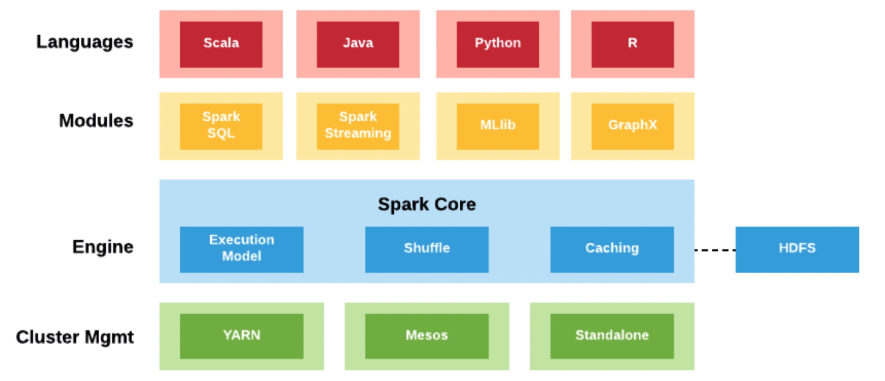
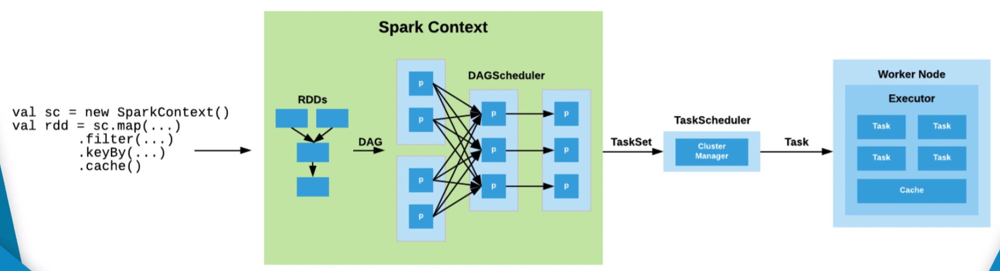
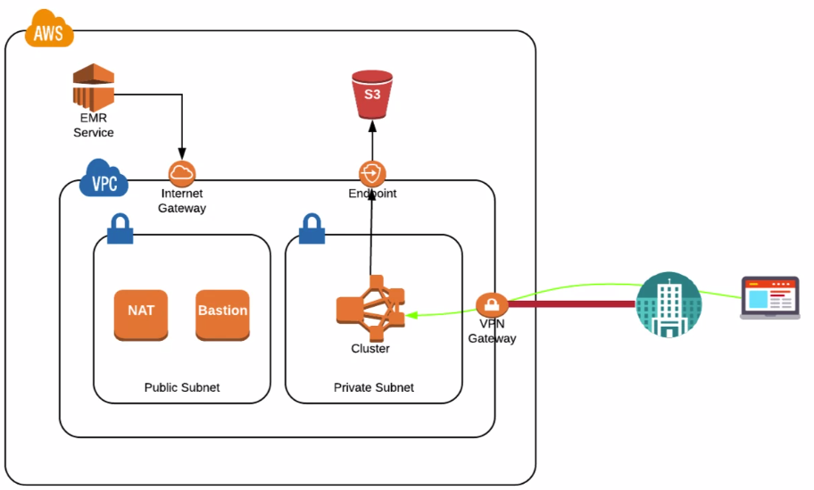
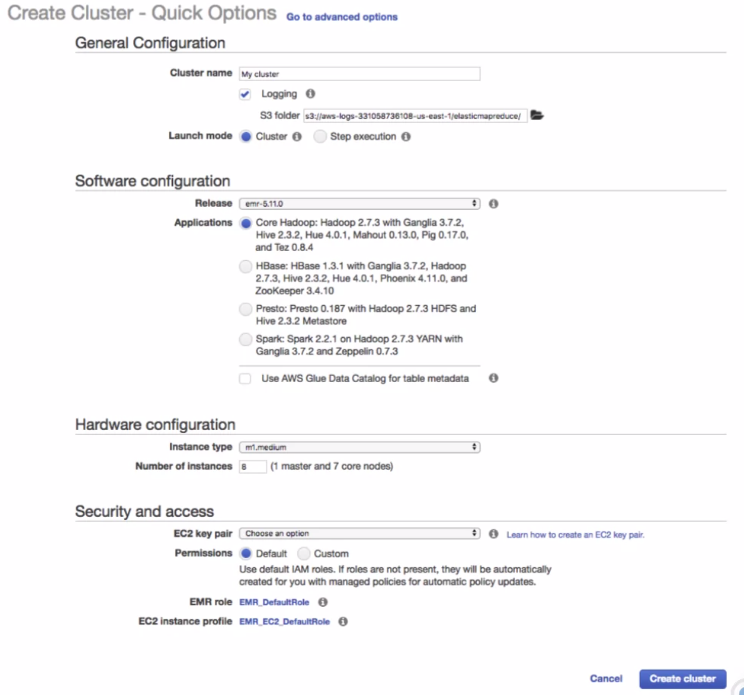
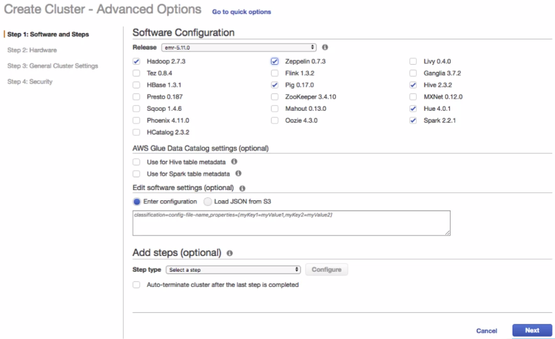
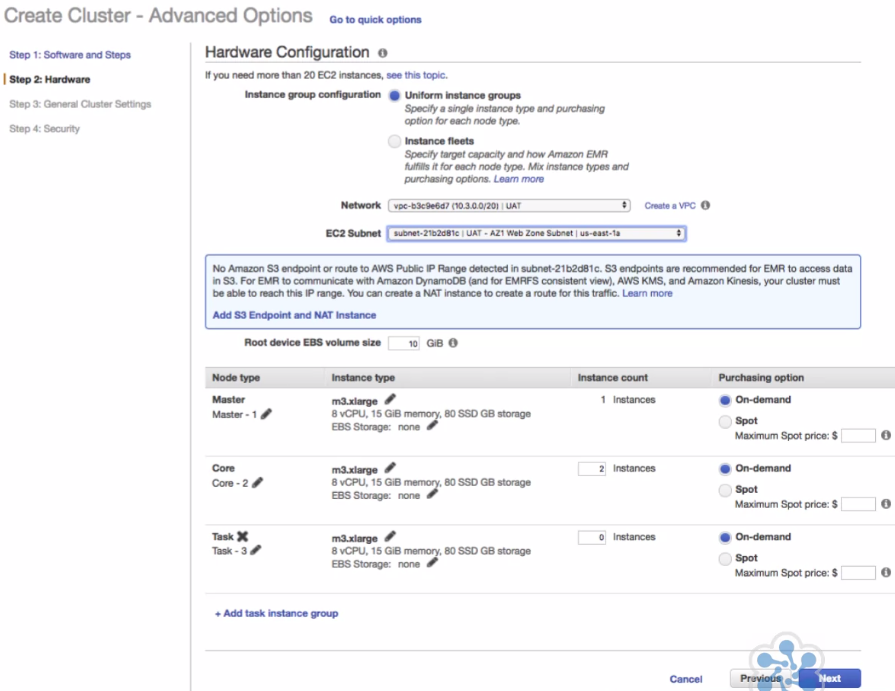

# Working with Distributed Machine Learning

<br/>

## Distributed Machine Learning Concepts

<br/>

### Course Introduction

**Learning Objectives**
- Understand distributed Machine Learning
- Understand Apache Spark and EMR
- Understand Spark MLlib
- Create Distributed Machine Learning Environment
- Understand AWS Glue and ETL
- Know how to Zepplin Notebooks
- Understand Decision Trees

### Distributed Machine Learning

Distributed machine learning refers to the concept in which machine learning processes have been scaled out and
deployed across a cluster of compute resources.

In doing so, distributed machine learning allows you to draw upon more compute resource, allowing you to paralyze the
machine learning mechanics and mathematical operations which in turn expedites end results and outputs.

**Motives:**
- Large Datasets
  - Big data is just too much for one machine to process.
- Speed
  - Parallelizing machine learning allowing much faster processing
- Complexity
  - The complexity of features may exceed a single node set up,.
- Accuracy
  - More accurate results can be achieved with more data.

<br/>

### Apache Spark

Apache Spark is an opensource cluster computing framework that provisions a cluster of machines, configured to provide
a general purpose distributed computing engine, that processes large amounts of data in memory--resulting in huge
performance boost.

Spark is built in Scala, a typesafe JVM language that incorporates both object oriented and functional programming.

Apache spark can easily be launched on an EMR cluster with simple configuration options--together they become an
excellent platform for processing large datasets.

**Spark Stack**

The foundation of Spark is the *Spark Core*. It provides distributed task dispatching, scheduling and basic I/O
functionalities. It is expose through an API with interfaces available in Scala, Python, Java and R.

Spark comes with in-built modules for SQL (Spark SQL), streaming (Spark Streaming), machine learning (MLlib) and
graphs (GraphX)--this course focuses on MLlib.



#### Master Slave Infrastructure

Apache Spark is built using a master slave type infrastructure. The master node acts as a central controller and
coordinator. The picture below illustrates the main software components within the Spark master slave architecture.


**Driver Program**

The *driver* is the process where the main method runs.  First, it converts you user program into *tasks* and then
schedules and distributing those tasks on the *executors* by communicating with the *cluster manager*.  

Note: In client mode, the *driver program* is on the *master node*--the node in which spark is executing from--while
in cluster mode the driver is allocated to a cluster node.  To use pyspark in, either mode, the same version of python
needs to be installed on all nodes in a cluster.

**Cluster Manager**

There are many *cluster managers* that Spark can work with including YARN, Mesos and a standalone cluster manager
(I have even heard of using kubernetes)

**Worker Nodes**

*Worker Nodes* are the machines that do the actual computations.  They host Spark *executor* processes.

**Executors**

*Executors* are the individual JVM processes that are launched within a worker. An *executor* process has the
responsibility of running an individual task for a specific Spark job. They are launched at the beginning of a spark
application, and typically, run for the entire lifetime of an application. Once the task is completed the *executor*
sends the results back to the *Driver*. *Executors* also provide a memory caching of local data.

A *task* is a unit of work that the driver program sends to the executor JVM process to be launched.

**Spark Context**

A *SparkContext* is the entry point to the Spark core, and for any work you wish to submit into the Spark cluster, a
*SparkContext* provides you an access point into the Spark execution environment, and acts as the controller of your
Spark application.

**EMR and Spark**

*When an EMR cluster is launched with Spark enabled, AWS takes care of the installation of Spark!!!* This is the
great thing about running Spark on top of EMR. You get the installation and deployment of Spark done automatically for
you. The ability to launch a working Spark environment, hosted in AWS, on an EMR cluster, is both very simple and
quick, allowing you to focus and maintain your energies into the data science itself.

By default EMR will launch spark with YARN.

An EMR core node is the same as a Spark worker node.

#### Data Abstractions

**RDD**

- An RDD, or Resilient Distributed Dataset, is the original data abstraction.  
- It provides a fault tolerant collection of items that can be computed on in parallel--it is Spark's representation of a
dataset partitioned over a cluster of machines.
- An API is provided, which enables you to manipulate it.
- RDD's can be created from various data formats, and sources such as CSV files, JSON files, and/or databases via
JDBC connections.

**DataFrame**

- DataFrames were next introduced, which organize data into named columns, similar to a database table.
- A key objective of DataFrames is to make dataset processing easier and more accessible to general users.
- DataFrmes have a schema.

**Dataset**

DataSet, builds on the success of the DataFrame, by providing an additional typesafe, object oriented programming
interface, that provides access to a strongly typed, immutable collection of objects, that are mapped to a
relational schema.

#### Directed Acyclic Graph (DAG)



Spark features an advanced *Directed Acyclic Graph*. Each Spark job created results in a DAG.

The *DAG* represents a sequence of *task stages* to be performed on the cluster. *DAGs* created by Spark can contain any
number of stages. Your Spark code gets converted into a *DAG*, which in turn is passed to the *DAG scheduler*. The
*DAG scheduler* splits the graph into stages of *tasks*, and distributes them as *task sets* to the *task scheduler* on
the *cluster manager*. Finally, the individual *tasks* are delivered to an assigned *executor process*, on a particular
*worker node*. We simply create our data scripts, and submit as jobs to Spark. Spark performs all of the above under
the hood.

<br/>

### Spark MLlib

- Scalability
- Performance
- APIs - Language compatibility
- Integration with other Spark tools
- Comes standard with Spark

**Use cases**

- Feature extraction
- Transformation
- Classification
- regression
- Clustering
- And many more

**Business use cases**
- Advertising and marketing optimization
- Anomaly fraud Detection
- Recommendation Systems
- etc.

**MLlib Algorithms**


**Logistic Regression Code Ex.**


**Decision Tree Code Ex.**


<br/>

### Decision Trees

Decision Trees are Supervised Machine Learning models that are in the form of tree structures. They are one of the
most popular and widely used Machine Learning algorithms. They are nothing more than a tree in which each non-leaf
node represents a decision between a set of choices in where the leaf nodes are the final decision or classification.


**Advantages**
- simple to understand and interpret.
  - mirror human decision making.
- Able to handle both numerical and categorical data.
- Require little or minimal data preparation.
- Perform well with very large data sets.

<br/>

### Amazon Elastic MapReduce

Amazon EMR provides a managed Hadoop framework that makes it easy, fast and cost effective to process vast amounts of
data.

Amazon EMR, together with Spark, simplifies the task of cluster and distributed job management.

Aside from running Spark on top of EMR, you can also run other popular distributed frameworks such as H-base, Presto
and Flink.

#### EMR Use Cases
- Log Analysis
- Web Indexing
- ETL
- Financial Forecasting
- Bioinformatics
- Machine Learning

#### EMR Ecosystem

A rich ecosystem of big data processing applications is available to cherry pick from. You can customize the
installation of applications that compliment the core EMR Hadoop application.


#### EMR Node Types

When you launch an EMR cluster, you need to define and allocate compute resources to three different nodes:
*Master*, *Core* and *Task*.


**Master Node**
- Each EMR cluster will have one *Master Node*.
- Manages the cluster
- Coordinates the distribution of jobs and data to the *core* and *task* nodes.
- Runs the primary Hadoop deamons like: Name Node, Job Trigger and Resource Manager.

**Core Node**
- Job tasks are performed on a collection of *core nodes*.
- Data is stored using the Hadoop distributed file system, HDFS.
- Runs the Data Node and task tracker demons.

**Task Node**
- Optional
- Can also run tasks
- Only runs the task tracker deamon

#### EMR Resizable Clusters

One of the really great features available in designing and operating an EMR cluster is the ability to resize it.
You can adjust the number of Amazon EC2 instances, available to an EMR cluster, automatically or manually, in response
to workloads that have varying demands. This allows you to ensure your cluster is always running optimally with
respect to both cost and performance.

#### EMR Storage Connectivity

Spark running on an email cluster can connect to multiple data storage locations.

- DynamoDB
  - EMR DynamoDB Connector
- SQL
  - JDBC Connector
- ElasticSearch Connector
- S3
  - EMR FileSystem EMRFS
- Streaming Connectors
- RedShift Copy from HDFS

#### EMR Networking

Various networking options are available when it comes to deploying your EMR cluster. Most common deployments
involve deploying into a VPC, Virtual Private Network. You can either deploy into either a *public subnet* or
*private subnet*.


Deploying into a *public subnet* (shown in picture above) provides a more simple solution but with limited security.
In this configuration, the EMR nodes are provisioned with public IP addresses. This configuration might be
sufficient for some solutions in which the data in your EMR cluster isn't sensitive.

This solution can be improved on and made more secure by instead deploying the cluster into a *private subnet*.
In this configuration, we can connect to the web interfaces of the various starter applications hosted on the EMR
Master Node via the VPC assigned public IP address. To ensure this configuration is secure, we would ensure to
control inbound connections through the appropriate use of security groups and/or network ACLs.


Alternatively, we can perform SSH port forwarding from the client host to the EMR Master Node for a specific
application port. In this design, the security of the networking is improved by deploying the EMR cluster into a
*private subnet*. To support this type of setup, a NAT instances configured for outbound internet access and a
VPC endpoint is configured to provide private access from the EMR cluster to the S3 service.

Finally, to access the EMR cluster itself from outside of the VPC, a bastion host is provided to act as the jump host.
In this configuration we would use a combination of a local web proxy to redirect all traffic through the bastion host
and an SSH tunnel from the local host to the bastion host. With this configuration active, we can use the client
browser to gain access to the web interface via the EMR Master Node private IP address and the respective application
port number.



If we wish, we can consider connecting our VPC back to our corporate networks. In doing so we can access sensitive
data that has to remain within our on-prem networks. The connectivity can be achieved either via an IP Sec VPN
connection or through a direct connect connection. Either way, this connectivity will allow the VPC hosted EMR cluster
access to data sets located within our on-prem networks.

This style of design would also allow us to connect directly to the web interfaces of the various data applications
on the EMR Master Node via its private IP. Without need for an SSH port forwarding, etc.

#### Launching an EMR Cluster

Launching an EMR cluster can be performed either with an AWS web console or from the command line via the AWS CLI.

Regardless of method, both achieve the same outcome in much the same way when it comes to providing the configuration.
The AWS EMR service console provides both a Quick Options and an Advanced Options approach. The difference being that
the Advanced Options screen gives you finer control over the various configuration options.

##### Quick Options



Four main subsections:
1. General Configuration
  - self-explanatory except for the launch mode
  - Launch mode can either be set to: `Cluster` or `Step execution`.
    - Cluster mode: EMR will launch a cluster that remains up and running until you proactively terminate it yourself.
    - Step Execution mode: EMR will launch a cluster, perform and execute all of the added steps and, upon completion, terminate itself.
2. Software Configuration
  - select the software version of EMR itself from a list of presets
  - Applications section: select from four pre-configured groupings of various big data processing applications.
3. Hardware Configuration
  - requires you to specify the EC2 instance type that will be used for both the Master and Core nodes.
  - Note: the deployment here will take place in the default VPC of the current AWS account.
4. Security and Access
  - You can optionally specify an EC2 Key Pair. By doing so, will allow you to SSH into any of the nodes.
  - You can also configure either default or custom IM role positions for both the EMR role and/or EMR instance profile.
  - Note: the difference is that the EMR role is used by the EMR service itself whereas the ERM instance profile is
    assigned to the EC2 instances within the EMR cluster.

##### Advanced Options

This has the same four sub-sections but in this case has separate screens for each.



**1. Software and Steps section:**

This screen allows you select a custom release of the EMR software. By default, the latest version is selected.

Next, you have the option of picking additional software to be installed on top of the EMR cluster. In the
example above, we have added both Zeppelin and Spark into the mix. Aside from these two packages, the
rest were selected for us by default.

*AWS Glue data catalog settings*
- If we are using the AWS Glue service for ETL purposes, then we can integrate our EMR cluster with the respective
AWS Glue data catalog and *enable Hive and/or Spark* to use it for metadata storage.

*Software Settings*
- Specify configuration properties used to control the behavior of the various applications that are deployed.

*Add steps*
- A *Step* is a unit of work submitted to the cluster. For instance, a Step might contain one or more Hadoop or
Spark jobs.


**2. Hardware**



This screen allows you to specify the style of deployment, the VPC network and subnet into which the EMR cluster is
deployed. You increase or decrease the route device EBS volume size of which you should do depending on how many
applications you configured to be deployed on the previous screen.

For each EMR node, you can specify a particular EC2 instance type in purchasing option either On Demand or Spot.
You also have the ability here to deploy Task nodes.

**3. General Cluster Settings**


*General Options*
- Specify the name of your EMR cluster and to enable or disable logging, debugging and termination protection.

*Tags*
- EMR cluster tags can be supplied. Tags supplied here are propagated down to all of the EC2 instances launched as part
of the cluster.

*Additional Options*
- Specify a customer AMI ID

*Bootstrap Actions*
- Specify custom boot strapping scripts to install other applications or required packages.

**4. Security**


- Specify the EC2 key pair to be configured on the cluster instances, which will give you SSH access onto these
instances.
- You can control the cluster visibility by enabling or disabling the cluster visibility setting.

*Permissions*
- Same as the quick settings options.
- Ability to configure a security configuration policy that controls things like: data encryption at rest, and transit,
and/or authentication and authorization.

*EC2 security groups*
- Specify custom security groups per EMR node type.

#### Zepplin or Jupyter Notebooks

EMR comes with an option to install Zeppelin when launching your EMR cluster. If you're more inclined to use Jupyter,
then you can do so by installing it through the EMR bootstrapping mechanism.

<br/>

### AWS Glue

- Fully managed ETL tool
- Fully managed and serverless service
- Built on top of Apache Spark

#### Components


Composed of three main components:
1. Data Catalog
  - Central metadata repository
2. ETL Engine
  - Used to perform ETL operations on the data sets discovered and registered within the data catalog
  - Automatically generates python/pySpark code based on supplied configuration of source and destination data sets
  - Or, you can handcraft your own ETL scripts from scratch
3. Job Scheduler
  - Used to trigger your ETL jobs based on supplied configuration.
  - Performs additional tasks, such as job monitoring and retries.

#### Crawling


The first thing you would generally do with an AWS Glue is to crawl your data sources. AWS Glue can be figured to
crawl data sets stored in these three or databases via JDBC connections. After the crawler is set up and activated,
AWS Glue performs a crawl and derives a data schema storing this and other associated meta data into the AWL Glue
data catalog.

#### ETL


AWS Glue provides an ETL tool that allows you to create and configure ETL jobs. Using the AWS Glue server's console
you can simply specify input and output tables registered in the data catalog. Next, you specify the mappings between
the input and output table schemas.

AWS Glue will then auto-generate an ETL script using PySpark--the Spark Python API. The picture above displays an
example Glue ETL job. The PySpark script on the right-hand side has been auto-generated based on the initial user
provided configuration. At this stage, you are free to update and refine the specifics of the script.

#### Triggers


The last thing you tend to do within AWS Glue is to configure the scheduling of your ETL jobs. You can use the
scheduler to trigger jobs to run based on a schedule, completion of another ETL job or on-demand.

## ML Project Demonstration

The Four Demonstrations in this section walk through an end-to-end machine learning project on AWS.


**Download and Save Census Income Dataset**

Download the dataset and load into S3 using AWS CLI.

```bash
# download data with curl
$ curl -O https://archive.ics.uci.edu/ml/machine-learning-databases/adult/adult.data

# create (make) S3 bucket
$ aws s3 mb s3://cloudacademy-emr-spark-data
make_bucket: cloudacademy-emr-spark-data

# copy downloaded data to S3 bucket
$ aws s3 cp adult.data s3://cloudacademy-emr-spark-data/adult.data
upload: ./adult.data to s3://cloudacademy-emr-spark-data/adult.data

# list contents of new bucket
$ aws s3 ls s3://cloudacademy-emr-spark-data
2018-01-03 16:05:12    3974305 adult.data
```

**Prepare Census Income Dataset**

Use AWS glue to configure a new crawler, to crawl the dataset that we're hosting in our S3 bucket. Running the crawler
results in a data schema being derived and stored in the data catalog. This represents the CSV file format of our
census data set.

Next, use Amazon Athena to define a secondary table schema, which we'll apply to the glue data catalog. The reason we
do this, is we want to set up an ETL job that will take our raw data, clean it, prepare it, and
then store it in a new table that we've defined and applied through Amazon Athena. It's important to note that
the glue data catalog represents the metadata of our data sources. The raw data that we crawl, or transform through our
ETL jobs, resides in an S3 bucket, or database represented by a JDBC Connection.

- Athena is a web database interface--like Hue.  From here we can see our created database and the table create by our
crawler. We can create a new table, using a create table statement, for the next stage in our ETL pipeline that will
be populated in the next step when we run our Glue job.

The final part of part two, is to define a glue job, or an ETL process, that takes out input dataset and manipulate it
so that it's prepared and ready for our machine learning process, which runs as a job within Spark on our EMR cluster.

- An ETL job is defined by selecting source and target tables then mapping columns in the web GUI--along with some other
security and location settings.  This will generate a pySpark script that will be executed to perform the job.

**Launch EMR Cluster with Spark and Zepplin**

Launch an EMR cluster (from the EMR cluster console), composed of one master node, and one core node, configured with
both Apache Spark, and Apache Zeppelin. Additionally, we'll configure the EMR cluster at launch time to have access to
the glue data catalog--which will give it access to the datasets that are registered within the data catalog.

- Note, when an EMR cluster is launched it actually launches a cluster of EC2 instances.  These instances can be seen
from the EC2 console. In this example, we had to navigate to the master node, on the EC2 Console, and enable SSH
communication with my IP address.  We can then SSH using the Master public DNS key given in the EMR console.
- SSH port forwarding.
  - Allows us to pull up a local browser and browse `localhost:8890` and have that traffic forwarded to the Zepplin
  application running on the master node.

**Build Decision Tree Model using Zepplin**

Use a zeppelin notebook to run our MLlib decision tree script. Our decision tree script will train itself on the data
stored in the data catalog. Running the zeppelin notebook provides us with an indirect position to the spark cluster.
This provides a convenient way to use the MLlib module to build our decision tree script. In doing so, we can train
our machine learning model, and then derive predictions from that model itself.

---